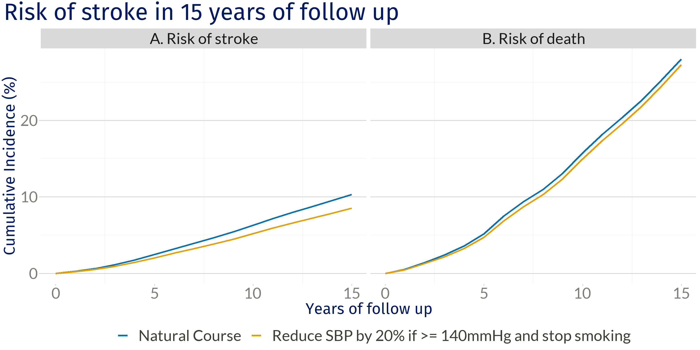

```{r setup, include=FALSE}
options(htmltools.dir.version = FALSE)
knitr::opts_chunk$set(
  fig.width=9, fig.height=3.5, fig.retina=3,
  out.width = "100%",
  cache = FALSE,
  echo = FALSE,
  message = FALSE, 
  warning = FALSE,
  hiline = TRUE
)

library(tidyverse)
library(gt)
library(knitr)
```

```{r xaringan-themer, include=FALSE, warning=FALSE}
library(xaringanthemer)
style_mono_accent(
 base_color = "#8bb8e8",
  black_color = "#005587",
  header_color = "#2774AE",
  text_bold_color = "#ffb81c",
  table_row_even_background_color = "#FFFFFF",
  title_slide_text_color = "#2774AE",
  table_border_color = "#8bb8e8",
 text_font_size = "22px")

```

background-image: url(./figs/logo.png)
background-position: 5% 95%
background-size: 35%
class: center, middle

# Target trial emulation

L. Paloma Rojas-Saunero

2022-09-02


---
class: center, middle

## Brief overview of some causal inference concepts

---

### Counterfactuals

Involves the human tendency to create possible alternatives to life events that have already occurred; something that is contrary to what actually happened. (_wiki_)

**Counterfactual outcomes**: to emphasize that these outcomes represent situations that may not actually occur (that is, counterto-the-fact situations).


**Potential outcomes**: to emphasize that, depending on the treatment that is received, different outcomes can be potentially observed.

---

### Notation

- A = 1 if I ate &#x1F36B; 

- A = 0 if I did not eat &#x274C;&#x1F36B;

- Y = 1 if I passed the test

- Y = 0 si I failed the test


- $Y^a$ is the counterfactual outcome under the level of A = a

---

### Individual causal effect

Starting from "_Chocolate increases the probability of passing the test_ "

<br>

.pull-left[

.center[
If I had eaten &#x1F36B;, I would have passed the test.

$Y^{a=1} = 1$

If I had not eaten chocolate &#x1F36B;, I would have failed the test.

$Y^{a=0} = 0$

]

]

--
<br>

.pull-right[

```{r}
tab <- tibble::tribble(
  ~Person, ~`A`, ~`Y`, ~`Ya=1`, ~`Ya=0`,
  "Ann",     1L,     1L,           1L,           0L,
  "Jhon",     0L,     0L,           0L,           0L,
  "Camila",     1L,     1L,           1L,           1L,
  "Ming",     0L,     0L,           1L,           0L,
  "Jesse",     0L,     1L,           0L,           1L
  ) 
tab %>% 
  mutate(Effect = c("Yes", "No", "No", "Yes", "No")) %>%
  kableExtra::kable()
```

$Y^{a=1} \neq  Y^{a=0}$ 
]

---
### The fundamental problem of causal inference

<br><br>

```{r}
tab <- tibble::tribble(
  ~Person, ~`A`, ~`Y`, ~`Ya=1`, ~`Ya=0`,
  "Ann",        "1",     "1",           "1",           "?",
  "Jhon",     "0",     "0",           "?",           "0",
  "Camila",    "1",     "1",           "1",           "?",
  "Ming",     "0",     "0",           "?",           "0",
  "Jesse",    "0",     "1",           "?",           "1"
  ) %>% 
  mutate(Effect = "?") 
tab %>%
  kableExtra::kable()
```

--
<br>

**Average causal effect:** $Pr[Y^{a=1} = 1] \neq Pr[Y^{a=0} = 1]$

---
### Randomized trials

Experiment in which participants are randomly assigned to follow specified treatment strategies.

--

**Ideal randomized trial**:

   + No loss to follow-up

   + Full adherence throught the study duration

   + Double blind assignment

--

Usually they following time points are aligned by design:

- Eligibility criteria

- Treatment assignment (randomization)

- Follow-up starts

???
Counterfactual or potential outcomes, Causal diagrams (e.g., DAGs, SWIGs)
The concept of an “ideal randomized trial” is tied directly to these languages

---
.center[

**Association is causation!**


]

.footnote[**Hernán MA, Robins JM (2020). Causal Inference: What If**]

???
Under this design, comparing the observed average outcomes under each treatment arm is the same as comparing what would have happened had everybody been in one treatment arm versus the other

---
## Target trial

--

- Conceptualize the hypothetical randomized trial we would like to conduct that answers our question

--

- Describe the protocol elements of that target trial

--

- Emulate the target trial with observational data as close as possible

--

- Benefits of protocol specification:

  + Helps with refining the research question (AKA estimand)
  
  + Helps detect sources of bias that can be prevented by design or in the analysis, or quantified
  
  + Explicit and transparent assumptions to connect our observed data to the causal question

  + Ensures clearer interpretations of results


---
### Statins and the risk of dementia


.footnote[Edouard L. Fu et al. Clinical Kidney Journal. 2020]
???

Frequently, observational studies that don't conceptualize the target trial selfinflict with bias due to time-zero missalignment, or other sources of bias

---
class: even_smaller

```{r}
target_statins <-
  tibble::tribble(
    ~ "<b> Section </b>",
    ~ "<b> Target trial protocol </b>",
    ~ "<b> Emulation using observational data </b>",
    "<b> Eligibility criteria </b>",
    "Age 55 - 80 years, no statin prescription in the previous 2 years, known to be dementia free, MMSE >=26; cholesterol, BMI and SBP measurement",
    "Same, except MMSE which is measured within the previous 3 years",
    "<b> Treatment strategies  </b>",
    "1. Initiate statin therapy at baseline and remain on it during the follow-up unless serious illnes occurs <br>
     2. Refrain from taking statin therapy during the follow-up unless serious illness occurs",
    "Same",
    "<b> Randomized assignment </b>",
    "Random assignment to either strategy at baseline",
    "Random assignment at baseline within levels of sex, educational attainment, age, calendar year, smoking status, MMSE, BMI, APOE4 status, cardiovascular covariates",
    "<b> Start/End of follow-up </b>",
    "From baseline until dementia dx, death, or loss to follow-up (10 years without an MMSE measurement), or January 1st, 2015, which ever happened first",
    "Same",
    "<b> Outcome  </b>",
    "Dementia (Death as a censoring event) <b>",
    "Same",
    "<b> Causal contrast  </b>",
    "Intention-to-treat <br>
    Per-protocol effect",
    "Same") %>% mutate(n = row_number())


target_statins %>% filter(n %in% c(1)) %>% select(-n) %>% gt() %>% 
   cols_width(
    "<b> Section </b>" ~ px(120),
    "<b> Target trial protocol </b>" ~ px(320),
    "<b> Emulation using observational data </b>" ~ px(320))
     
```

---
class: even_smaller

```{r}
target_statins %>% filter(n %in% c(1:2)) %>% select(-n) %>% gt()  %>% 
   cols_width(
    "<b> Section </b>" ~ px(120),
    "<b> Target trial protocol </b>" ~ px(320),
    "<b> Emulation using observational data </b>" ~ px(320))
```

---
class: even_smaller

```{r}
target_statins %>% filter(n %in% c(1:3)) %>% select(-n) %>% gt()  %>% 
   cols_width(
    "<b> Section </b>" ~ px(120),
    "<b> Target trial protocol </b>" ~ px(320),
    "<b> Emulation using observational data </b>" ~ px(320)) 
```

---
class: even_smaller

```{r}
target_statins %>% filter(n %in% c(1:4)) %>% select(-n) %>% gt()  %>% 
   cols_width(
    "<b> Section </b>" ~ px(120),
    "<b> Target trial protocol </b>" ~ px(320),
    "<b> Emulation using observational data </b>" ~ px(320))
```

---
class: even_smaller

```{r}
target_statins %>% filter(n %in% c(1:5)) %>% select(-n) %>% gt()  %>% 
   cols_width(
    "<b> Section </b>" ~ px(120),
    "<b> Target trial protocol </b>" ~ px(320),
    "<b> Emulation using observational data </b>" ~ px(320))
```

---
class: even_smaller

```{r}
target_statins %>% filter(n %in% c(1:6)) %>% select(-n) %>% gt()  %>% 
   cols_width(
    "<b> Section </b>" ~ px(120),
    "<b> Target trial protocol </b>" ~ px(320),
    "<b> Emulation using observational data </b>" ~ px(320))
```


---
### Intention to treat (Q1) vs. <br> sustained used of statins (Q2)


.center[


]

**10 year-dementia risk difference:** <br> -0.1% (-2.3%, 1.8%) vs -2.2% (-5.2%, 1.6%)

---

class: middle, right

## Hypothetical blood-pressure-lowering interventions and risk of stroke and dementia

<br><br>

---

class:: smaller

```{r}
target_ht <-
  tibble::tribble(
    ~ "<b> Section </b>",
    ~ "<b> Target trial protocol </b>",
    ~ "<b> Emulation using observational data </b>",
    "<b> Eligibility criteria </b>",
    "< 80 years old, no cognitive impairment, no history of stroke, dementia diagnosis and other related diseases.",
    "Same + MMSE above 26 at baseline",
    "<b> Treatment strategies  </b>",
    "0. Natural course (comparison arm) <br>
    1. Keep SBP < 120 mmHg <br>
    2. Keep SBP < 140 mmHg <br>
    3. Reduce SBP by 20% if >140 mmHg <br>
    4. Quit smoking <br>
    5. Joint 3 + 4",
    "Same",
    "<b> Follow-up </b>",
    "From year of first visit until 15 years of follow-up, or year of stroke/dementia or death, which ever happened first",
    "Same + visit process simulation",
    "<b> Outcome  </b>",
    "Stroke and Dementia (Death as a competing event)",
    "Same",
    "<b> Causal contrast  </b>",
    "What would have been observed if all individuals adhered to their assigned strategy over 15 years and death is not eliminated(Total per protocol effect)",
    "Same") %>% mutate(n = row_number())
target_ht %>% select(-n) %>% gt() %>% 
     cols_width(
    "<b> Section </b>" ~ px(120),
    "<b> Target trial protocol </b>" ~ px(320),
    "<b> Emulation using observational data </b>" ~ px(320))
```


---


### Statistical analysis

.center[**_What would have happened had everyone was randomized and had adhered to each intervention (g)?_**]

Parametric G-formula: Allows presence of time-varying confounding feedback

--

.pull-left[]

--

.pull-right[]

--

.footnote[
<br><br>
**A** = SBP, **L** = _Fixed covariates_: age, sex, education, SBP, history of diabetes and heart disease. _Time-varying covariates_: visit process, smoking status, SBP, BMI, HT medication, total cholesterol and diagnosis of diabetes, heart disease, Parkinson disease, Parkinsonism, TIA, dementia or cancer, **Y** = Stroke / Dementia]

---
### Results: Stroke

.center[


]


---
### Results: Stroke and death

.center[


]

---
### Results: Dementia

.center[


]

---
### Results: Dementia and death

.center[
]

---
### Current work

- Can we reduce the disparities in the risk of dementia across race/ethnicity groups, by reducing the disparities in hypertension?

- Extend the work on hypothetical interventions to reduce blood pressure sustainly over time across race/ethnicity.

- Data sources: Multi-Ethnic Study of Atherosclerosis (MESA)


---

### A note on well-defined interventions

<br><br>

- There is a long standing debate on what classifies as "well-defined" or "ill-defined".

--

- We didn't specified how SBP would be lowered, this represents a weighted average of strategies, determined by the frequency of these in the studied population.

--

- The target trial framework helps us in being more transparent about our questions, assumptions and interpretations.

---

## Take aways


- Having a clear question (or estimand) is key to conceptualize the best study design that answers it. 

--

- We can use the target trial framework even if we don’t have the intervention of
interested measured (or discovered).

--

- Specifying the components of the target trial should be one of the first steps prior to the outline
of an analysis plan that emulates such trial. 

--

- We can prevent several sources of bias from having a better design, and we can identify other sources of bias that can prevented (or quantified) through the analytic strategies.

--

- It is a dynamic process, since it requires a deep understanding of the data sources and a constant check that the causal contrasts and subsequent results are informative. 

---

