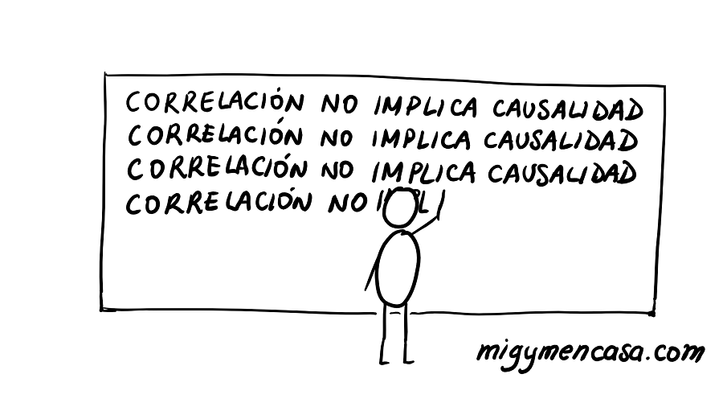
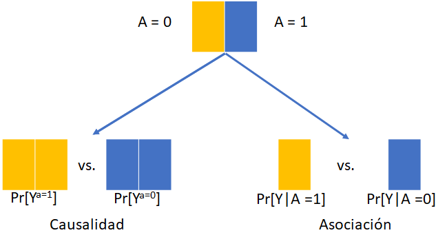
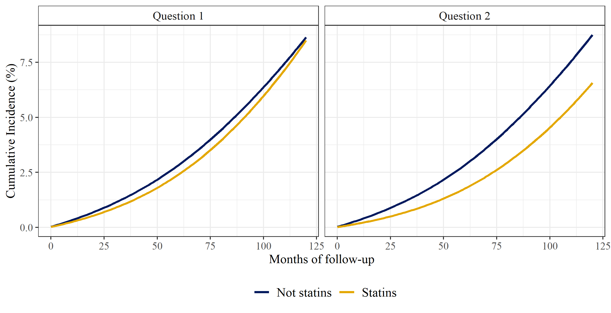
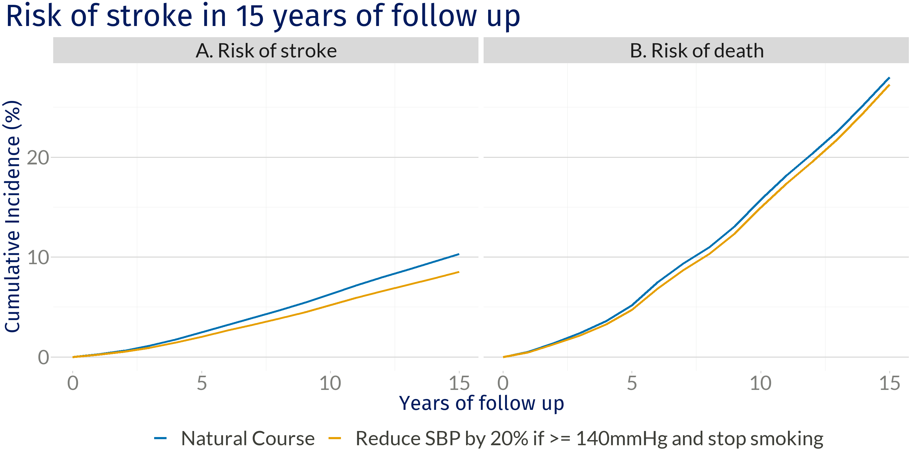
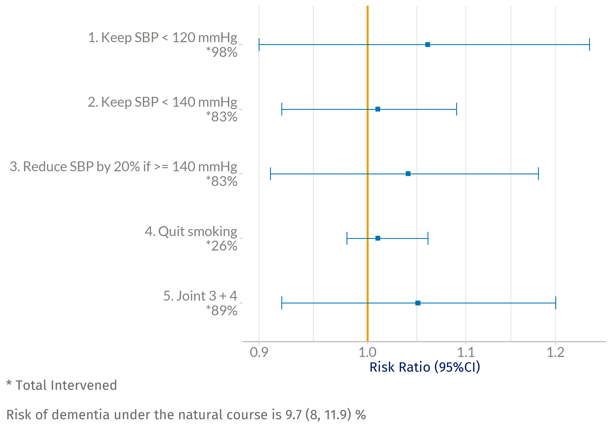
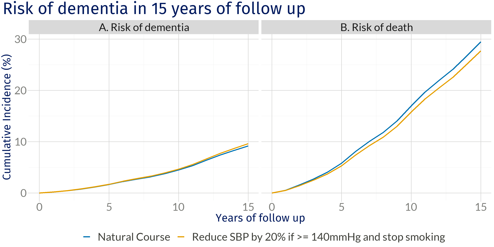
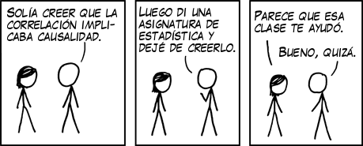

```{r setup, include=FALSE}
options(htmltools.dir.version = FALSE)
knitr::opts_chunk$set(
  fig.width=9, fig.height=3.5, fig.retina=3,
  out.width = "100%",
  cache = FALSE,
  echo = FALSE,
  message = FALSE, 
  warning = FALSE,
  hiline = TRUE
)

library(tidyverse)
library(gt)
library(knitr)
```

```{r xaringan-themer, include=FALSE, warning=FALSE}
library(xaringanthemer)
style_mono_accent(
 base_color = "#8bb8e8",
  black_color = "#005587",
  header_color = "#2774AE",
  text_bold_color = "#ffb81c",
  table_row_even_background_color = "#FFFFFF",
  title_slide_text_color = "#2774AE",
  table_border_color = "#8bb8e8",
 text_font_size = "22px")

```

background-image: url(./figs/logo.png)
background-position: 5% 95%
background-size: 35%
class: center, middle

#  Emulación de ensayos diana en estudios observacionales

<br> <br>

.right[L. Paloma Rojas-Saunero MD, PhD

**Departmento de Epidemiología**

`r icons::fontawesome$brands$twitter` </i>&nbsp; @palolili23</a><br>
]

---
class: center, middle




---
### Preguntas causales

<br>

- Cuál es la efectividad de un tratamiento para prevenir una enfermedad?

--

- Si le quito las medias a mi bebé, se resfriará?

--

- Cuál fue el impacto de cerrar las escuelas en la tasa de contagio de COVID19? 

--

- Si trabajo más horas, me subirán el sueldo?

---

background-image: url(./figs/ladder.jpg)
background-size: contain
background-color: white


.right[**El libro del porqué, Judea Pearl**]


---
class: center, middle

## Repaso de algunos conceptos de inferencia causal

---

### Contrafactual

<br><br><br>

.middle[.center[Acontecimiento que no ha sucedido en el universo actualmente observable pero que podría haber ocurrido. El acontecimiento contrafactual forma parte de un universo posible, mientras que el acontecimiento actual forma parte del universo observado. ]]

.footnote[_Wikipedia, 2022_]

---

### Notación

- A = 1 si tomé &#x1F48A; 

- A = 0 si no tomé &#x274C;&#x1F48A;

- Y = 1 si pasó el dolor de cabeza

- Y = 0 si sigue el dolor de cabeza


- $Y^a$ es el desenlace contrafactual cuando A = a

---

### Efecto causal individual

Empezando por "_Tomar la pastilla quita el dolor de cabeza_ "

<br>

.pull-left[

.center[
Si hubiese tomado &#x1F48A;, no tendría dolor de cabeza.

$Y^{a=1} = 1$

Si no hubiese tomado &#x1F48A;, seguiría con dolor de cabeza.

$Y^{a=0} = 0$

]

]

--
<br>

.pull-right[

```{r}
tab <- tibble::tribble(
  ~Persona, ~`A`, ~`Y`, ~`Ya=1`, ~`Ya=0`,
  "Luli",     1L,     1L,           1L,           0L,
  "Sergio",     0L,     0L,           0L,           0L,
  "Ana",     1L,     1L,           1L,           1L,
  "Joaquín",     0L,     0L,           1L,           0L,
  "Camila",     0L,     1L,           0L,           1L
  ) 
tab %>% 
  mutate(Efecto = c("Si", "No", "No", "Si", "No")) %>%
  kableExtra::kable()
```

**Efecto causal**: $Y^{a=1} \neq  Y^{a=0}$ 
]

---
### El problema fundamental de la inferencia causal

<br><br>

```{r}
tab <- tibble::tribble(
  ~Persona, ~`A`, ~`Y`, ~`Ya=1`, ~`Ya=0`,
  "Luli",        "1",     "1",           "1",           "?",
  "Sergio",    "0",     "0",           "?",           "0",
  "Ana",        "1",     "1",           "1",           "?",
  "Joaquín",   "0",     "0",           "?",           "0",
  "Camila",    "0",     "1",           "?",           "1"
  ) %>% 
  mutate(Efecto = "?") 
tab %>%
  kableExtra::kable()
```

--
<br>

**Efecto causal promedio:** $Pr[Y^{a=1} = 1] \neq Pr[Y^{a=0} = 1]$

---
### Ensayos clínicos

Experimentos donde se asigna aleatoriamente el tratamiento que recibirá cada participante. 

--

**Ensayo clínico ideal:**

   + No tiene pérdida de seguimieto

   + Adherencia total durante la duración del estudio

   + Doble ciego

--

**Pasos alineados en el tiempo:**

- Criterios de eligibilidad

- Asignación del tratamiento (aleatorización)

- Inicia el seguimiento para medir el desenlace

???
Counterfactual or potential outcomes, Causal diagrams (e.g., DAGs, SWIGs)
The concept of an “ideal randomized trial” is tied directly to these languages

---
.center[

**Asociación es causalidad!**



]

.footnote[**Hernán MA, Robins JM (2020). Causal Inference: What If**]

???
Under this design, comparing the observed average outcomes under each treatment arm is the Igual as comparing what would have happened had everybody been in one treatment arm versus the other

---
### Emulación del ensayo diana (_target trial emulation_)


---

### Beneficios 

<br><br>

- Ayuda a refinar la pregunta de investigación (AKA _estimand_).

--

- Permite detectar fuentes de sesgo que pueden ser prevenidas por el diseño o en el análisis.

--

- Permite ser transparente y explicito sobre los supuestos que conectan los datos observacionales a la pregunta causal.
  
--

- Asegura interpretación clara de los resultados
  
---

### Supuestos de identificación


Nos permiten conectar el mundo contrafactual con el factual.

--

**Intercambiabilidad:** Medimos todas las otras variables que puedan confundir nuestra asociación?

--

**Consistencia:** Esta bien definida la variable "tomar la pastilla"?

--

**Positividad:** Tenemos información en cada combinación de variables?

--

**Sin interferencia**
  
  
---
background-image: url(./figs/estimand.png)
background-size: 70%
class: center, middle, even_smaller


.footnote[Consejo Internacional de Armonización de los requisitos técnicos para el registro de medicamentos de uso humano publica publicó un addendum en 2020, sobre _estimandos_.
]

---
class: middle, right

### Estatinas y el riesgo de demencia

<br><br>

Ellen C. Caniglia, L. Paloma Rojas-Saunero,  Saima Hilal, Silvan Licher, Roger Logan, Bruno Stricker, M. Arfan Ikram, Sonja A. Swanson

_Neurology. 2020_

---

.center[]

.footnote[Edouard L. Fu et al. Clinical Kidney Journal. 2020]
???

Frequently, observational studies that don't conceptualize the target trial selfinflict with bias due to time-zero missalignment, or other sources of bias

---
class: even_smaller

```{r}
target_statins <-
  tibble::tribble(
    ~ "<b> Sección </b>",
    ~ "<b> Protocolo del ensayo diana </b>",
    ~ "<b> Emulación con datos observacionales </b>",
    "<b> Criterios de inclusión </b>",
    "Edad 55 - 80 años, sin prescripción de estatinas en los 2 años previos, libre de demencia, MMSE >=26",
    "Igual, excepto que MMSE se midió en los 3 años previos",
    "<b> Ramas de tratamiento  </b>",
    "1. Inicia tratamiento con estatinas al inicio del estudio y se mantiene durante el seguimiento a menos que desarrolle una enfermedad severa <br>
     2. Abstenerse de tomar estatinas durante el seguimiento, a menos que surja una enfermedad severa",
    "Igual",
    "<b> Asignación aleatorizada</b>",
    "Aleatorización al inicio del estudio",
    "Aleatorización al inicio del estudio dentro de cada estrato de sexo, educación, edad, año calendario, consumo de tabaco, MMSE, IMC, APOE4, factores cardiovasculares",
    "<b> Seguimiento </b>",
    "Desde el inicio del estudio hasta el dx. de demencia, muerte, pérdida de seguimiento (10 años sin MMSE), o 1ro de Enero, 2015",
    "Igual",
    "<b> Desenlace  </b>",
    "Demencia (Muerte como evento de censura) <b>",
    "Igual",
    "<b> Contraste causal  </b>",
    "Intención de tratar <br>
    Efecto por protocolo",
    "Igual") %>% mutate(n = row_number())


target_statins %>% filter(n %in% c(1)) %>% select(-n) %>% gt() %>% 
   cols_width(
    "<b> Sección </b>" ~ px(120),
    "<b> Protocolo del ensayo diana </b>" ~ px(320),
    "<b> Emulación con datos observacionales </b>" ~ px(320))
     
```

---
class: even_smaller

```{r}
target_statins %>% filter(n %in% c(1:2)) %>% select(-n) %>% gt()  %>% 
   cols_width(
    "<b> Sección </b>" ~ px(120),
    "<b> Protocolo del ensayo diana </b>" ~ px(320),
    "<b> Emulación con datos observacionales </b>" ~ px(320))
```

---
class: even_smaller

```{r}
target_statins %>% filter(n %in% c(1:3)) %>% select(-n) %>% gt()  %>% 
   cols_width(
    "<b> Sección </b>" ~ px(120),
    "<b> Protocolo del ensayo diana </b>" ~ px(320),
    "<b> Emulación con datos observacionales </b>" ~ px(320))
```

---
class: even_smaller

```{r}
target_statins %>% filter(n %in% c(1:4)) %>% select(-n) %>% gt()  %>% 
   cols_width(
    "<b> Sección </b>" ~ px(120),
    "<b> Protocolo del ensayo diana </b>" ~ px(320),
    "<b> Emulación con datos observacionales </b>" ~ px(320))
```

---
class: even_smaller

```{r}
target_statins %>% filter(n %in% c(1:5)) %>% select(-n) %>% gt()  %>% 
   cols_width(
    "<b> Sección </b>" ~ px(120),
    "<b> Protocolo del ensayo diana </b>" ~ px(320),
    "<b> Emulación con datos observacionales </b>" ~ px(320))
```

---
class: even_smaller

```{r}
target_statins %>% filter(n %in% c(1:6)) %>% select(-n) %>% gt()  %>% 
   cols_width(
    "<b> Sección </b>" ~ px(120),
    "<b> Protocolo del ensayo diana </b>" ~ px(320),
    "<b> Emulación con datos observacionales </b>" ~ px(320))
```


---
### Intención de tratar (P1) vs. Por protocolo (P2)


.center[


]

**Diferencia del riesgo de demencia a los 10 años:** <br> -0.1% (-2.3%, 1.8%) vs -2.2% (-5.2%, 1.6%)

---

class: middle, right

### Intervenciones hipotéticas para disminuir la presión arterial y el riesgo de ACV y demencia

<br><br>

L. Paloma Rojas-Saunero, Saima Hilal, Eleanor Murray, Roger Logan, M. Arfan Ikram, Sonja A. Swanson

_European Journal of Epidemiology. 2021_

---

class:: smaller

```{r}
target_ht <-
  tibble::tribble(
    ~ "<b> Sección </b>",
    ~ "<b> Protocolo del ensayo diana </b>",
    ~ "<b> Emulación con datos observacionales </b>",
    "<b> Criterios de inclusión </b>",
    "< 80 años, sin deterioro cognitivo, sin historia de ACV o demencia",
    "Igual + MMSE > 26 al inicio",
    "<b> Ramas de tratamiento  </b>",
    "0. Curso natural (rama de comparación) <br>
    1. Mantener PAS < 120 mmHg <br>
    2. Mantener PAS < 140 mmHg <br>
    3. Reducir PAS en 20% si >140 mmHg <br>
    4. Dejar de fumar <br>
    5. 3 + 4",
    "Igual",
    "<b> Seguimiento </b>",
    "Desde el año de la primera visita hasta 15 años de seguimiento, o año de ACV/demencia o muerte",
    "Igual + simulación de las visitas clínicas",
    "<b> Desenlace  </b>",
    "ACV y demencia (Muerte como evento competitivo)",
    "Igual",
    "<b> Contraste causal  </b>",
    "Qué observaríamos si todos los participantes hubiesen adherido a su rama asignada por 15 años y que las muertes no sean eliminadas?",
    "Igual") %>% mutate(n = row_number())
target_ht %>% select(-n) %>% gt() %>% 
     cols_width(
    "<b> Sección </b>" ~ px(120),
    "<b> Protocolo del ensayo diana </b>" ~ px(320),
    "<b> Emulación con datos observacionales </b>" ~ px(320))
```


---


### Análisis estadístico

.center[**_"Qué observaríamos si todos los participantes hubiesen adherido a la rama asignada (g) por 15 años?_**]

Presencia de confundidores que cambian en el tiempo

--

.pull-left[]

--

.pull-right[]

--

.footnote[
<br><br>
**A** = PAS, **L** = Confundidores basales y que cambian en el tiepo, **Y** = ACV / Demencia]

---
### Resultados: ACV

.center[


]


---
### Resultados: ACV y muerte

.center[


]

---
### Resultos: Demencia

.center[


]

---
### Resultados: Demencia y muerte

.center[
]

---

### Mensaje final

- Si estas pensando en sesgos de confusión o que necesitas "ajustar" por covariables, tienes una pregunta causal.

--

- Definir una pregunta clara como estimando es esencial para conceptualizar el diseño que la responda. 

--

- Podemos usar la emulación de ensayos diana aún si no hemos medido (o no existe) la intervención de interés.

--

- Especificar todos los elementos del ensayo diana es un paso esencial para definir el análisis estadístico. 

--

- Es un proceso dinámico, require que entendamos bien los mecanismos de cómo se generan los datos y que los contrastes causales sean informativos. 

---
class: center, middle




--

La inferencia causal nos permite definir **bajo qué _supuestos_ puedo interpretar mis resultados como causales**

--

Siempre y cuando la **pregunta de investigación sea clara**.

--

Diseñemos bien nuestro estudio.


---

class::center, middle


.right[

###"_Eres más inteligente que tus datos. <br> Los datos no entienden de causas y efectos; las personas sí._" 

<br>


**El libro del porqué, Judea Pearl**
]

---
class::center, middle

<br><br>

### Muchas gracias!

`r icons::fontawesome("paper-plane", style = "solid" )`</i>&nbsp; lp.rojassaunero@ucla.edu</a><br>

`r icons::fontawesome$brands$twitter` </i>&nbsp; @palolili23</a><br>

---

### Preguntas para la audiencia

- Cuáles son las barreras más importantes para adoptar preguntas causales y aplicar los métodos correspondientes?

- Cómo podemos construir un puente entre métodos novedosos y las investigaciones aplicadas más rápido?
