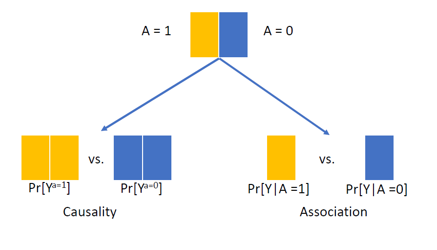
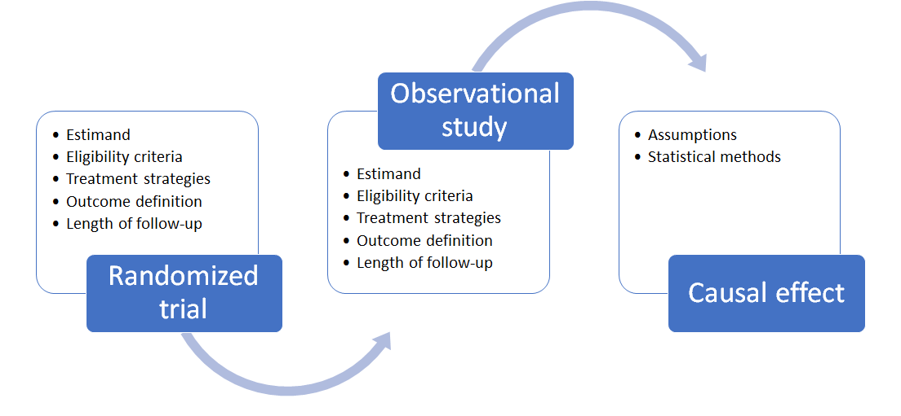

```{r setup, include=FALSE}
options(htmltools.dir.version = FALSE)
knitr::opts_chunk$set(
  fig.width=9, fig.height=3.5, fig.retina=3,
  out.width = "100%",
  cache = FALSE,
  echo = FALSE,
  message = FALSE, 
  warning = FALSE,
  hiline = TRUE
)

library(tidyverse)
library(gt)
library(knitr)
library(fontawesome)
```

```{r xaringan-themer, include=FALSE, warning=FALSE}
library(xaringanthemer)
style_mono_accent(
 base_color = "#8bb8e8",
  black_color = "#005587",
  header_color = "#2774AE",
  text_bold_color = "#ffb81c",
  table_row_even_background_color = "#FFFFFF",
  title_slide_text_color = "#2774AE",
  table_border_color = "#8bb8e8",
 text_font_size = "22px")

```

background-image: url(./figs/logo.png)
background-position: 5% 95%
background-size: 35%
class: center, middle

# Target trial emulation for the study of social determinants in dementia research

.pull.right[

L. Paloma Rojas-Saunero MD, PhD
<br>
Postdoctoral scholar
<br>
**Mayeda Research Group, Department of Epidemiology**

]

---
background-image: url(./figs/hill.jpg)
background-size: 75%

.footnote[Hill et al. _Ethnicity and disease_. 2015]

???
Throughout the meeting we have seen great work focused on risk factors related to dementia and the health disparities related to aging.

NIA encourages the need to deliniate causal pathways and to broden the scope for malleable targets for intervention.

Helpful for elucidating mechanisms contributing to racial health disparities, identifying effective intervention targets (4-6, 29), and in turn addressing rather than solely further documenting racial health disparities

---

## Randomized trials

Experiment in which participants are randomly assigned to follow specified treatment strategies.

--

**Ideal randomized trial**:

   + No loss to follow-up

   + Full adherence through out the study duration

   + Double blind assignment

--

Usually they following time points are aligned by design:

- Eligibility criteria

- Treatment assignment (randomization)

- Follow-up starts

???
Counterfactual or potential outcomes, Causal diagrams (e.g., DAGs, SWIGs)
The concept of an “ideal randomized trial” is tied directly to these languages

---
.center[

**Association is causation!**



]

.footnote[**Hernán MA, Robins JM (2020). Causal Inference: What If**]

???
Under this design, comparing the observed average outcomes under each treatment arm is the same as comparing what would have happened had everybody been in one treatment arm versus the other

---
## Target trial emulation framework
class: center, middle


???
The ttf is a method to analyze observational data, that motivates researchers to conceptualize the hypothetical randomized trial that we would like to conduct that answers our question

Describe the protocol elements of that target trial

Emulate the target trial with observational data as close as possible

---

class: middle, center


???
Now, you may feel skeptical about this framework if you are not working specifically in pharmacoepi. Most of the modifiable risk factors are not easy to conceptualize as treatment arms in a trial. 
I hope my work here helps moving out from that dilemma and using the core concepts of this framework to improve the way ask questions and seek responses with observational studies. 

---
class: middle, left, even smaller
background-image: url(./figs/t.jpg)
background-position: 90% 90%
background-size: 15%

## Early-life racial residential segregation and its effect on memory decline in older adults

.left[ _Work led by Taylor Mobley (UCLA, Mayeda's research lab)_ ]

???
To illustrate what we might gain from using the TTF I will use as example a work in progress led by TM. This is an initial step and we plan to expand these ideas to other questions of structural racism in this grant.

---
## Research question

<br><br><br>
.center[
_What is the effect of early-life racial residencial segregation in 1940, measured by the dissimilarity index, on later-life memory decline in US population?_
]

---

```{r}
target_statins <-
  tibble::tribble(
    ~ "<b> Section </b>",
    ~ "<b> Target trial protocol </b>",
    ~ "<b> Emulation using observational data </b>",
    "<b> Eligibility criteria </b>",
    "Population who self-identify as white or Black, born in the US by 1940, who resided in a county with Black residents",
    "Same + participated in HRS, with linked data for 1940 census, living in counties with > 1 enumeration district and with memory assessment measured by 1998",
    "<b> Policy-level strategies  </b>",
    "1. Reduce racial residencial segregation in every county by certain amount <br>
     2. Status quo (no change)",
    "Same",
    "<b> Randomized assignment </b>",
    "Random assignment to either strategy in 1940",
    "Random assignment in 1940, within levels of county level covariates",
    "<b> Start/End of follow-up </b>",
    "1998 (1st memory assessment) until 2018, including every wave of data in between",
    "Same",
    "<b> Outcome  </b>",
    "Composite memory score <b>",
    "Same",
    "<b> Causal contrast  </b>",
    "Intention-to-treat",
    "Same") %>% mutate(n = row_number())


target_statins %>% filter(n %in% c(1)) %>% select(-n) %>% gt() %>% 
   cols_width(
    "<b> Section </b>" ~ px(120),
    "<b> Target trial protocol </b>" ~ px(320),
    "<b> Emulation using observational data </b>" ~ px(320))
     
```

???
Let's imagine 
---
class: even_smaller

```{r}
target_statins %>% filter(n %in% c(1:2)) %>% select(-n) %>% gt()  %>% 
   cols_width(
    "<b> Section </b>" ~ px(120),
    "<b> Target trial protocol </b>" ~ px(320),
    "<b> Emulation using observational data </b>" ~ px(320))
```

---
class: even_smaller

```{r}
target_statins %>% filter(n %in% c(1:3)) %>% select(-n) %>% gt()  %>% 
   cols_width(
    "<b> Section </b>" ~ px(120),
    "<b> Target trial protocol </b>" ~ px(320),
    "<b> Emulation using observational data </b>" ~ px(320)) 
```

---
class: even_smaller

```{r}
target_statins %>% filter(n %in% c(1:4)) %>% select(-n) %>% gt()  %>% 
   cols_width(
    "<b> Section </b>" ~ px(120),
    "<b> Target trial protocol </b>" ~ px(320),
    "<b> Emulation using observational data </b>" ~ px(320))
```

---
class: even_smaller

```{r}
target_statins %>% filter(n %in% c(1:5)) %>% select(-n) %>% gt()  %>% 
   cols_width(
    "<b> Section </b>" ~ px(120),
    "<b> Target trial protocol </b>" ~ px(320),
    "<b> Emulation using observational data </b>" ~ px(320))
```

---
class: even_smaller

```{r}
target_statins %>% filter(n %in% c(1:6)) %>% select(-n) %>% gt()  %>% 
   cols_width(
    "<b> Section </b>" ~ px(120),
    "<b> Target trial protocol </b>" ~ px(320),
    "<b> Emulation using observational data </b>" ~ px(320))
```

---
background-image: url(./figs/dag1940.png)
background-size: 50%
class: even_smaller

## Directed acyclic graph

.footnote[

*A0*: Early life metropolitan-area segregation <br>
*ED-level L0:* population, % > 8th grade, % owned a home (overall and/or race-specific measures) <br> 
*Individual-level L0:* Age at baseline cognitive assessment, sex, childhood SES index <br>
*Y1, Y2, Yk*: Measurements of memory decline <br>
*C2, Ck*: Censoring due to loss to follow-up or death]

---
## Estimand

$$E[Y_{1998}^{a = 1, c = 0}] - E[Y_{1998}^{a = 0, c = 0}]$$
--

<br>

$$E[Y_{2000}^{a = 1, c = 0}] - [Y_{2000}^{a = 0, c = 0}]$$
.center[....]
<br>

--

$$E[Y_{2008}^{a = 1, c = 0}] - E[Y_{2008}^{a = 0, c = 0}]$$
---
## Identifiability assumptions

- Consistency: well-defined intervention

--

- Exchangeability: no unmeasured confounding

--

- Positivity:

--

- No interference:


---

### Identifiability assumptions: Consistency

- This framework improves the narrative and conversation around these complex exposures.

--

  _What does it mean to intervene in 1940 on segregation_

--

  _Is the dissimilarity index a representative measurement_

--

  _What is a relevant intervention on the dissimilarity index, reducing under certain threshold or by certain value?_

---
### Identifiability assumptions: Consistency

- In this setting, the interventions represent a weighted average of strategies, determined by the frequency of these in the studied population.

--

- The target trial framework helps us in being more transparent about our questions, assumptions and interpretations.

--

- It requires deep interdisciplinary dialogue, and only with subject matter expertise can inform how well we feel about satisfying this assumption


???
The consistency assumption is also defined as the well-defined intervention. Although there is a long standing debate on what classifies as "well-defined" or "ill-defined".

---
### Identifiability assumptions: Exchangeability

- Considering what variables to adjust for is more challenging.

--

- Since there are many factors that can influence residential segregation, whatever we adjust for is not accounted into how we would intervene.

--

- There is a moral and ethical value in terms of what variables to adjust. "Allowable" sources of difference are considered fair, and "non-allowable" sources are considered unfair.*

--

- Doubly robust methods (TMLE)** can help us obtain valid inferences if either the exposure or the outcome mechanism is consistently estimated.

.footnote[
* Jackson J. Epidemiology. 2021.
** Targeted maximum likelihood estimation. Schuler M. & Rose S. AJE. 2016.
]
---
## Other identifiability assumptions

- Positivity

- No interference

- No model misspecification

---

## Take aways


- Having a clear question (or estimand) is key to conceptualize the best study design that answers it. 
  
--

- We can use the target trial framework even if the intervention of interest is not measured (or exists!). 

--

- Specifying the components of the target trial should be one of the first steps prior to the outline of an analysis plan that emulates such trial. 

--

- We can prevent several sources of bias from having a better design, and we can identify other sources of bias that can prevented (or quantified) through the analytic strategies.

--

- It is a dynamic process, since it requires a deep understanding of the data sources and a constant check that the causal contrasts and subsequent results are informative. 

---
## Acknowledgments

NIA R01AG074359: Historical social and environmental determinants of memory decline and dementia among U.S. older adults (Dr. Mayeda and Dr. Casey)

---

class: center, middle


---
class: center, middle

### Thank you, Gracias!

`r fa("paper-plane")`</i>&nbsp;lp.rojassaunero@ucla.edu</a><br>

`r fa("twitter")` <a href="http://twitter.com/palolili23"> </i>&nbsp; @palolili23</a><br>

`r fa("github")` <a href="https://github.com/palolili23"> </i>&nbsp; @palolili23</a><br>


---

## The Dissimilarity Index

A measure of "evenness" of groups (e.g., Black vs white populations) within a given area

<br>
$$ DI = 0.5*\sum_{i = 1}^{N}{(\frac{B_i}{B_t} - \frac{W_i}{W_t})} $$

.center[Range: 0 (no segregation) - 1 (complete segregation)]

<br>
We use counties as the larger geographic area of interest (_t_) and enumeration districts (_i_) as geographic subunits
    
.footnote[
*"A Methodological Analysis of Segregation Indexes" Duncan & Duncan, 1955*
]

???

A group is evenly distributed when each geographic unit has the same percentage of group members as the total population. The index score can also be interpreted as the percentage of one of the two groups included in the calculation that would have to move to different geographic areas in order to produce a distribution that matches that of the larger area.
