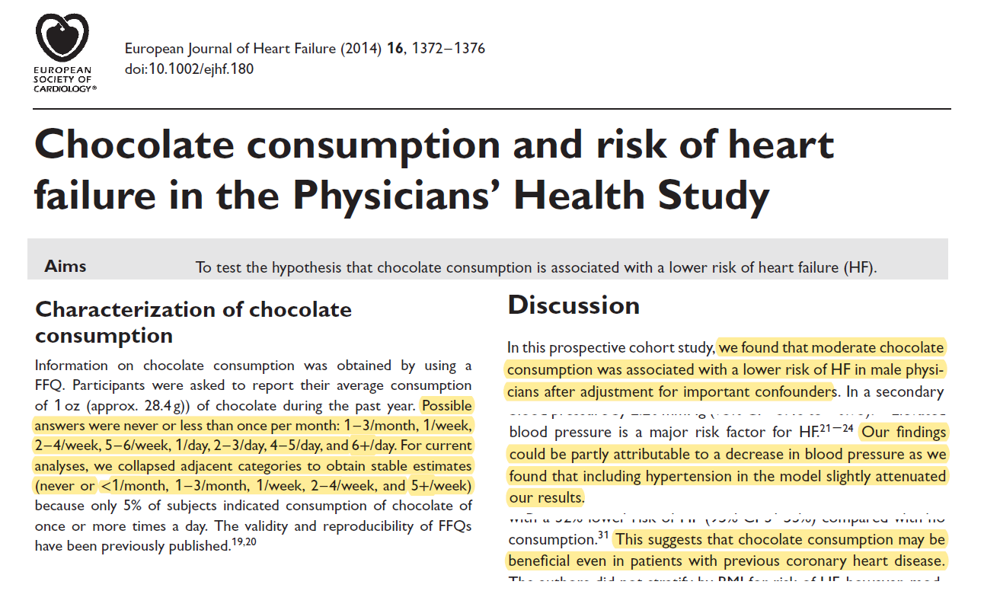
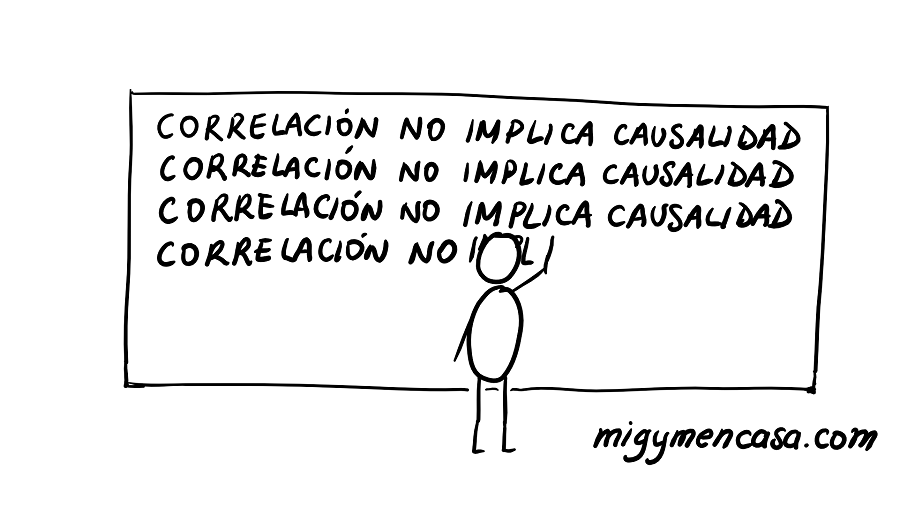
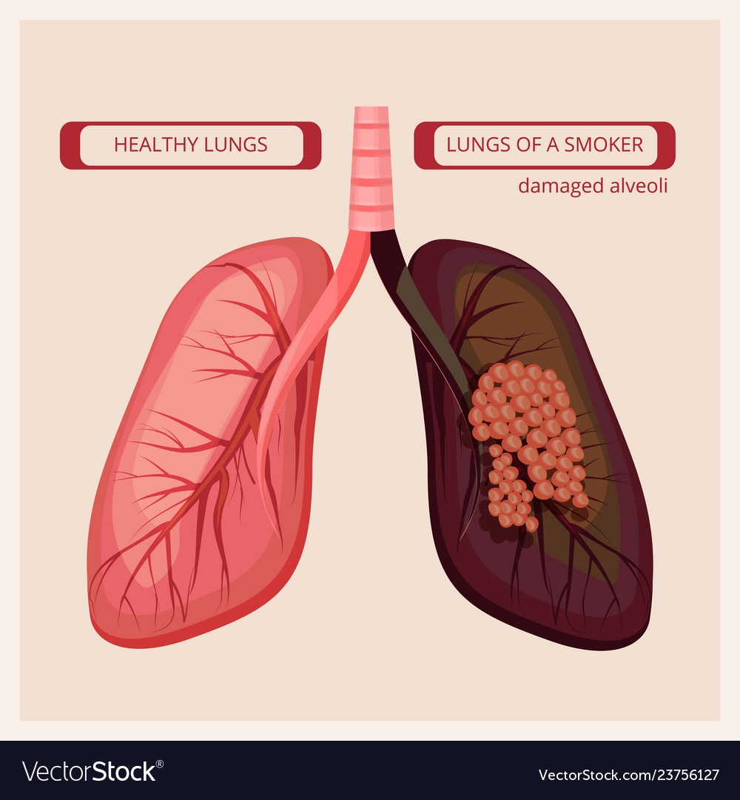
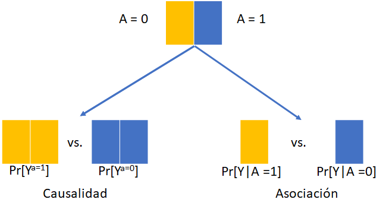
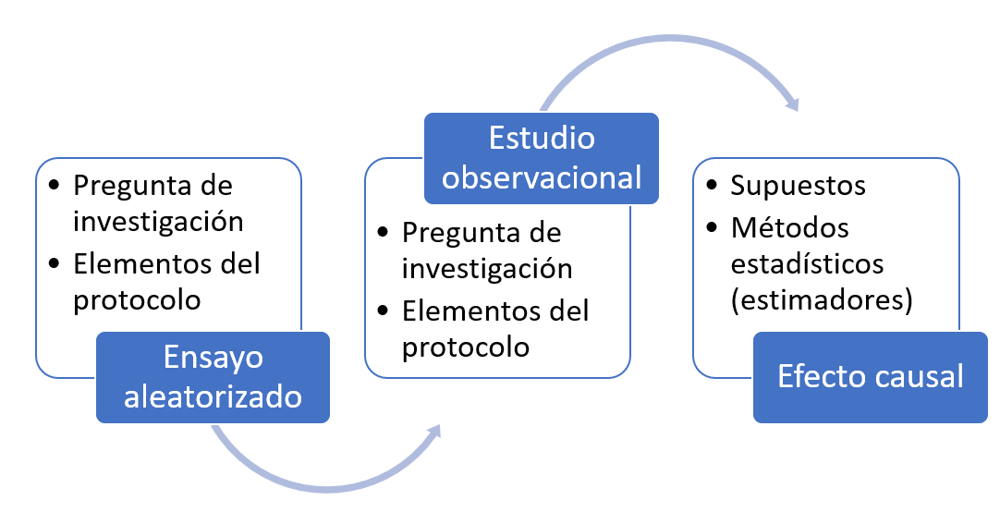
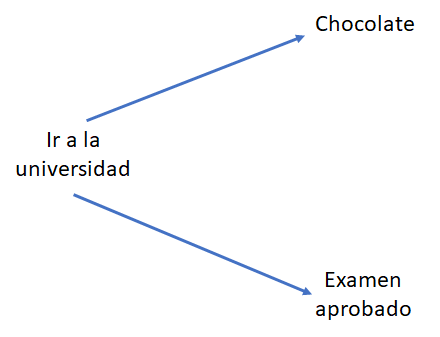

```{r setup, include=FALSE}
options(htmltools.dir.version = FALSE)
knitr::opts_chunk$set(
  fig.width=9, fig.height=3.5, fig.retina=3,
  out.width = "100%",
  cache = FALSE,
  echo = FALSE,
  message = FALSE, 
  warning = FALSE,
  hiline = TRUE
)

library(tidyverse)
library(gt)
library(knitr)
```

```{r xaringan-themer, include=FALSE, warning=FALSE}
library(xaringanthemer)
style_mono_accent(
 base_color = "#8bb8e8",
  black_color = "#005587",
  header_color = "#2774AE",
  text_bold_color = "#ffb81c",
  table_row_even_background_color = "#FFFFFF",
  title_slide_text_color = "#2774AE",
  table_border_color = "#8bb8e8",
 text_font_size = "22px")

```

background-image: url(./figs/logo.png)
background-position: 5% 95%
background-size: 35%
class: center, middle

#  Principios de inferencia causal en estudios observacionales

<br> <br>

.right[L. Paloma Rojas-Saunero MD, PhD

**Departmento de Epidemiología**

`r icons::fontawesome$brands$twitter` </i>&nbsp; @palolili23</a><br>
]

---
## Objetivos de la clase

<br>

- Tipos de preguntas de investigación

--

- Qué es inferencia causal?

--

- El mundo contrafactual

--

- El ensayo clínico ideal (_ensayo diana_)

---

## Tipos de preguntas de investigación

--

- **Estudios descriptivos:**
<br>
Nos dan un resumen cuantitativo de alguna características del mundo. Por ej. una prevalencia, visualizaciones.

--

- **Estudios de predicción:**
<br>
Nos permite utilizar datos ya medidos para poder predecir un nuevo dato. Por ej. estudios de diagnóstico y scores de pronóstico

--

- **Estudios causales:**
<br>
Nos permite utilizar datos para predecir ciertas características en el mundo, si el mundo fuera diferente. Por ej. el efecto de un tratamiento, el efecto de una política de salud, el efecto de una decisión.


.footnote[Miguel A. Hernán, John Hsu & Brian Healy. **_A Second Chance to Get Causal Inference Right: A Classification of Data Science Tasks_**, CHANCE (2019)
]

---
## Estudios descriptivos

.center[]

.footnote[Fuente: https://coronavirus.jhu.edu/map.html]

---
## Estudios predictivos


.center[]

---
## Estudios causales


.center[]

---

## Y los estudios de asociación?

- Estudiar la **asociación** entre una exposición y un evento de desenlace no es una pregunta científica.

  - Es una pregunta estadística

  - Existe por razones históricas

  - Encubre la verdadera pregunta de investigación

---
## Mirada crítica



---

## Mirada crítica

<br><br><br>
"_La asociación entre el consumo de chocolate está asociado con un riesgo menor de falla cardiaca._"
<br><br>
.center[
**A. Descriptivo**

**B. Predictivo**

**C. Causal**
]

---
class: middle, left

# Inferencia causal

---

## Correlación y Causalidad



---

## Preguntas causales

<br>

- Cuál es la efectividad de un tratamiento para prevenir una enfermedad?

--

- Si le quito las medias a mi bebé, se resfriará?

--

- Cuál fue el impacto de cerrar las escuelas en la tasa de contagio de COVID19? 

--

- Si trabajo más horas, me subirán el sueldo?

---
## Causalidad en epidemiología

<br> <br>

.pull-left[
- En epidemiología estudiamos **determinantes** de la salud.

- No siempre podemos realizar ensayos clínicos.

- Muchos hitos de la epidemiología fueron a partir de estudios observacionales.
]

.pull-right[

]

---

## Cómo conectamos nuestras preguntas a la estadística?

- Podemos definir la inferencia causal respecto al **evento contrafactual**.

<br>

--

- Podemos pensar la inferencia causal a partir de la **emulación de un ensayo clínico hipotético** ("ensayo ideal", _target trial_)

<br>

--

- Podemos definir la inferencia causal en base a **diagramas causales** (Gráficos acíclicos dirigidos causales)

---

## Preguntas precisas, respuestas precisas

Establecer **cuál es la pregunta de investigación causal** nos permite:

<br>

- Definir cuál es el mejor método estadístico?

- Por qué variables debería o no ajustar en mi modelo?

- Cómo interpretan los resultados mis colegas?

- Confío en un resultado publicado que diga que A causa Y?

- Que datos debería recolectar en un próximo estudio?

---
class:middle

## Mundo contrafactual

---
class: middle, center


.right[**Contrafactual:** _acontecimiento que no ha sucedido en el universo actualmente observable pero que podría haber ocurrido. Se dice que el acontecimiento forman parte de un universo posible, mientras que el acontecimiento actual forma parte del universo fáctico o universo actual o universo real_.]

---
## Notación

- A = 1 si comí &#x1F36B; 

- A = 0 si &#x274C;&#x1F36B;

- Y = 1 si aprobé estadística

- Y = 0 si no aprobé estadística


- $Y^a$ es el evento contrafactual bajo A = a

---

### Efecto causal individual

Partiendo de "_Comer chocolate permite aprobar estadística_ "

<br>

.pull-left[

.center[
Si hubiese comido &#x1F36B;, hubiera aprobado estadística.

$Y^{a=1} = 1$

Si no hubiese comido &#x1F36B;, no hubiera aprobado estadística

$Y^{a=0} = 0$

]

]

--
<br>

.pull-right[

```{r}
tab <- tibble::tribble(
  ~Persona, ~`A`, ~`Y`, ~`Ya=1`, ~`Ya=0`,
  "Luli",     1L,     1L,           1L,           0L,
  "Sergio",     0L,     0L,           0L,           0L,
  "Ana",     1L,     1L,           1L,           1L,
  "Joaquín",     0L,     0L,           1L,           0L,
  "Camila",     0L,     1L,           0L,           1L
  ) 
tab %>% 
  mutate(Efecto = c("Si", "No", "No", "Si", "No")) %>%
  kableExtra::kable()
```

**Efecto causal**: $Y^{a=1} \neq  Y^{a=0}$ 
]

---
### El problema fundamental de la inferencia causal

<br><br>

```{r}
tab <- tibble::tribble(
  ~Persona, ~`A`, ~`Y`, ~`Ya=1`, ~`Ya=0`,
  "Luli",        "1",     "1",           "1",           "?",
  "Sergio",    "0",     "0",           "?",           "0",
  "Ana",        "1",     "1",           "1",           "?",
  "Joaquín",   "0",     "0",           "?",           "0",
  "Camila",    "0",     "1",           "?",           "1"
  ) %>% 
  mutate(Efecto = "?") 
tab %>%
  kableExtra::kable()
```

--
<br>

**Efecto causal promedio:** $Pr[Y^{a=1} = 1] \neq Pr[Y^{a=0} = 1]$

---
### Ensayos clínicos

Experimentos donde se asigna aleatoriamente el tratamiento que recibirá cada participante. 

--

**Ensayo clínico ideal:**

   + No tiene pérdida de seguimieto

   + Adherencia total durante la duración del estudio

   + Doble ciego

--

**Pasos alineados en el tiempo:**

- Criterios de eligibilidad

- Asignación del tratamiento (aleatorización)

- Inicia el seguimiento para medir el desenlace

???
Counterfactual or potential outcomes, Causal diagrams (e.g., DAGs, SWIGs)
The concept of an “ideal randomized trial” is tied directly to these languages

---
.center[

**Asociación es causalidad!**



]

.footnote[**Hernán MA, Robins JM (2020). Causal Inference: What If**]

???
Under this design, comparing the observed average outcomes under each treatment arm is the Igual as comparing what would have happened had everybody been in one treatment arm versus the other

---
### Diferencia de riesgo causal

<br><br>


$Pr[Y^{a=1} = 1] - Pr[Y^{a=0} = 1]$

Si toda la población de estudio hubiese sido tratada, el riesgo del evento seria X unidades más que si nadie hubiese sido tratada, durante el periodo de estudio.

---

### Riesgo relativo causal

<br><br>


$Pr[Y^{a=1} = 1] / Pr[Y^{a=0} = 1]$

Si toda la población de estudio hubiese sido tratada, el riesgo del evento seria X veces más el riesgo que si nadie hubiese sido tratada, durante el periodo de estudio.


---


### Los ensayos de la vida real

- No son ideales (falta de adherencia, pérdida de seguimiento)

--

- Nos permiten contestar preguntas que no pueden contestarse por ECAs

  - No son éticos
  - No son factibles
  - Necesitan mucho tiempo
  
--

- Debemos basarnos en estudios observacionales

---

### Qué hacemos en este caso?

- Diseñamos el **ensayo clínico ideal o diana** considerando todos los puntos claves de un protocolo.

- Esto nos permite definir bien la pregunta causal

- Evitar errores en el diseño del análisis

---

### Emulación del ensayo diana (_target trial emulation_)



---

### Beneficios 

<br><br>

- Ayuda a refinar la pregunta de investigación (AKA _estimand_).

--

- Permite detectar fuentes de sesgo que pueden ser prevenidas por el diseño o en el análisis.

--

- Permite ser transparente y explicito sobre los supuestos que conectan los datos observacionales a la pregunta causal.
  
--

- Asegura interpretación clara de los resultados
  
---

### Estudios observacionales

.pull-left[



]

--

.pull-right[
**Supuestos** que nos permitan conectar el mundo contrafactual con el factual.

**Intercambiabilidad**: Medimos todas las otras variables que puedan confundir nuestra asociación?

**Consistencia**: Esta bien definida la variable "comer chocolate"?

**Positividad**

**Sin interferencia**

]

---
## Sesgos de confusión

.pull-left[

]

--

.pull-right[

]

---


### Mensaje final

- Si estas pensando en sesgos de confusión o que necesitas "ajustar" por covariables, tienes una pregunta causal.

--

- Definir una pregunta clara como estimando es esencial para conceptualizar el diseño que la responda. 

--

- Podemos usar la emulación de ensayos diana aún si no hemos medido (o no existe) la intervención de interés.

--

- Especificar todos los elementos del ensayo diana es un paso esencial para definir el análisis estadístico. 

--

- Es un proceso dinámico, require que entendamos bien los mecanismos de cómo se generan los datos y que los contrastes causales sean informativos. 

---
class: center, middle


--

La inferencia causal nos permite definir **bajo qué _supuestos_ puedo interpretar mis resultados como causales**

--

Siempre y cuando la **pregunta de investigación sea clara**.

--

Diseñemos bien nuestro estudio.


---

class::center, middle


.right[

###"_Eres más inteligente que tus datos. <br> Los datos no entienden de causas y efectos; las personas sí._" 

<br>


**El libro del porqué, Judea Pearl**
]


