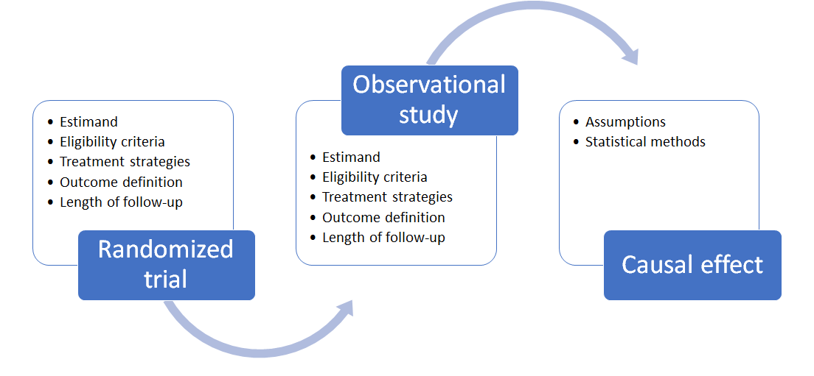

```{r setup, include=FALSE}
options(htmltools.dir.version = FALSE)
knitr::opts_chunk$set(
  fig.width=9, fig.height=3.5, fig.retina=3,
  out.width = "100%",
  cache = FALSE,
  echo = FALSE,
  message = FALSE, 
  warning = FALSE,
  hiline = TRUE
)

library(tidyverse)
library(gt)
library(knitr)
library(fontawesome)
```

```{r xaringan-themer, include=FALSE, warning=FALSE}
library(xaringanthemer)
style_mono_accent(
 base_color = "#8bb8e8",
  black_color = "#005587",
  header_color = "#2774AE",
  text_bold_color = "#ffb81c",
  table_row_even_background_color = "#FFFFFF",
  title_slide_text_color = "#2774AE",
  table_border_color = "#8bb8e8",
 text_font_size = "22px")

```

background-image: url(./figs/logo.png)
background-position: 5% 95%
background-size: 35%
class: center, middle

# Target trial emulation for the study of social determinants in dementia research

.pull.right[

L. Paloma Rojas-Saunero MD, PhD
<br>
Postdoctoral scholar
<br>
**Mayeda Research Group, Department of Epidemiology**

]


???

I would like to thank Dr. Caniglia and Dr. Schisterman for the opportunity to talk in this session. Today I will discuss the implementation of the ttf in the study of social determinants in dementia research to ground ideas related to my current.
I should note that through out my talk I will make more questions than giving answers, but I am confident that this is the perfect place to pose them and take these as conversartion startes.

---
background-image: url(./figs/hill.jpg)
background-size: 75%

.footnote[Hill et al. _Ethnicity and disease_. 2015]

???

In this graph, the NIA emphasizes that the study of life-course exposures in dementia research is to understand the etiologic pathways and ultimately identify effective targets for intervention. THus, we are very frequently interested in answering causal questions.

However there has been a long resistance to connect causal methods to structural factors is because the best study design is a randomized trial.

So while we are mostly focusing on RCTs to answer questions for biological mechanisms, we still need the best of these methods to study structural factors. 


---

## Ideal randomized trial

- No loss to follow-up

--

- Full adherence through out the study duration

--

- Double blind assignment

--

- Time points aligned by design:

    + Eligibility criteria
    + Treatment assignment (randomization)
    + Follow-up starts

???
So, I would first like to highlight a few characteristics of randomized trials that make them ideal to answer causal questions

The concept of an “ideal randomized trial” is tied directly to the language of counterfactual or potential outcomes and causal diagrams


---
class: center, middle

## Target trial emulation framework


???

The ttf is a method to analyze observational data, that motivates researchers to conceptualize the hypothetical randomized trial that we would like to conduct that answers our question

Describe the protocol elements of that target trial

Emulate the target trial with observational data as close as possible

This shows that an essential part of this framework relies on the study design.
Sometimes we heavily focus on the assumptions and estimators to answer causal effects,
but the essence of the ttf is to be more transparent about the study design decisins we face when we use observational data that has not been collected specifically to answer one specific research question. 


---
background-image: url(./figs/t.jpg)
background-position: 90% 90%
background-size: 15%

## Research question

<br><br><br>

.center[
_What is the effect of early-life racial residencial segregation in 1940, measured by the dissimilarity index, on later-life memory decline in US population, represented by the Health and Retirement Study (HRS)?_]

.footnote[ _Work led by Taylor Mobley (UCLA, Mayeda's research lab)_ ]

???
THe HRS is a national representative data with oversampling of black, latino population. 
Recruitment started in the 90's and collects all kind of measurements, including memory scores every 2 years.
---

```{r}
target_statins <-
  tibble::tribble(
    ~ "<b> Section </b>",
    ~ "<b> Target trial protocol </b>",
    ~ "<b> Emulation using observational data </b>",
    "<b> Eligibility criteria </b>",
    "Population who self-identify as white or Black, born in the US by 1940, who resided in a county with Black residents",
    "Same + participated in HRS, with linked data for 1940 census, living in counties with > 1 enumeration district and with memory assessment measured by 1998",
    "<b> Policy-level interventions  </b>",
    " 0. Do nothing (Status quo) <br>
    1. Reduce racial residencial segregation at a county level by certain amount
     ", 
    "Same",
    "<b> Randomized assignment </b>",
    "Random assignment to either strategy in 1940",
    "Random assignment in 1940, within levels of county level covariates",
    "<b> Start/End of follow-up </b>",
    "1998 (1st memory assessment) until 2018, including every wave of data in between",
    "Same",
    "<b> Outcome  </b>",
    "Composite memory score <b>",
    "Same",
    "<b> Causal contrast  </b>",
    "Intention-to-treat",
    "Same") %>% mutate(n = row_number())


target_statins %>% filter(n %in% c(1)) %>% select(-n) %>% gt() %>% 
   cols_width(
    "<b> Section </b>" ~ px(120),
    "<b> Target trial protocol </b>" ~ px(320),
    "<b> Emulation using observational data </b>" ~ px(320))
     
```

???
Before answering this question, lets take some time to outline the target trial and how we would emulate it... so hold on to your seats because we are going to be creative

First, lets imagine we can take a time machine that transport us to 1940.


---
class: even_smaller

```{r}
target_statins %>% filter(n %in% c(1:2)) %>% select(-n) %>% gt()  %>% 
   cols_width(
    "<b> Section </b>" ~ px(120),
    "<b> Target trial protocol </b>" ~ px(320),
    "<b> Emulation using observational data </b>" ~ px(320))
```

---
class: even_smaller

```{r}
target_statins %>% filter(n %in% c(1:3)) %>% select(-n) %>% gt()  %>% 
   cols_width(
    "<b> Section </b>" ~ px(120),
    "<b> Target trial protocol </b>" ~ px(320),
    "<b> Emulation using observational data </b>" ~ px(320)) 
```

---
class: even_smaller

```{r}
target_statins %>% filter(n %in% c(1:4)) %>% select(-n) %>% gt()  %>% 
   cols_width(
    "<b> Section </b>" ~ px(120),
    "<b> Target trial protocol </b>" ~ px(320),
    "<b> Emulation using observational data </b>" ~ px(320))
```

---
class: even_smaller

```{r}
target_statins %>% filter(n %in% c(1:5)) %>% select(-n) %>% gt()  %>% 
   cols_width(
    "<b> Section </b>" ~ px(120),
    "<b> Target trial protocol </b>" ~ px(320),
    "<b> Emulation using observational data </b>" ~ px(320))
```

---
class: even_smaller

```{r}
target_statins %>% filter(n %in% c(1:6)) %>% select(-n) %>% gt()  %>% 
   cols_width(
    "<b> Section </b>" ~ px(120),
    "<b> Target trial protocol </b>" ~ px(320),
    "<b> Emulation using observational data </b>" ~ px(320))
```

---
## Estimand

$$E[Y_{1998}^{a = 1}] - E[Y_{1998}^{a = 0}]$$
--

<br>

$$E[Y_{2000}^{a = 1, c = 0}] - [Y_{2000}^{a = 0, c = 0}]$$
.center[....]
<br>

???
With that in mind, we can outline our estimand or paratemer of interest.
Since we are interested in a continuous outcome over time, we first discretized our estimand, by each time point.
So first, we would be interested in evaluating the mean memory score in 1998 had everyone had followed intervention 1) compared to the mean score at baseline had everyone had followed intervention 0)

Next we would look at the mean difference on the memory score, under the two treatment strategies, and on and on we would do this until the last wave of data, and we could plot these point estimates over time, either as by treatment arm or the difference between them.


--

$$E[Y_{2018}^{a = 1, c = 0}] - E[Y_{2018}^{a = 0, c = 0}]$$
---
## Identifiability assumptions

- Consistency

- Exchangeability

- Positivity

- No interference

???


---

## Consistency

- Refers to having a well defined intervention.

--

 -  _What does it mean to intervene in 1940 on segregation?_

--

 -  _Is the dissimilarity index a good a proxy of all the racist policies that had consequences in residential segregation?_

--

  - _What is a relevant intervention on the dissimilarity index, reducing under certain threshold or by certain value?_

---
## Consistency


- The target trial framework may help us expand the narrative and conversation around these complex exposures.

--

- The interventions represent a weighted average of strategies, determined by the frequency of these in the studied population.

--

- It requires deep interdisciplinary dialogue, and only with subject matter expertise we can inform how well we feel about satisfying this assumption.

---
## Exchangeability

- There is a moral and ethical value in terms of what variables to adjust.  "Non-allowable" sources are considered unfair and contribute to disparities (_Jackson J. Epidemiology. 2021_).

--

- Whatever we adjust for is not accounted into how we would intervene.

--

- Doubly robust methods can help us obtain valid inferences if either the exposure or the outcome mechanism is consistently estimated.


---

## Take aways

- The target trial framework helps us in being more transparent about our questions, assumptions and interpretations.

--

- We can use the target trial framework even if the intervention of interest is not measured (or exists!). 

--

- We can prevent several sources of bias from having a better design, and we can identify other sources of bias that can prevented (or quantified) through the analytic strategies.

--

- It is a dynamic process, since it requires a deep understanding of the data sources and a constant check that the causal contrasts and subsequent results are informative. 

---
class: middle, right

#### _To search for all the refutable consequences of a hypothesis demands highly imaginative thinking. Imagination is needed to arrive at the hypothesis in the first place, let alone to suggest rigorous tests for it. (Carol Buck)_ 

.footnote[
_Buck C. Popper's Philosophy for Epidemiologists, IJE. 1975_
]
---
##           Thank you, Gracias!

.pull-left[

**Mayeda Research Group**

**Study Contributors:**

- Elizabeth Rose Mayeda
- Joan Casey
- Taylor Mobley
- Kara Rudolph
- Nick Williams
- Heather McBrien
- Milo Gordon

**NIA: R01AG074359**
]

.pull-right[

<br> <br>

`r fa("paper-plane")`</i>&nbsp;lp.rojassaunero@ucla.edu</a><br>

`r fa("twitter")` <a href="http://twitter.com/palolili23"> </i>&nbsp; @palolili23</a><br>

`r fa("github")` <a href="https://github.com/palolili23"> </i>&nbsp; @palolili23</a><br>

]