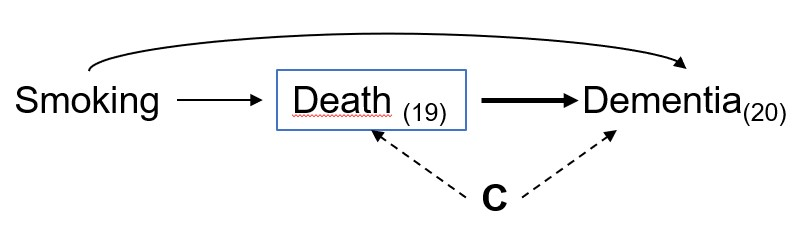
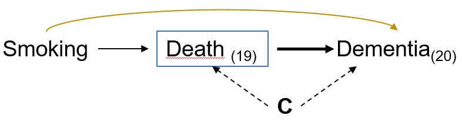

```{r setup, include=FALSE}
options(htmltools.dir.version = FALSE)
knitr::opts_chunk$set(
  fig.width=9, fig.height=3.5, fig.retina=3,
  out.width = "100%",
  cache = FALSE,
  echo = FALSE,
  message = FALSE, 
  warning = FALSE,
  hiline = TRUE
)

library(tidyverse)
library(gt)
library(knitr)
library(fontawesome)
```

```{r xaringan-themer, include=FALSE, warning=FALSE}
library(xaringanthemer)
style_mono_accent(
 base_color = "#8bb8e8",
  text_bold_color = "#005587",
  header_color = "#2774AE",
  black_color = "#002B43",
  table_row_even_background_color = "#FFFFFF",
  title_slide_text_color = "#2774AE",
  table_border_color = "#8bb8e8",
 text_font_size = "22px")

```

background-image: url(./figs/logo.png)
background-position: 5% 95%
background-size: 35%
class: center, middle

## Considering questions before methods in dementia research with competing events and causal goals

<br>

.pull.right[

L. Paloma Rojas-Saunero MD, PhD
<br>
Postdoctoral scholar
<br>
Mayeda Research Group, Department of Epidemiology

]

---
## A bit about myself....

.pull-left[

- Born and raised in La Paz, Bolivia (11,893 ft above sea level)

- Medical degree from Universidad Mayor de San Andrés.

- Master in clinical research, Hospital Italiano de Buenos Aires, Argentina

- Specialization in Statistics for Health Sciences, Universidad de Buenos Aires, Argentina

]

.pull-right[


]

.footnote[ _Photo by @lalibelle - reposted @howtolapaz_ ]

---
## A bit about myself....

.pull-left[

- PhD in Epidemiology at Erasmus MC in
Rotterdam, Netherlands

]

.pull-right[


]

.footnote[ _Illustration by Lucia Mayorga Garrido Cortés_ ]

---

background-image: url(./figs/hill.jpg)
background-size: 75%

.footnote[Hill et al. _Ethnicity and disease_. 2015]

???


---
background-image: url(./figs/press1.PNG)
background-size: 75%

.footnote[www.express.co.uk, 2016]

---
background-image: url(./figs/press2.PNG)
background-size: 75%

.footnote[Medscape, 2019]

---
background-image: url(./figs/cr_austin.PNG)
background-size: 65%

## Cause-specific vs. subdistribution HR 

.footnote[Austin et al. _Circulation_.2016]

---
## Systematic review

**Searching criteria**

- Original research published between Jan/2018 to Dec/2019

- Dementia/AD & longitudinal/cohort & hazard/risk 

- Alzheimer’s and Dementia, Annals of Neurology, BMJ, Neurology, JAMA, Jama Neurology, Lancet, Lancet Neurology
  
--

**Eligibility criteria** 

- Time-to-dementia/AD as primary or co-primary outcome

- With a clear exposure/intervention, and uses methods to handle confounding

- Not a descriptive or predictive aim

---

## Results

Out of **57/209** papers included:

--

- **56%** report death numbers, **18%** death by exposure level

--

- **47%** do not include any description about death in the methods section, **26%** consider it a sensitivity example, **14%** only mention it was treated as a censoring event

--

- **87%** use Cox PH models, **93%** present hazard ratios

--

- **86%** innacurate interpretations (e.g. "_risks_")

---
## The hazard of hazards

.center[


]

.footnote[
Stensrud et al. Eur Heart J. 2019.
]

---
background-image: url(./figs/simqr.png)
background-position: 95% 95%
background-size: 15%
class: center, middle


---
background-image: url(./figs/ajeqr.png)
background-position: 95% 95%
background-size: 15%
class: center, middle

.center[


]

---
class: center, middle



---
## Total effect

<br>

.center[
.middle[

What is the risk of dementia at 20 years of follow-up had all individuals stopped smoking, compared to had all individuals continued smoking?

$$Pr[Y_{20}^{a = 1}] - Pr[Y_{20}^{a = 0}]$$

]]


--


---

## Controlled direct effect

<br>

.center[
.middle[

What is the risk of dementia at 20 years of follow-up had all individuals stopped smoking _and not died_ throughout the study period, compared to had all individuals continued smoking in adulthood _and not died_ throughout the study period?


$$Pr[Y_{20}^{a = 1, d_{19} = 0}] - Pr[Y_{20}^{a = 0, d_{19} = 0}]$$

]
]

--



---

## Controlled direct effect

<br>

.center[
.middle[

What is the risk of dementia at 20 years of follow-up had all individuals stopped smoking _and not died_ throughout the study period, compared to had all individuals continued smoking in adulthood _and not died_ throughout the study period?


$$Pr[Y_{20}^{a = 1, d_{19} = 0}] - Pr[Y_{20}^{a = 0, d_{19} = 0}]$$

]
]


---

## Identifiability assumptions

```{r}
table <- tibble::tribble(
  ~ "<b> Assumption </b>",
  ~ "<b> Total Effect </b>",
  ~ "<b> Controlled direct effect </b>",
  "<b> Exchangeability assumption needed for death (competing events)? </b>",
  "Not needed",
  "At each k + 1, conditional on the measured past, death is independent of future counterfactual outcomes had everyone followed A = a and death was eliminated.",
  "<b> Positivity assumption needed for death (competing events)? </b>",
  "Not needed",
  "For any possibly observed level A = a and covariate history amongst those remaining uncensored (alive) and free of dementia diagnosis through k, some individuals continue to remain alive through k + 1.",
  "<b> Consistency assumption needed for death (competing events) </b>",
  "Not needed",
  "An intervention that “eliminates death (competing events)” is well-defined."
)

table %>% slice(1) %>% gt() %>% 
  tab_options(
    table.font.size = 18
  ) %>% 
      cols_width(
    "<b> Assumption </b>" ~ px(200),
    "<b> Total Effect </b>" ~ px(150),
    "<b> Controlled direct effect </b>" ~ px(350))
```

---

## Identifiability assumptions
```{r}
table %>% slice(1:2) %>% gt() %>% 
  tab_options(
    table.font.size = 18
  ) %>% 
    cols_width(
    "<b> Assumption </b>" ~ px(200),
    "<b> Total Effect </b>" ~ px(150),
    "<b> Controlled direct effect </b>" ~ px(350))
```

---
## Identifiability assumptions

```{r}
table %>% gt() %>%   tab_options(
    table.font.size = 18
  ) %>% 
      cols_width(
    "<b> Assumption </b>" ~ px(200),
    "<b> Total Effect </b>" ~ px(150),
    "<b> Controlled direct effect </b>" ~ px(350))
```

---
## Application 

- Participants from Rotterdam Study I, recruited between 1990-1993 and with follow-up data 

  - Current and former smokers

  - No prior history of dementia diagnosis

  - Complete information at baseline

- Final sample size of 4179 participants

- Mean age at baseline of 62 years

- 368 developed dementia and 1318 died

---
## Analysis plan

- **For confounding:** Inverse probability weighting for treatment (IPTW)

--

- **Total effect:** Cause-specific cumulative incidence / Aalen-Johansen estimator + IPTW

--

- **Controlled direct effect:** Kaplan-Meier + Inverse probability censoring weights + IPTW

--

- Bootstrapping for confidence intervals

Semi-parametric or parametric alternatives are also possible

---
## Results

```{r}

res <- tibble::tribble(
  ~ "<b> Causal effect </b>",
  ~ "<b> Risk Difference (95%CI) </b>",
  ~ "<b> Risk Ratio (95%CI) </b>",
  "<b> Total effect on dementia </b>",
  "2.1 (-0.1, 4.2)",
  "1.21 (0.99, 1.50)",
  "<b> Controlled direct effect on dementia (with IPCW for death) </b>",
  "-2.6 (-6.1, 0.8)",
  "0.86 (0.72, 1.05)",
  "<b> Total effect on mortality </b>",
  "-17.4 (-20.5, -14.2)",
  "0.68, (0.63, 0.72)"
)

res %>% gt() %>% tab_options(
    table.font.size = 18
  ) %>% 
    cols_width(
    "<b> Causal effect </b>" ~ px(400),
    "<b> Risk Difference (95%CI) </b>" ~ px(150),
    "<b> Risk Ratio (95%CI) </b>" ~ px(150))
```

---

## Results

```{r}

res2 <- tibble::tribble(
  ~ "<b> Assumption </b>",
  ~ "<b> Risk Difference (95%CI) </b>", 
  ~ "<b> Risk Ratio (95%CI) </b>",
"<b> Evoking unconditional exchangeability assumption for censoring </b>",
"-0.7 (-3.3, 2.2)",
"0.96 (0.82, 1.16)",
"<b> Evoking conditional exchangeability assumption on baseline covariates for censoring </b>",
"-1.5 (-4.6, 1.8)",		
"0.92 (0.78, 1.12)",		
"<b> Evoking conditional exchangeability assumption on baseline and time-varying covariates for censoring  </b>",
"-2.7 (-6.1, 0.8)",
"0.86 (0.7, 1.1)")

res2 %>% gt() %>% tab_options(
    table.font.size = 18
  ) %>% 
    cols_width(
    "<b> Assumption </b>" ~ px(400),
    "<b> Risk Difference (95%CI) </b>" ~ px(150),
    "<b> Risk Ratio (95%CI) </b>" ~ px(150))
```


---
class: center, middle


---

## Other examples


---
## Other possible estimands

- **Survivors average causal effect:** The risk of dementia on a subgroup of individuals who would never experience the competing event.

--

- **Separable effects:** Effects of modified treatments motivated by
the physical decomposition of the exposure assumed to operate on dementia and death through separate pathways.

--

- **Composite outcome of dementia and death**

---
background-image: url(./figs/selection_bias.png)
background-position: 95% 95%
background-size: 15%

## Out of the oven!

.center[

]

---

## Conclusion

- When competing events are present there is more than one way to consider them as part of the primary research question.

--

- Let the question guide the most appropiate methods and estimators.

--

- For various reasons, risks and survival curves should be preferred over hazards.

--

- Collaborative work between clinical researchers, epidemiologists and statisticians should narrow the gap between methods development and applied research.

---
class: center, middle
# Thank you! Gracias!

<br> <br>

`r fa("paper-plane")`</i>&nbsp;lp.rojassaunero@ucla.edu</a><br>

`r fa("twitter")` <a href="http://twitter.com/palolili23"> </i>&nbsp; @palolili23</a><br>

`r fa("github")` <a href="https://github.com/palolili23"> </i>&nbsp; @palolili23</a><br>
