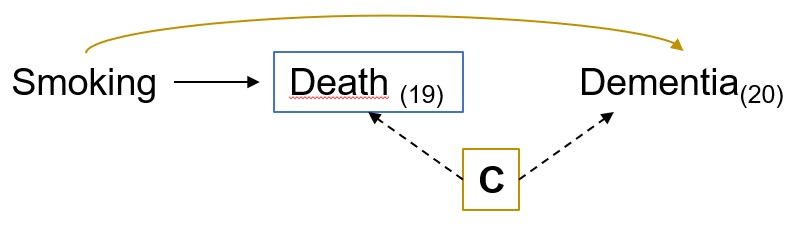
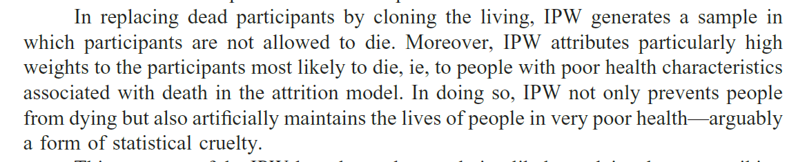

```{r setup, include=FALSE}
options(htmltools.dir.version = FALSE)
knitr::opts_chunk$set(
  fig.width=9, fig.height=3.5, fig.retina=3,
  out.width = "100%",
  cache = FALSE,
  echo = FALSE,
  message = FALSE, 
  warning = FALSE,
  hiline = TRUE
)

library(tidyverse)
library(gt)
library(knitr)
library(fontawesome)
```

```{r xaringan-themer, include=FALSE, warning=FALSE}
library(xaringanthemer)
style_mono_accent(
 base_color = "#8bb8e8",
  text_bold_color = "#005587",
  header_color = "#2774AE",
  black_color = "#002B43",
  table_row_even_background_color = "#FFFFFF",
  title_slide_text_color = "#2774AE",
  table_border_color = "#8bb8e8",
 text_font_size = "24px")

```

background-image: url(./figs/logo.png), url(./figs/ser.jpg)
background-position: 5% 95%, 95% 95%
background-size: 28%, 25%
class: center, middle

## When survival bias is not truly a bias, but rather the correct answer to the wrong question


.center[

L. Paloma Rojas-Saunero MD, PhD
<br>
Postdoctoral scholar
<br>
Department of Epidemiology, UCLA

]

???
Thank you very much for inviting me to join this exciting discussion. My talk, titled “When survival bias is not truly a bias, but rather the correct answer to the wrong question” will shift focus to the selective selection process that happens after inclusion into the study due to competing events.

---
## Competing events

Events that _preclude*_ the outcome of interest.

--

.center[

]

???
So for example, lets imagine our goal was to estimate the effect of quitting smoking in late-life on dementia risk over 20 years of follow-up, and we had ideal circumstances meaning that we had a representative study population, perfect randomization, perfect adherence and continuous screening of dementia over the study period with no loss to follow-up....

---
## Competing events

Events that _preclude*_ the outcome of interest.


.center[

]

???

even so, some participants may die for other reasons prior to having dementia - so here death acts as a competing event because it prevents from having dementia in the subsequent timepoints. In addition, we know that dementia and death have shared risk factors, represented by C. So, conditioning on survival, the box around death, opens a backdoor path between and smoking and dementia. A classic collider-bias but -> is... is this really bias?

As everything in epi, it depends...we cant conceptualize bias without defining the research question or estimand in the first place. So how do we incorporate them as part of the research question or estimands? 

---
## Causal estimands

- Contrast of (counterfactual) outcome distributions in the **same individuals** but under **different levels of exposure**.

- The only explanation for a difference is the exposure, not comparing different individuals.


???

To set the stage, when I refer to causal estimands I refer to 
contrast of (counterfactual) outcome distributions in the **same individuals** but under **different levels of exposure**.

and that the only explanation for a difference is... this is one of the reasons that I will refrain from discussin incidence rates or hazards, and focus on cumulative incidence or risks throughout this presentation

So in settings with competing events, we have 2 causal estimands that have been popular on statistical literature

---
## Total effect

--

<br>

.center[
.middle[

What is the risk** of dementia at 20 years of follow-up had all individuals stopped smoking, compared to had all individuals continued smoking?

$$Pr[Y_{20}^{a = 1} = 1] - Pr[Y_{20}^{a = 0} = 1]$$

]]

--


--

** _Cause-specific cumulative incidence_ or _crude_ risk

---
## Controlled direct effect

<br>

.center[
.middle[

What is the risk** of dementia at 20 years of follow-up had all individuals stopped smoking _and not died_ during the study period, compared to had all individuals continued smoking _and not died_ ?


$$Pr[Y_{20}^{a = 1, d_{19} = 0} = 1] - Pr[Y_{20}^{a = 0, d_{19} = 0} = 1]$$

]
]

--


--

** _Marginal_ or _net_ risk

---
## Controlled direct effect

<br>

.center[.middle[

What is the risk** of dementia at 20 years of follow-up had all individuals stopped smoking _and not died_ during the study period, compared to had all individuals continued smoking _and not died_ ?


$$Pr[Y_{20}^{a = 1, d_{19} = 0} = 1] - Pr[Y_{20}^{a = 0, d_{19} = 0} = 1]$$

]]




** _Marginal_ or _net_ risk

???
So up to now, we can see that these two questions have very different interpretations and rely on different assumptions

---
### Identifiability assumptions for death (competing event)

```{r}
table <- tibble::tribble(
  ~ "<b> Assumption </b>",
  ~ "<b> Total Effect </b>",
  ~ "<b> Controlled direct effect </b>",
  "<b> Exchangeability </b>",
  "Not needed",
  "Death is independent of future outcomes had everyone followed A = a and death was eliminated, conditional on covariates",
  "<b> Positivity </b>",
  "Not needed",
  "At every follow-up time, there are individuals with any possibly observed level A = a and covariate history who remain alive and free of dementia diagnosis.",
  "<b> Consistency </b>",
  "Not needed",
  "An intervention that “eliminates death” is well-defined."
)

table %>% slice(1) %>% gt() %>% 
  tab_options(
    table.font.size = 22
  ) %>% 
      cols_width(
    "<b> Assumption </b>" ~ px(200),
    "<b> Total Effect </b>" ~ px(150),
    "<b> Controlled direct effect </b>" ~ px(350))
```

---
### Identifiability assumptions for death (competing event)

```{r}
table %>% slice(1:2) %>% gt() %>% 
  tab_options(
    table.font.size = 22
  ) %>% 
    cols_width(
    "<b> Assumption </b>" ~ px(200),
    "<b> Total Effect </b>" ~ px(150),
    "<b> Controlled direct effect </b>" ~ px(350))
```

---
### Identifiability assumptions for death (competing event)

```{r}
table %>% gt() %>%   tab_options(
    table.font.size = 22
  ) %>% 
      cols_width(
    "<b> Assumption </b>" ~ px(200),
    "<b> Total Effect </b>" ~ px(150),
    "<b> Controlled direct effect </b>" ~ px(350))
```

---
### Smoking cessation on dementia risk over 20 years


.footnote[Rojas-Saunero et al. AJE.2023]

---
### Incident stroke on dementia risk in Asian American and White population in California

.center[


]

.footnote[Rojas-Saunero et al. _Work in progress._]

---
## Why this matters in health disparities research

--

- Mortality rates are often higher for marginalized populations.

--

- Descriptive, predictive or causal estimation of dementia risk will be impacted by differential mortality.

--

- We can either allow the disparity effect measure to be impacted by the effect of death or we can try to imagine an scenario were we could have eliminated death.

---
## The controlled direct effect estimand


_Survival R Package documentation. Thernau 2023._

--


_Chaix et al. Epidemiology.2012_
--


_Andersen & Keiding. Statistics in Medicine. 2012._

---
## History of competing events analysis

- During the smallpox epidemic (18th century), smallpox inoculation was a controversial therapy.

--

- Bernoulli compared the observed life expectancy to a counterfactual scenario that **eliminates smallpox deaths** assuming a hypothethical scenario were every person was innoculated at birth.

--

- Therefore smallpox inoculation (as a vaccine) would improve life expectancy for the population at that time.


.footnote[Karn. 1931; Colombo & Diamanti. 2015]

---
## Other possible estimands

- **Composite outcome of dementia and death**

--

- **Survivors average causal effect:** 

$$Pr[Y_{t}^{a = 1} = 1 |\bar{D}_{t}^{a = 1} = \bar{D}_{t}^{a = 0} = 0] - Pr[Y_{t}^{a = 0} = 1 |\bar{D}_{t}^{a = 1} = \bar{D}_{t}^{a = 0} = 0]$$

--

- **Natural direct effects**:

$$Pr[Y_{t}^{a = 1, \bar{D}_{t}^{a = 0}} = 1] - Pr[Y_{t}^{a = 0, \bar{D}_{t}^{a = 0}} = 1]$$
--

- **Separable effects**
  - Physical decomposition of the exposure assumed to operate on dementia and death through separate pathways. (_Stensrud et al. JASA. 2020_)

---
## Conclusion

- When competing events are present there is not one but several way to consider them as part of the primary research question.

--

- Being explicit about the question, allows us to understand the potential sources of bias, and helps us choose between estimators.

--

- We can extend these concepts to exploring the selective process before inclusion into the study.


---
class: middle, right

#### _To search for all the refutable consequences of a hypothesis demands highly imaginative thinking. Imagination is needed to arrive at the hypothesis in the first place, let alone to suggest rigorous tests for it. (Carol Buck)_ 

.footnote[
_Buck C. Popper's Philosophy for Epidemiologists, IJE. 1975_
]


---
class: center, middle
# Thank you! Gracias!

<br> <br>

`r fa("paper-plane")`</i>&nbsp;lp.rojassaunero@ucla.edu</a><br>

`r fa("twitter")` <a href="http://twitter.com/palolili23"> </i>&nbsp; @palolili23</a><br>

`r fa("github")` <a href="https://github.com/palolili23"> </i>&nbsp; @palolili23</a><br>
