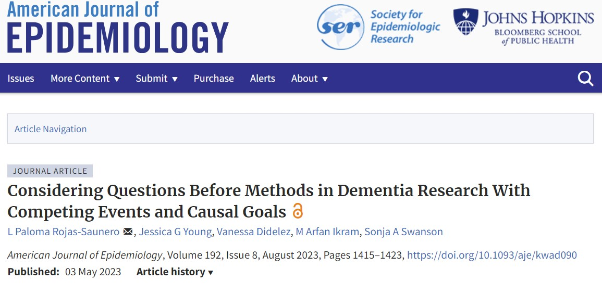
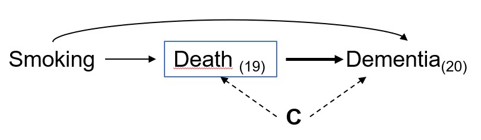
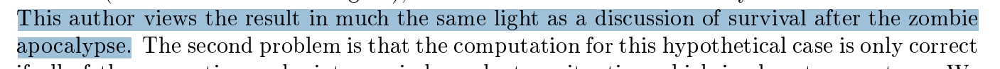
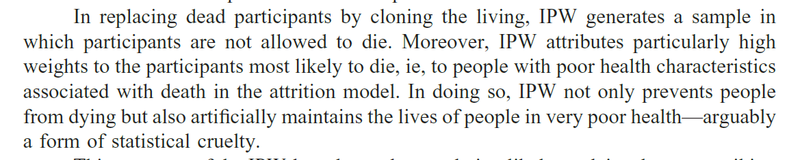

```{r setup, include=FALSE}
options(htmltools.dir.version = FALSE)

knitr::opts_chunk$set(
  fig.retina=3,
  out.width = "100%",
  cache = FALSE,
  echo = FALSE,
  message = FALSE, 
  warning = FALSE,
  hiline = TRUE
)

library(tidyverse)
library(gt)
library(knitr)
library(fontawesome)
```

```{r xaringan-themer, include=FALSE, warning=FALSE}
library(xaringanthemer)
style_mono_accent(
 base_color = "#8bb8e8",
  text_bold_color = "#005587",
  header_color = "#2774AE",
  black_color = "#002B43",
  table_row_even_background_color = "#FFFFFF",
  title_slide_text_color = "#2774AE",
  table_border_color = "#8bb8e8",
 text_font_size = "22px")

```

background-image: url(./figs/logo.png)
background-position: 5% 95%
background-size: 35%
class: center, middle

## Understanding the Role of Competing Events in Dementia Research 
### The Need for Multiple Estimands

<br>

.pull.right[

L. Paloma Rojas-Saunero MD, PhD
<br>
Postdoctoral scholar
<br>
Department of Epidemiology

]

???
Hi, I feel honored by the opportunity to present in this seminar series. Today i will discuss the role of competing events in dementia research, and talk about several estimands. I really hope that this talk is rather a conversation, so please feel free to chime and interrupt me if you have questions.

---
background-image: url(./figs/economist_2022.jpg)
background-size: 90%

.footnote[https://www.economist.com/graphic-detail/2022/01/11/]

???
Alzheimer’s disease and related dementias are a global public health issue, disproportionately affecting women and underserved populations, including those in LMICs. Despite the growing burden, there is limited understanding of the underlying causes and little success in developing effective therapies.

---

background-image: url(./figs/hill.jpg)
background-size: 75%

.footnote[Hill et al. _Ethnicity and disease_. 2015]

???
The National Institute of Aging proposed a Health Disparities Research Framework to conceptualize environmental, social, behavioral and biological factors contributing to dementia. The goal is that future research can identify causal pathways and intervention to reduce dementia disparities. Now, this includes exposures that are often considered “ill-defined”. I would be very happy to discuss about Ill-defined exposures as well, in the Q&A, but for now I ask you to keep an open mind and embrace that dementia research aims to answer causal questions about complex exposures. 

Now, a challenge we face is that most of this factors impact death, which is a competing event in dementia research
---

## Competing events


Events that _preclude*_ the outcome of interest.

- *to prevent the existence, or occurrence of; make impossible

--

.center[


]

???

Understanding how to address this challenge is crucial on observational data, because it can lead to erroneous interpretations.

---
background-image: url(./figs/press1.PNG)
background-size: 75%

.footnote[www.express.co.uk, 2016]

???

For example, in 2016, a group of researchers concluded that people that smoked had a lower risk of dementia compared to never smokers, and used an inductive approach to explain the nicotine could be the biological mechanism that could drive this association.

---
background-image: url(./figs/press2.PNG)
background-size: 75%

.footnote[Medscape, 2019]

???
A few years later, a new study found that there was no association, after accounting for the competing event of death.
But what does that account mean? what is the method of choice for this setting?

---
background-image: url(./figs/cr_austin.PNG)
background-size: 65%

## Cause-specific vs. subdistribution HR 

.footnote[Austin et al. _Circulation_.2016]

???
Several statisticians and epidemiologists suggest that cs-hazard should be used for... 
and subdistribution hr but this recommendation does not emphasize interpretation at all. 

---
## Systematic Review

**Searching criteria**

- Original research published between Jan/2018 to Dec/2019

- Dementia/AD & longitudinal/cohort & hazard/risk 

- Alzheimer’s and Dementia, Annals of Neurology, BMJ, Neurology, JAMA, Jama Neurology, Lancet, Lancet Neurology

???
During my Phd I did a systematic review to see what was the most common approach for handling competing events in dementia research with causal aims. 

--

**Eligibility criteria** 

- Time-to-dementia/AD as primary or co-primary outcome

- With a clear exposure/intervention, and uses methods to handle confounding

- Not a descriptive or predictive aim

---

## Results

Out of **57/209** papers included:

???
We found that there is limited descriptive information about death on cohort studies, and most studies use cox models and report hazards.
One particular point is that most studies interpret hazards as risks in the results, discussion and conclusion section.

--

- **Half** report death numbers, **1/5** report death by exposure level

--

- **Half** do not include any description about death in the methods section, **1/4** consider competing events as part of a sensitivity analysis

--

- **9/10** uses Cox PH models and present hazard ratios
 
--

- **9/10** inaccurate interpretations (e.g. "hazards are interpreted as risks")

---
## The hazard of hazard ratios

???
Many of us are likely familiar with the intrinsic limitations of hazard ratios. Despite methods to move away from hazards and derive adjusted cumulative incidence and contrasts, these approaches are underutilized in applied research. Addressing this gap is critical, as misinterpretations can lead to flawed conclusions.

--
.pull-left[

]

.footnote[
_Work in progress. Gradwohl N et al._
]

???
For instance, several studies suggest that hypertension at older ages might reduce dementia risk, and refer to biological mechanisms to support this claim. In a recent project from my group, we showcase that indeed hazard ratios for this relationship shift toward the null at older ages.

--

.pull-right[

]

???
However, When we look at absolute risk differences, we observed a different story: individuals with hypertension have a higher cumulative incidence of dementia over time, with differences growing substantially at older ages.   


---
background-image: url(./figs/chain2.PNG)
background-size: 80%

???
This reflects that there is lack of communication between

---
background-image: url(./figs/simqr.png)
background-position: 95% 95%
background-size: 15%
class: center, middle


???
Fortunately, Jessica Young and colleagues published this fundamental paper a few years ago, which connects causal estimands to common estimators used in survival analysis. 

---
background-image: url(./figs/ajeqr.png)
background-position: 95% 95%
background-size: 15%
class: center, middle

.center[



]

???
So few years after, we translated that paper to an epi audience, so now I will discuss this work.

---
## Causal estimands

- Contrast of (counterfactual) outcome distributions in the **same individuals** but under **different levels of exposure**

- The only explanation for a difference is the exposure, not comparing different individuals

---


class: center, middle



---
## Total effect

--

<br>

.center[
.middle[

What is the risk** of dementia at 20 years of follow-up had all individuals stopped smoking, compared to had all individuals continued smoking?

$$Pr[Y_{20}^{a = 1} = 1] - Pr[Y_{20}^{a = 0} = 1]$$

]]

--


--

** _Cause-specific cumulative incidence_ or _crude_ risk

---
## Controlled direct effect

<br>

.center[
.middle[

What is the risk** of dementia at 20 years of follow-up had all individuals stopped smoking _and not died_ during the study period, compared to had all individuals continued smoking _and not died_ ?


$$Pr[Y_{20}^{a = 1, d_{19} = 0} = 1] - Pr[Y_{20}^{a = 0, d_{19} = 0} = 1]$$

]
]

--


--

** _Marginal_ or _net_ risk

---
## Controlled direct effect

<br>

.center[.middle[

What is the risk** of dementia at 20 years of follow-up had all individuals stopped smoking _and not died_ during the study period, compared to had all individuals continued smoking _and not died_ ?


$$Pr[Y_{20}^{a = 1, d_{19} = 0} = 1] - Pr[Y_{20}^{a = 0, d_{19} = 0} = 1]$$

]]


** _Marginal_ or _net_ risk

???
So up to now, we can see that these two questions have very different interpretations and rely on different assumptions

---
## Identifiability assumptions for death

```{r}
table <- tibble::tribble(
  ~ "<b> Assumption </b>",
  ~ "<b> Total Effect </b>",
  ~ "<b> Controlled direct effect </b>",
  "<b> Exchangeability </b>",
  "Not needed",
  "Death is independent of future outcomes had everyone followed A = a and death was eliminated, conditional on covariates",
  "<b> Positivity </b>",
  "Not needed",
  "At every follow-up time, there are individuals with any possibly observed level A = a and covariate history who remain alive and free of dementia diagnosis",
  "<b> Consistency </b>",
  "Not needed",
  "An intervention that “eliminates death” is well-defined"
)

table %>% slice(1) %>% gt() %>% 
  tab_options(
    table.font.size = 22
  ) %>% 
      cols_width(
    "<b> Assumption </b>" ~ px(200),
    "<b> Total Effect </b>" ~ px(150),
    "<b> Controlled direct effect </b>" ~ px(350))
```

---
## Identifiability assumptions for death

```{r}
table %>% slice(1:2) %>% gt() %>% 
  tab_options(
    table.font.size = 22
  ) %>% 
    cols_width(
    "<b> Assumption </b>" ~ px(200),
    "<b> Total Effect </b>" ~ px(150),
    "<b> Controlled direct effect </b>" ~ px(350))
```
???
Independent censoring assumption

---
## Identifiability assumptions for death

```{r}
table %>% gt() %>%   tab_options(
    table.font.size = 22
  ) %>% 
      cols_width(
    "<b> Assumption </b>" ~ px(200),
    "<b> Total Effect </b>" ~ px(150),
    "<b> Controlled direct effect </b>" ~ px(350))
```

---

## Smoking cessation on dementia risk over 20 years

<br><br>
```{r}

res <- tibble::tribble(
  ~ "<b> Causal effect </b>",
  ~ "<b> Risk Difference (95%CI) </b>",
  ~ "<b> Risk Ratio (95%CI) </b>",
  "<b> Total effect on dementia </b>",
  "2.1 (-0.1, 4.2)",
  "1.21 (0.99, 1.50)",
  "<b> Controlled direct effect on dementia (with IPCW for death) </b>",
  "-2.6 (-6.1, 0.8)",
  "0.86 (0.72, 1.05)",
  "<b> Total effect on mortality </b>",
  "-17.4 (-20.5, -14.2)",
  "0.68, (0.63, 0.72)"
)

res %>% gt() %>% tab_options(
    table.font.size = 18
  ) %>% 
    cols_width(
    "<b> Causal effect </b>" ~ px(250),
    "<b> Risk Difference (95%CI) </b>" ~ px(250),
    "<b> Risk Ratio (95%CI) </b>" ~ px(200))
```

---
## Exchangeability assumption for death as censoring event


```{r}

res2 <- tibble::tribble(
  ~ "<b> Assumption </b>",
  ~ "<b> Risk Difference (95%CI) </b>", 
  ~ "<b> Risk Ratio (95%CI) </b>",
"<b> Evoking unconditional exchangeability </b>",
"-0.7 (-3.3, 2.2)",
"0.96 (0.82, 1.16)",
"<b> Evoking conditional exchangeability on baseline covariates </b>",
"-1.5 (-4.6, 1.8)",		
"0.92 (0.78, 1.12)",		
"<b> Evoking conditional exchangeability on baseline and time-varying covariates</b>",
"-2.7 (-6.1, 0.8)",
"0.86 (0.7, 1.1)")

res2 %>% gt() %>% tab_options(
    table.font.size = 18
  ) %>% 
    cols_width(
    "<b> Assumption </b>" ~ px(250),
    "<b> Risk Difference (95%CI) </b>" ~ px(250),
    "<b> Risk Ratio (95%CI) </b>" ~ px(200))
```

???
we also show, depending on how we chose to evoke, and what we accomplished this, we would get different answers

---
## Bounds for the controlled direct effect

???
Now, since we know that the exchangeability assumption is not verifyiable, if we are concerned about this assumption we...

We can calculate bounds to evaluate extreme scenarios of dependency between death and dementia

--

- Lower bound: All those who died would not have had dementia
  - Cause-specific cumulative risk contrast

- Upper bound: Everyone who died would have had dementia around the same time of death
  - Risk for the composite outcome for dementia and death contrast


.footnote[Peterson. _PNAS_. 1976; van Geloven. _Statistics in Medicine_. 2014]

---
### Incident stroke on dementia risk in Asian American and White population in California

.center[


]

.footnote[Rojas-Saunero et al. _Under review._]

???
In a recent work understanding the effect of the acute event of stroke on dementia risk in AA populations, we found that under a CDE we would see a large effect of stroke on dementia, and as opposed a total effect would show the opposite. We opted to show both and discuss interpretations and assumptions. 

---
## Competing events in health disparities research

--

- Mortality rates are often higher for marginalized populations

--

- Descriptive, predictive or causal contrasts comparing dementia risk between two groups (_disparity estimand_) will be impacted by differential mortality

--

- We can either allow the disparity estimand to be mediated by the effect of death, or chose estimands that somehow remove the impact of  death 

--

- Effect heterogeneity in stratified analyses will also depend on the distribution of competing events.

.footnote[Rojas-Saunero LP, Glymour MM, Mayeda ER. _Curr Epidemiol Rep_. 2024]

---
## Controlled direct effect controversies


Thernau. _Survival R Package documentation_. 2023

--


Chaix et al. _Epidemiology_. 2012

--


Andersen & Keiding. _Statistics in Medicine._ 2012

---
background-image: url(./figs/smallpox.jpg)
background-size: 50%

## History of competing events analysis

.footnote[During the 18th century smallpox epidemic, smallpox inoculation was a controversial therapy]

---
## History of competing events analysis

- Bernoulli wanted to estimate how inoculation affected life expectancy, treating smallpox deaths as a competing event for other causes of death

--

- He compared a hypothetical scenario of universal inoculation (eliminating smallpox deaths) to observed life expectancy, concluding innoculation would increase life expectancy

--

- D’Alembert criticized Bernoulli’s approach before the Académie des Sciences, arguing it introduced subjective biases into mathematical probability, shaped by moral and political views.

--

- Counterfactual scenarios, such as preventing tuberculosis or cancer deaths, became increasingly popular for studying life expectancy.

.footnote[Colombo & Diamanti. _Lettera Matematica._ 2015; Gosztonyi. _Educational Studies in Mathematics_. 2021]

---
## Other estimands

- **Composite outcome of dementia and death**

- **Survivors average causal effect:** 

$$Pr[Y_{t}^{a = 1} = 1 |\bar{D}_{t}^{a = 1} = \bar{D}_{t}^{a = 0} = 0] - Pr[Y_{t}^{a = 0} = 1 |\bar{D}_{t}^{a = 1} = \bar{D}_{t}^{a = 0} = 0]$$

- **Natural direct effects**:

$$Pr[Y_{t}^{a = 1, \bar{D}_{t}^{a = 0}} = 1] - Pr[Y_{t}^{a = 0, \bar{D}_{t}^{a = 0}} = 1]$$
???
The SACE would refer to a subset of the original population who would never experience the competing event regardless of the intervention

---

## Separable effects

Effects of modified treatments motivated by the physical decomposition of the exposure assumed to operate on dementia and death through separate pathways

.center[


]

.footnote[Stensrud et al. _JASA_. 2020]

---

## Summary

- When competing events are present there is more than one way to consider them as part of the primary research question

--

- Let the question guide the most appropriate methods and estimators

--

- We need to communicate that all these questions are possible with their trade-offs, rather than continuing a narrative that _"One size fits all"_

--

- Collaborative work between applied researchers, epidemiologists and statisticians should narrow the gap between methods development and applied research

---
## Next steps

- How do we map these estimands for continuous outcomes with death as a truncation event? 

--

- What can we do if we only have data on those who survived up to certain age?


---
class: middle, right

#### _To search for all the refutable consequences of a hypothesis demands highly imaginative thinking. Imagination is needed to arrive at the hypothesis in the first place, let alone to suggest rigorous tests for it. (Carol Buck)_ 

.footnote[
Buck C. Popper's Philosophy for Epidemiologists. _IJE._ 1975
]


---
class: center, middle
# Thank you! Gracias!

<br> <br>


`r fa("paper-plane")`</i>&nbsp;lp.rojassaunero@ucla.edu</a><br>

`r fa("github")` <a href="https://github.com/palolili23"> </i>&nbsp; @palolili23</a><br>

@palolili23.bsky.social