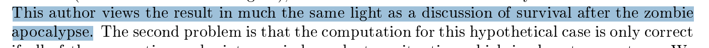

```{r setup, include=FALSE}
options(htmltools.dir.version = FALSE)

knitr::opts_chunk$set(
  fig.retina=3,
  out.width = "100%",
  cache = FALSE,
  echo = FALSE,
  message = FALSE, 
  warning = FALSE,
  hiline = TRUE
)

library(tidyverse)
library(gt)
library(knitr)
library(fontawesome)
```

```{r xaringan-themer, include=FALSE, warning=FALSE}
library(xaringanthemer)
style_mono_accent(
 base_color = "#8bb8e8",
  text_bold_color = "#005587",
  header_color = "#2774AE",
  black_color = "#002B43",
  table_row_even_background_color = "#FFFFFF",
  title_slide_text_color = "#2774AE",
  table_border_color = "#8bb8e8",
 text_font_size = "22px")

```

background-image: url(./figs/logo.png)
background-position: 5% 95%
background-size: 35%
class: center, middle

## Considerando la pregunta antes que los métodos en investigación sobre de demencia cuando hay eventos competitivos
<br>

.pull.right[

L. Paloma Rojas-Saunero MD, PhD
<br>
Postdoctoral scholar
<br>
Department of Epidemiology

]

???
Hi, I feel honored by the opportunity to present in this seminar series. Today i will discuss the role of competing events in dementia research, and talk about several estimands. I really hope that this talk is rather a conversation, so please feel free to chime and interrupt me if you have questions.

---
## Un poco sobre mi....

.pull-left[

- Soy de La Paz, Bolivia (3,650 m sobre el nivel del mar)

- Médico egresada de la Universidad Mayor de San Andrés.

- Master in Investigación Clínica, Hospital Italiano de Buenos Aires, Argentina

- Especialización en Estadística para Ciencias de la Salud, Universidad de Buenos Aires, Argentina

]

.pull-right[


]

.footnote[ _Photo by @lalibelle - reposted @howtolapaz_ ]

---
## Un poco sobre mi...

.pull-left[

- PhD en Epidemiología, Erasmus MC,
Rotterdam, Netherlands

]

.pull-right[


]

.footnote[ _Illustration by Lucia Mayorga Garrido Cortés_ ]

---
background-image: url(./figs/economist_2022.jpg)
background-size: 90%

.footnote[https://www.economist.com/graphic-detail/2022/01/11/]

???
La enfermedad de Alzheimer y las demencias relacionadas son un problema de salud pública mundial que afecta de manera desproporcionada a las mujeres y a las poblaciones desatendidas, incluidas las de los países de ingresos bajos y medianos. A pesar de la creciente carga, existe una comprensión limitada de las causas subyacentes y poco éxito en el desarrollo de terapias efectivas.

---

background-image: url(./figs/hill.jpg)
background-size: 75%

.footnote[Hill et al. _Ethnicity and disease_. 2015]

???
El Instituto Nacional del Envejecimiento propuso un marco de investigación sobre disparidades en salud para conceptualizar los factores ambientales, sociales, conductuales y biológicos que contribuyen a la demencia. El objetivo es que investigaciones futuras puedan identificar vías causales e intervenciones para reducir las disparidades en la demencia. Ahora bien, esto incluye exposiciones que a menudo se consideran "mal definidas". 

Ahora, un desafío que enfrentamos es que la mayoría de estos factores impactan la muerte, que es un evento competitivo en la investigación de la demencia.
---

### Eventos competitivos


Eventos que that _imposibilitan*_ el evento de desenlace.

- *previenen la existencia u ocurrencia

--

.center[


]

???
Entender como resolvemos este reto con datos observaciones es super importante porque puede llevar a interpretaciones equivocadas

---
background-image: url(./figs/press1.PNG)
background-size: 75%

.footnote[www.express.co.uk, 2016]

???

Por ejemplo, el 2016, un grupo de investigadores concluyeron que las personas que fuman tienen menos riesgo de demencia que las que nunca fumaron, y usaron un metodo inductivo para explicar que la nicotina podia explicar este mecanismo biológico que explique esta asociacion

---
background-image: url(./figs/press2.PNG)
background-size: 75%

.footnote[Medscape, 2019]

???
A few years later, a new study found that there was no association, after accounting for the competing event of death.
But what does that account mean? what is the method of choice for this setting?

---
background-image: url(./figs/cr_austin.PNG)
background-size: 65%

### Cause-specific vs. subdistribution HR 

.footnote[Austin et al. _Circulation_.2016]

???
Several statisticians and epidemiologists suggest that cs-hazard should be used for... 
and subdistribution hr but this recommendation does not emphasize interpretation at all. 

---
### Revisión sistematica

**Criterios de búsqueda**

- Investigación publicada entre Enero/2018 a Diciembre/2019

- Demencia/AD & longitudinal/cohorte & hazard/riesgo 

- Alzheimer’s and Dementia, Annals of Neurology, BMJ, Neurology, JAMA, Jama Neurology, Lancet, Lancet Neurology

???
During my Phd I did a systematic review to see what was the most common approach for handling competing events in dementia research with causal aims. 

--

**Criterios de elegibilidad** 

- Tiempo a demencia/AD como evento primario

- Con una intervención/exposición clara, usa métodos para eliminar el sesgo de confución

- No tiene un objetivo descriptivo o predictivo

---

### Resultados

De **57/209** papers publicados:

???
We found that there is limited descriptive information about death on cohort studies, and most studies use cox models and report hazards.
One particular point is that most studies interpret hazards as risks in the results, discussion and conclusion section.

--

- **Mitad** reportan frequecia de mortalidad, **1/5** reporta mortalidad para cada nivel de exposición

--

- **Mitad** no incluye ningula descripción sobre muerte en los métodos, **1/4** considera el análisis de eventos competitivos como análisis de sensibilidad

--

- **9/10** usa modelos de Cox PH y presenta hazard ratios
 
--

- **9/10** interpretaciones incorrectas (ej. "hazards interpretados como riesgo acumulado")

---
#### El riesgo de los cocientes de riesgos instantáneos (_The hazard of hazard ratios_)

.center[


]

.footnote[Stensrud et al. _Eur Heart J_. 2019]

---
#### El riesgo de los cocientes de riesgos instantáneos (_The hazard of hazard ratios_)


???
Many of us are likely familiar with the intrinsic limitations of hazard ratios. Despite methods to move away from hazards and derive adjusted cumulative incidence and contrasts, these approaches are underutilized in applied research. Addressing this gap is critical, as misinterpretations can lead to flawed conclusions.

--
.pull-left[

]

.footnote[
_Work in progress. Gradwohl N et al._
]

???
For instance, several studies suggest that hypertension at older ages might reduce dementia risk, and refer to biological mechanisms to support this claim. In a recent project from my group, we showcase that indeed hazard ratios for this relationship shift toward the null at older ages.

--

.pull-right[

]

???
However, When we look at absolute risk differences, we observed a different story: individuals with hypertension have a higher cumulative incidence of dementia over time, with differences growing substantially at older ages.   


---
background-image: url(./figs/chain2.png)
background-size: 80%

???
This reflects that there is lack of communication between

---
background-image: url(./figs/simqr.png)
background-position: 95% 95%
background-size: 15%
class: center, middle


???
Fortunately, Jessica Young and colleagues published this fundamental paper a few years ago, which connects causal estimands to common estimators used in survival analysis. 

---
background-image: url(./figs/ajeqr.png)
background-position: 95% 95%
background-size: 15%
class: center, middle

.center[


]

???
So few years after, we translated that paper to an epi audience, so now I will discuss this work.

---
### Estimandos causales

- Contraste de la distribución en el evento de deselance bajo distintos contrafactuales, en las **mismas personas** pero bajo **diferentes niveles de exposición**

- La única explicación para una diferencia es la exposición, no comparar diferentes personas.
---


class: center, middle


---
### Efecto total

--

<br>

.center[
.middle[

Cuál es el riesgo** de demencia a los 20 años de seguimiento, si todas las personas hubiesen dejado de fumar vs. si las personas todas hubiesen continuado fumando?

$$Pr[Y_{20}^{a = 1} = 1] - Pr[Y_{20}^{a = 0} = 1]$$

]]

--


--

** _Cause-specific cumulative incidence_ or _crude_ risk

---
### Efecto directo controlado (_controlled direct effect_)

<br>

.center[
.middle[

Cuál es el riesgo** de demencia a los 20 años de seguimiento, si todas las personas hubiesen dejado de fumar _y no hubiesen muerto_ vs. si las personas todas hubiesen continuado fumando _y no hubiesen muerto_?


$$Pr[Y_{20}^{a = 1, d_{19} = 0} = 1] - Pr[Y_{20}^{a = 0, d_{19} = 0} = 1]$$

]
]

--


--

** _Marginal_ or _net_ risk

---
### Efecto directo controlado (_controlled direct effect_)

<br>

.center[
.middle[

Cuál es el riesgo** de demencia a los 20 años de seguimiento, si todas las personas hubiesen dejado de fumar _y no hubiesen muerto_ vs. si las personas todas hubiesen continuado fumando _y no hubiesen muerto_?

$$Pr[Y_{20}^{a = 1, d_{19} = 0} = 1] - Pr[Y_{20}^{a = 0, d_{19} = 0} = 1]$$

]]


** _Marginal_ or _net_ risk

???
So up to now, we can see that these two questions have very different interpretations and rely on different assumptions

---
### Supuestos de identificación para muerte

```{r}
table <- tibble::tribble(
  ~ "<b> Supuesto </b>",
  ~ "<b> Efecto Total </b>",
  ~ "<b> Efecto Directo Controlado </b>",
  "<b> Intercambiabilidad </b>",
  "No es necesario",
  "Muerte es independiente de los resultados futuros si todos hubieran seguido A = a y se hubiera eliminado muerte, condicional en las covariables",
  "<b> Positivity </b>",
  "No es necesario",
  "Durate el seguimiento, hay personas con cualquier nivel posible observado A = a y covariables que permanecen vivas y sin diagnóstico de demencia.",
  "<b> Consistency </b>",
  "No es necesario",
  "La intervención “elimina muerte” esta bien definida"
)

table %>% slice(1) %>% gt() %>% 
  tab_options(
    table.font.size = 22
  ) %>% 
      cols_width(
    "<b> Supuesto </b>" ~ px(200),
    "<b> Efecto Total </b>" ~ px(150),
    "<b> Efecto Directo Controlado </b>" ~ px(350))
```

---
### Supuestos de identificación para muerte

```{r}
table %>% slice(1:2) %>% gt() %>% 
  tab_options(
    table.font.size = 22
  ) %>% 
    cols_width(
    "<b> Supuesto </b>" ~ px(200),
    "<b> Efecto Total </b>" ~ px(150),
    "<b> Efecto Directo Controlado </b>" ~ px(350))
```
???
Supuesto de censura independiente

---
### Supuestos de identificación para muerte

```{r}
table %>% gt() %>%   tab_options(
    table.font.size = 22
  ) %>% 
      cols_width(
    "<b> Supuesto </b>" ~ px(200),
    "<b> Efecto Total </b>" ~ px(150),
    "<b> Efecto Directo Controlado </b>" ~ px(350))
```

---

### Dejar de fumar sobre el riesgo de demencia en 20 años

<br><br>
```{r}

res <- tibble::tribble(
  ~ "<b> Efecto Causal </b>",
  ~ "<b> Diferencia de Riesgos (95%CI) </b>",
  ~ "<b> Riesgo Relativo (95%CI) </b>",
  "<b> Efecto Total en demencia </b>",
  "2.1 (-0.1, 4.2)",
  "1.21 (0.99, 1.50)",
  "<b> Efecto Directo controlado en (usando IPCW) </b>",
  "-2.6 (-6.1, 0.8)",
  "0.86 (0.72, 1.05)",
  "<b> Efecto total en mortalidad </b>",
  "-17.4 (-20.5, -14.2)",
  "0.68, (0.63, 0.72)"
)

res %>% gt() %>% tab_options(
    table.font.size = 18
  ) %>% 
    cols_width(
    "<b> Efecto Causal </b>" ~ px(250),
    "<b> Diferencia de Riesgos (95%CI) </b>" ~ px(250),
    "<b> Riesgo Relativo (95%CI) </b>" ~ px(200))
```

---
#### Supuesto de intercambiabilidad para muerte como evento de censura


```{r}

res2 <- tibble::tribble(
  ~ "<b> Supuesto </b>",
  ~ "<b> Diferencia de Riesgos (95%CI) </b>", 
  ~ "<b> Riesgo Relativo (95%CI) </b>",
"<b> Asumiendo intercambiabilidad incondicional </b>",
"-0.7 (-3.3, 2.2)",
"0.96 (0.82, 1.16)",
"<b> Asumiendo intercambiabilidad condicional en variables basales </b>",
"-1.5 (-4.6, 1.8)",		
"0.92 (0.78, 1.12)",		
"<b> Asumiendo intercambiabilidad condicional en variables basales y durante el seguimiento </b>",
"-2.7 (-6.1, 0.8)",
"0.86 (0.7, 1.1)")

res2 %>% gt() %>% tab_options(
    table.font.size = 18
  ) %>% 
    cols_width(
    "<b> Supuesto </b>" ~ px(250),
    "<b> Diferencia de Riesgos (95%CI) </b>" ~ px(250),
    "<b> Riesgo Relativo (95%CI) </b>" ~ px(200))
```

???
we also show, depending on how we chose to evoke, and what we accomplished this, we would get different answers

---
### Límites (_bounds_) para el efecto directo controlado

???
Now, since we know that the exchangeability assumption is not verifyiable, if we are concerned about this assumption we...

We can calculate bounds to evaluate extreme scenarios of dependency between death and dementia

--

- Límite inferior: Todos los que murieron no habrían tenido demencia
  - Contraste de riesgo acumulativo por causa específica

- Límite superior: todos los que murieron habrían tenido demencia aproximadamente en el mismo momento de la muerte.
  - Riesgo para el evento compuesto de demencia y muerte


.footnote[Peterson. _PNAS_. 1976; van Geloven. _Statistics in Medicine_. 2014]

---
#### Efecto de un accidente cerebrovascular en el riesgo de demencia en población Asiática Americana and Blanca en California

.center[


]

.footnote[Rojas-Saunero et al. _Under review._]

???
In a recent work understanding the effect of the acute event of stroke on dementia risk in AA populations, we found that under a CDE we would see a large effect of stroke on dementia, and as opposed a total effect would show the opposite. We opted to show both and discuss interpretations and assumptions. 

---
### Eventos competitivos en evaluación de inequidades en salud

--

- Las tasas de mortalidad suelen ser más altas en las poblaciones marginalizadas.

--

- Los contrastes descriptivos, predictivos o causales que comparan el riesgo de demencia entre dos grupos (_estimando de disparidad_) se verán afectados por la mortalidad diferencial

--

- Podemos permitir que la estimación de disparidad esté mediada por el efecto de la muerte, o elegir estimandos que de alguna manera eliminen el impacto de la muerte

--

- Para evaluar la heterogeneidad de efecto con análisis estratificados también tenemos que considerar la distribución del evento competitivo


.footnote[Rojas-Saunero LP, Glymour MM, Mayeda ER. _Curr Epidemiol Rep_. 2024]

---
### Controversias del efecto directo controlado


Thernau. _Survival R Package documentation_. 2023

--


Chaix et al. _Epidemiology_. 2012

--


Andersen & Keiding. _Statistics in Medicine._ 2012

---
background-image: url(./figs/smallpox.jpg)
background-size: 50%

### Historia del análisis de eventos competitivos

.footnote[Durante la epidemia de viruela del siglo XVIII, la inoculación contra la viruela fue una terapia controversial]

---
### Historia del análisis de eventos competitivos

- Bernoulli quería estimar cómo la inoculación afectaba la esperanza de vida, tratando muertes por viruela como evento competitivo para otras causas de muerte

--

- Comparó un escenario hipotético de inoculación universal (eliminando las muertes por viruela) vs. la esperanza de vida observada

--

- D'Alembert criticó el trabajo de Bernoulli ante la Academia de Ciencias, argumentando que introdujo subjetividad a probabilidad matemática, atribuyendo principios morales y políticos.

--

- Los escenarios contrafácticos eliminando causas de muerte por tuberculosis o cáncer, se hicieron cada vez más populares para estudiar la esperanza de vida.

.footnote[Colombo & Diamanti. _Lettera Matematica._ 2015; Gosztonyi. _Educational Studies in Mathematics_. 2021]

---
### Otros estimandos

- **Evento compuesto de demencia y muerte**

- **Efecto causal promedio en los sobrevivientes:** 

$$Pr[Y_{t}^{a = 1} = 1 |\bar{D}_{t}^{a = 1} = \bar{D}_{t}^{a = 0} = 0] - Pr[Y_{t}^{a = 0} = 1 |\bar{D}_{t}^{a = 1} = \bar{D}_{t}^{a = 0} = 0]$$

- **Efecto natural directo**:

$$Pr[Y_{t}^{a = 1, \bar{D}_{t}^{a = 0}} = 1] - Pr[Y_{t}^{a = 0, \bar{D}_{t}^{a = 0}} = 1]$$
???
The SACE would refer to a subset of the original population who would never experience the competing event regardless of the intervention

---

### Efectos separables

Efectos de un tratamiento modificado, motivados por la descomposición física de la exposición, separando mecanismos que operan sobre la demencia y la muerte por vías separadas
.center[


]

.footnote[Stensrud et al. _JASA_. 2020]

---

### Resumen

- Cuando hay eventos competitivos, hay más de una manera de considerarlos como parte de la pregunta principal de investigación

--

- Deja que la pregunta oriente los métodos y estimadores más adecuados

--

- Necesitamos comunicar que todas estas preguntas son posibles con sus limitaciones, en lugar de continuar con una narrativa de que "una talla sirve para todos".

--

- El trabajo colaborativo entre investigadores aplicades, epidemiólogues y estadístiques debería reducir la brecha entre el desarrollo de métodos y la investigación aplicada.

---
class: middle, right

#### _Buscar todas las consecuencias refutables de una hipótesis exige un pensamiento muy imaginativo. En primer lugar, se necesita imaginación para llegar a la hipótesis, y aún más para sugerir pruebas rigurosas de la misma. (Carol Buck)_

.footnote[
Buck C. Popper's Philosophy for Epidemiologists. _IJE._ 1975
]


---
class: center, middle
# Muchas Gracias!

<br> <br>


`r fa("paper-plane")`</i>&nbsp;lp.rojassaunero@ucla.edu</a><br>

`r fa("github")` <a href="https://github.com/palolili23"> </i>&nbsp; @palolili23</a><br>

@palolili23.bsky.social