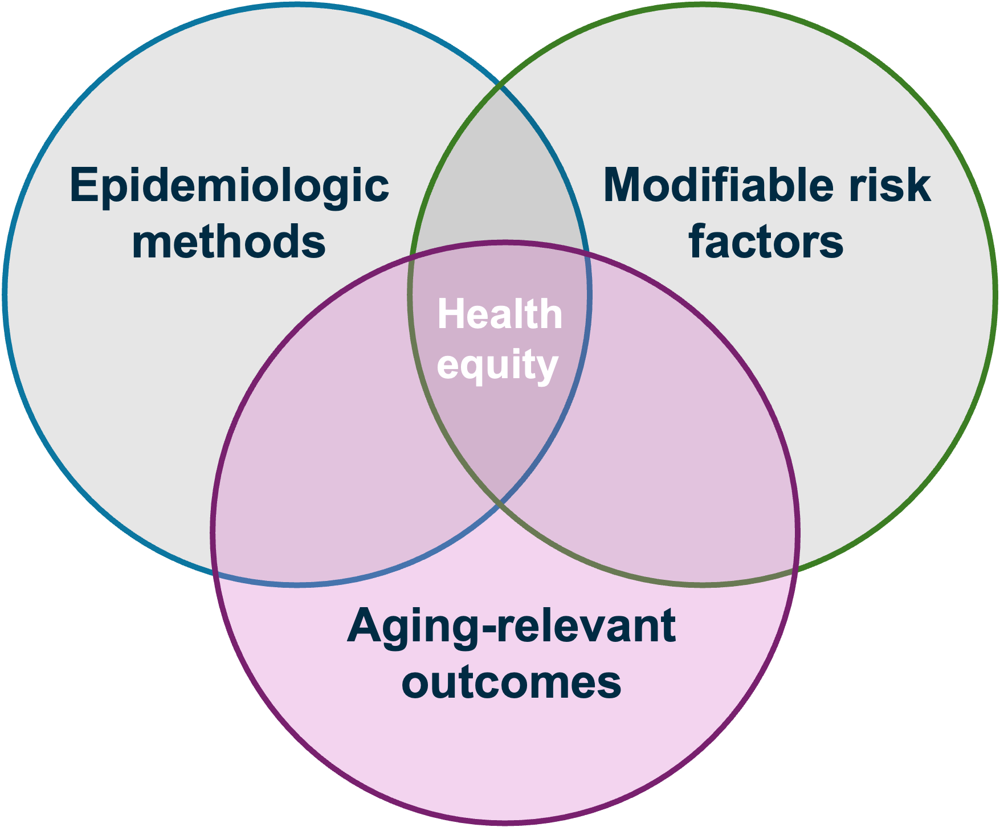

```{r setup, include=FALSE}
options(htmltools.dir.version = FALSE)
knitr::opts_chunk$set(
  fig.width=9, fig.height=3.5, fig.retina=3,
  out.width = "100%",
  cache = FALSE,
  echo = FALSE,
  message = FALSE, 
  warning = FALSE,
  hiline = TRUE
)
library(tidyverse)
library(gt)
library(knitr)
library(fontawesome)
library(xaringanExtra)


```

```{r xaringan-themer, warning=FALSE, include=FALSE}
library(xaringanthemer)
style_mono_accent(
  base_color = "#005587",
  black_color = "#002B43",
  table_row_even_background_color = "#FFFFFF",
  title_slide_text_color = "#FFFFFF",
  table_border_color = "#8bb8e8",
  text_bold_color = "#002B43",
  background_color = "#FFFFFF",
  text_font_size = "28px",
  header_h1_font_size = "2.5rem",
  header_h2_font_size = "2.3rem",
  header_h3_font_size = "1.5rem",
  padding = "16px 64px 16px 32px",
  colors = c(
    yellow = "#ffb81c",
    purple = "#3e2f5b",
    green = "#136f63",
    white = "#FFFFFF"
  ))

```

```{r xaringan-tile-view, echo=FALSE}
xaringanExtra::use_tile_view()
```

class: title-slide, center, middle, inverse
background-image: url(./figs/logo.png)
background-position: 95% 95%
background-size: 28%, 25%

# Advancing .yellow[Health Equity] in .yellow[Aging Research] through a .yellow[Causal Inference] Framework


.center[

L. Paloma Rojas-Saunero MD, PhD
<br>
Postdoctoral scholar
<br>
Department of Epidemiology, UCLA

]

???

---
```{r, echo=FALSE}
xaringanExtra::use_progress_bar("#ffb81c", "top", "0.25em")
```
# Background

.twoCols[
.col[
.smaller[
- **Bolivia**
  + Medicine
  + Undergraduate Research Assistant
]]


.col[
.smaller[

_Healthcare Access and Quality Index, Lancet Global Health, 2022_
]]
]

???
I was born and raised in Bolivia, here in the heart of south america, where I earned my medical degree. This map, from The Lancet Global Health, shows healthcare access and quality index worlwide, and as you can see Bolivia is one of the most disadvantaged countries in the region. Experiencing these health inequities is what fueled my passion for public health.

---
# Background

.twoCols[
.col[
.smaller[
- **Bolivia**
  + Medicine
  + Undergraduate Research Assistant
- **Argentina**
  + Master in Clinical Research/Statistics for Health Sciences
  + Researcher in Clinical Epidemiology
  ]]


.col[
.smaller[

_Healthcare Access and Quality Index, Lancet Global Health, 2022_
]]
]

???
I moved to Argentina, where I earned a Master’s in Clinical Research and completed a two-year graduate program in statistics for health sciences. Here, I mostly worked as clinical researcher in Internal Medicine, Critical Care and Liver Transplant outcomes. 
I taught biostatistics in a master program, and co-founded R-Ladies Buenos Aires, a community of practice to teach programming to women and gender minorities. After working with electronic health records and clinical registries, I realized I needed training in causal inference methods to translata data into meaningful research.


---
# Background

.twoCols[
.col[
.smaller[
- **Bolivia**
  + Medicine
  + Undergraduate Research Assistant
- **Argentina**
  + Master in Clinical Research/Statistics for Health Sciences
  + Researcher in Clinical Epidemiology
- **Mexico**
  + Research Assistant Environmental Epi
]]


.col[
.smaller[

_Healthcare Access and Quality Index, Lancet Global Health, 2022_
]]
]
???
While living in Argentina, I also worked as research assistant for the National Institute of Public Health in Mexico, in a remote position for the Environmental Epi department.
My mentor encouraged me to pursuit a PhD in Epidemiology

---
# Background

.twoCols[
.col[
.smaller[
- **Bolivia**
  + Medicine
  + Undergraduate Research Assistant
- **Argentina**
  + Master in Clinical Research/Statistics for Health Sciences
  + Researcher in Clinical Epidemiology
- **Mexico**
  +  Research Assistant Environmental Epi
- **Netherlands**
  + PhD. in Epidemiology, Erasmus MC
- **United States**
  + Visiting Scholar CAUSALab
- **Germany**
  + Visiting Scholar, Leibniz Inst


]]


.col[
.smaller[

_Healthcare Access and Quality Index, Lancet Global Health, 2022_
]]]

???
I received my PhD in Epidemiology at Erasmus MC under the mentorship of dr. sonja swanson here, my dissertation focused on extending causal inference methods to dementia research. During my PhD, I visited the CAUSALab at Harvard, and TA'd methods for confounding to master students. I also spent at the Leibniz Institute in Germany. During this time I built strong collaborations with causal inference experts and launched a career in methods. When I completed by PhD I realized I wanted to bring methods to study social determinants of health

---
# Background

.twoCols[
.col[
.smaller[
- **Bolivia**
  + Medicine
  + Undergraduate Research Assistant
- **Argentina**
  + Master in Clinical Research/Statistics for Health Sciences
  + Researcher in Clinical Epidemiology
- **Mexico**
  +  Research Assistant Environmental Epi
- **Netherlands**
  + PhD. in Epidemiology, Erasmus MC
- **United States**
  + Visiting Scholar CAUSALab
- **Germany**
  + Visiting Scholar, Leibniz Inst
- **United States**
  + Postdoctoral Scholar, FSPH, UCLA

]]


.col[
.smaller[

_Healthcare Access and Quality Index, Lancet Global Health, 2022_
]]
]

???
I moved to LA to do my postdoc with Dr. Elizabeth Rose Mayeda and Dr. Maria Glymour at BU, to extend causal inference methods to study aging-related outcomes and related disparities

---
# Research Focus

.pull-left[

 
]

--

.pull-right[
**Methods:** 
- **Causal inference:**
  + Estimands for competing/truncation events
  + Target trial emulation
  + Application of G-methods

- **Intersectionality:**
  + Effect heterogeneity
  + MAIHDA framework

]

???
Specifically, I focus on implementing causal inference methods to aging research
I’ve defined estimands for competing risks and truncation by death, emulated target trials, and applied g-methods.
During my postdoc I have expanded my research to study effect heterogeneity by race/ethnicity and sex/gender and applied MAIHDA framework to describe disparities.

Transition:
"With these tools, I’ve examined risk factors across multiple levels."?

---
# Research Focus

.pull-left[

 ]

.pull-right[
**Modifiable Risk Factors:**
- **Clinical:** statins, blood pressure interventions

- **Social**: social isolation, education, SES, food insecurity, household crowding

- **Structural:** residential segregation, rural-urban disparities

]

???
What ties these factors together is that they are potentially intervenable across the life course, and this could reduce the burden and disparities in aging relevant outcomes

---
# Research Focus

.pull-left[


]

.pull-right[

**Outcomes**:

- **Clinical**: stroke, dementia, death

- **Cognition**: memory decline

- **Functional**: functional impairment and disability
]

---
# Research Focus

.center[


]

???
So across methods, risk factors, and outcomes, my research aims to identify actionable targets to reduce the burden of aging related outcomes, and related disparties, as well as to develope and teach methods to improve the quality of AD/ADRD research.

---
# Research Outline

**Estimands for competing and truncation events on aging-related outcomes**

  + Smoking and dementia risk
  + Stroke and dementia risk
  + Social isolation and functional impairment trajectories

???
Today, I will
--

**Target trial framework to evaluate modifiable risk factors of dementia**

  + Intensive vs. standard management of systolic blood pressure across race/ethnic subgroups

--

**Future work**

  + Occupational determinants of cognitive and brain health in Latinx community

???
I organize my work into three main areas:

Estimands for competing and truncation events—for example, studying smoking and dementia risk, stroke and dementia risk, and social isolation and functional impairment trajectories.

Target trial frameworks—to evaluate modifiable risk factors, like intensive versus standard blood pressure management across race and ethnic subgroups.

Future work—extending these methods to study occupational determinants of cognitive and brain health in Latinx populations."*

I’ll start with the first area, estimands for competing and truncation events, to show how clarifying the research question guides the choice of methods.

---
class: left, middle, inverse

# Estimands for Competing and Truncation Events

---

background-image: url(./figs/inverse_risk_factors.jpg)
background-size: 100%

???
Several studies had found a protective association between smoking and dementia, using data from population-based cohort studies. 
Researchers explained several biologic mechanism that could explain this association, including nicotine. 
Now your epidemiologic instincts might be thinking of all the potential sources of bias that could explain these associations...but we can only understand bias if we have a clear estimand or parameter of interest in the first place

---
## Quitting smoking and 20-year dementia risk  

<br><br><br>

.center[


]

.footnote[**C**: Shared risk factors <br> Rojas-Saunero et al. _American Journal of Epidemiology_. 2023]

???
So let's imagine a study in which people are randomized to either receive or not an intervention to help them with quitting smoking. And every year they get a dementia screenning assessment, over 20 years. So here is a node for dementia indexed at time 20. To participate in the 20th year screening people needed to survive to year 19, so here is a node for death at time 19, and the blue box represent that we are selecting those who survived. The bolded arrow represents the determinist association between these too, participants who die by time 19 have zero risk of dementia at year 20. Now smoking may directly affect dementia, but it also increases death. And there could be shared common risk factors, such as hypertension and diabetes that increase the risk of dementia and death. 

So how can we summarize this challenge as part of our research question?
---

## Questions before methods

.pull-left[
**Total effect**

What is the risk of dementia at 20 years of follow-up had all individuals stopped smoking, compared to had all individuals continued smoking?


]

--

.pull-right[
**Controlled direct effect**

What is the risk of dementia at 20 years of follow-up had all individuals stopped smoking **and not died** during the study period, compared to had all individuals continued smoking **and not died** ?


]

.footnote[**C**: Shared risk factors]

---
## Questions before methods

.pull-left[
**Total effect**

What is the risk of dementia at 20 years of follow-up had all individuals stopped smoking, compared to had all individuals continued smoking?

]


.pull-right[
**Controlled direct effect**

What is the risk of dementia at 20 years of follow-up had all individuals stopped smoking **and not died** during the study period, compared to had all individuals continued smoking **and not died** ?


]

.footnote[**C**: Shared risk factors]

---
## Identifiability assumptions for death

```{r}
table <- tibble::tribble(
  ~ "<b> Assumption </b>",
  ~ "<b> Total Effect </b>",
  ~ "<b> Controlled direct effect </b>",
  "<b> Exchangeability </b>",
  "Not needed",
  "Death is independent of future outcomes had everyone followed A = a and death was eliminated, conditional on covariates",
  "<b> Positivity </b>",
  "Not needed",
  "At every follow-up time, there are individuals with any possibly observed level A = a and covariate history who remain alive and free of dementia diagnosis.",
  "<b> Consistency </b>",
  "Not needed",
  "An intervention that “eliminates death” is well-defined."
)

table %>% gt() %>% 
  tab_options(
    table.font.size = 22
  ) %>% 
      cols_width(
    "<b> Assumption </b>" ~ px(200),
    "<b> Total Effect </b>" ~ px(150),
    "<b> Controlled direct effect </b>" ~ px(350))
```

.footnote[Rojas-Saunero et al. _American Journal of Epidemiology_. 2023]

---
## Estimators


```{r}
estimands <- tibble::tribble(
  ~Feature,        ~`Total Effect`,                                                                                  ~`Controlled Direct Effect`,
  "Estimator",     "Aalen–Johansen",                                                                                 "Kaplan–Meier",
  "Death handling","Competing event",                                                                                "Censoring event",
  "Hazards needed","Dementia + death",                                                                               "Dementia only",
  "Risks",         "Risk of dementia = conditional risk of dementia in year t × cumulative probability of surviving dementia-free and death-free up to t−1", 
                   "Risk of dementia = conditional risk of dementia in year t × cumulative probability of surviving dementia-free up to t−1"
)

estimands %>% 
  gt() %>% tab_options(
    table.font.size = 22
  ) %>% 
    cols_width(
   1 ~ px(300),
    2 ~ px(300),
   3 ~ px(300)
    ) %>% 
   tab_style(
    style = cell_text(align = "center", weight = "bold"),
    locations = cells_column_labels(everything()))

```

.footnote[Rojas-Saunero et al. _American Journal of Epidemiology_. 2023]

---
background-image: url(./figs/rs_logo.jpg)
background-position: 95% 95%
background-size: 12%

## Quitting smoking on dementia risk at 20 years

.center[
]

.footnote[Rojas-Saunero et al. _American Journal of Epidemiology_. 2023]

???
What we see is that had we asked a question about the CDE and use appropiate methods, we would see that smoking cessation prevents dementia risk.
Had we asked a question about the total effect, smoking cessation increases your risk of dementia, but again this is not bias, but rather the unbiased result for a question that does not satisfy our interest.

---
background-image: url(./figs/kaiser_logo.png)
background-position: 93% 93%
background-size: 20%

## Incident stroke on dementia risk in Asian American and White population

.center[


]

.footnote[Rojas-Saunero et al. _Neurology_. 2025]

???
Transition:Next,I’ll show how these ideas guide our work when focusing on repeated measures of a continuous outcome, such as functional impairment trajectories.

---
## Social isolation and functional impairment trajectories

.pull-left[


]

.pull-right[

- The evidence between social isolation and functional impairment is mixed

- Most studies have an analytic sample of only survivors

- Drop out and death act as truncation events, meaning that once they happen their future outcome is undefined

]

---
background-image: url(./figs/khandle_star_logo.png)
background-position: 90% 95%
background-size: 40%

## Methods

**Social Isolation**: Binarized 5-item Social Isolation Index

**Functional Impairment**: Functional impairment (ADLs + IADLs + mobility, 0–36) at 4 waves over 5 years

**Descriptive estimands**:

**As observed:** among participants still alive and observed

**Under elimination of dropout/death:** predicts trajectories for all participants at all waves

---
## Social isolation and trajectories of functional impairment


.center[] 

.footnote[Currently under R&R at _J. Gerontol. A Biol. Sci. Med. Sci._]


---

## Competing/truncation events in health equity research


.pull-left[
- Differential mortality can bias descriptive, predictive, and causal comparisons across groups.

- Accounting for death is critical when studying disparities in aging outcomes.
]

.pull-right[
<br><br>

]

.footnote[**Rojas-Saunero LP**, Glymour MM, Mayeda ER. _Current Epidemiology Reports._ 2024]

---
# Discussion

- Competing events can be framed in different ways depending on the research question

--

- All approaches have trade-offs—there is no "one size fits all"

--

- Measures of disparity are shaped by differential mortality

--

- Translating novel estimands into applied research requires acknowledging their importance first

--

- Progress needs collaboration across statisticians, epidemiologists, applied researchers, and stakeholders

---
# Related Work

.smaller[
- **Rojas-Saunero LP**, Wu Y, Gee GC, Brookmeyer R, Posis AIB, Whitmer RA, Gilsanz P, Mayeda ER. Sex/gender differences in the risk of dementia for Asian American ethnic subgroups and non-Latino White older adults in California. _npj Dementia._ 2025.

- **Rojas-Saunero LP**, van der Willik KD, Schagen SB, Ikram MA, Swanson SA. Towards a clearer causal question underlying the association between cancer and dementia. _Epidemiology._ 2024.

- **Rojas-Saunero LP**, Patino CM, Ferreira JC. Intercurrent events in clinical research: the norm, not the exception. _Jornal Brasileiro de Pneumologia._ 2022.

- Young J, Stensrud M, **Rojas-Saunero LP**. Society of Epidemiologic Research Pre-Conference Workshop: **"Causal inference with competing events"**. 2022-2023.

]

---
class: left, middle, inverse

# Target trial emulation to study modifiable risk factors of dementia

---
## Motivation

.pull-left[
- There is a need to identify modifiable risk factors across the life course
]

.pull-right[
 ]

---
## Motivation

.pull-left[
- There is a need to identify modifiable risk factors across the life course, and we rely on observational data

- Studies focus on single time-point exposure assessment rather than the longitudinal effects 
]

.pull-right[
 ]

---
## Motivation

.pull-left[
- There is a need to identify modifiable risk factors across the life course, and we rely on observational data

- Studies focus on single time-point exposure assessment rather than the longitudinal effects 

- We need causal methods to guide prevention strategies
]

.pull-right[
 ]


---
## Hypertension and Blood Pressure

- SPRINT-MIND: intensive (<120 mmHg) vs. standard (<140 mmHg) control of systolic blood pressure on dementia outcomes

--

- Highly selected population → limited generalizability

--

- Hypertension burden is higher in Black and Latinx adults

--

- We need evidence on whether intensive blood pressure control could reduce disparities

---
## Target Trial Framework

.center[] 

---

```{r}
target_ht <-
  tibble::tribble(
    ~ "Section",
    ~ "Target trial protocol",
    ~ "Emulation using observational data",
    "Eligibility criteria",
    "Chinese, Black, Latinx, White <br>
    < 85 years old <br>
    Free of cardiovascular disease <br>
    No dementia diagnosis at baseline",
    "Same",
    "Treatment strategies",
    "0. Natural course (comparison arm) <br>
    1. Keep SBP < 120 mmHg <br>
    2. Keep SBP < 140 mmHg",
    "Same strategies during the first 10 years of follow-up",
    "Follow-up",
    "From year of first visit until 19 years of follow-up, or year of dementia or death, which ever happened first",
    "Same",
    "Assignment",
    "Participants randomized at baseline who might be aware of their treatment group",
    "Randomization emulated by adjusting for baseline covariates and adherence by adjusting for time-varying covariates",
    "Outcome",
    "Dementia screening yearly(Death as a censoring event)",
    "Dementia dx derived from EHR",
    "Causal contrast",
    "Controlled direct, per protocol effect",
    "Same") %>% mutate(n = row_number())

target_ht %>% filter(n == 1) %>% 
  select(-n) %>% gt() %>% 
     cols_width(
    "Section" ~ px(150),
    "Target trial protocol" ~ px(450),
    "Emulation using observational data" ~ px(450)) %>% 
  tab_options(
        table.font.size = 22) %>% 
  tab_style(
            style = cell_text(align = "center", weight = "bold"),
    locations = cells_column_labels(everything())
    )

```

---
```{r}
target_ht %>% filter(n %in% c(1,2)) %>% select(-n) %>% gt() %>% 
     cols_width(
    "Section" ~ px(150),
    "Target trial protocol" ~ px(450),
    "Emulation using observational data" ~ px(450)) %>% 
  tab_options(
        table.font.size = 22) %>% 
  tab_style(
            style = cell_text(align = "center", weight = "bold"),
    locations = cells_column_labels(everything())
    )
```

---
```{r}
target_ht %>% filter(n %in% c(1:3)) %>% select(-n) %>% gt() %>% 
     cols_width(
    "Section" ~ px(150),
    "Target trial protocol" ~ px(450),
    "Emulation using observational data" ~ px(450)) %>% 
  tab_options(
        table.font.size = 22) %>% 
  tab_style(
            style = cell_text(align = "center", weight = "bold"),
    locations = cells_column_labels(everything())
    )
```

---

```{r}
target_ht %>% filter(n %in% c(1:4)) %>% select(-n) %>% gt() %>% 
     cols_width(
    "Section" ~ px(150),
    "Target trial protocol" ~ px(450),
    "Emulation using observational data" ~ px(450)) %>% 
  tab_options(
        table.font.size = 22) %>% 
  tab_style(
            style = cell_text(align = "center", weight = "bold"),
    locations = cells_column_labels(everything())
    )
```

---
```{r}
target_ht %>% filter(n %in% c(1:5)) %>% select(-n) %>% gt() %>% 
     cols_width(
    "Section" ~ px(150),
    "Target trial protocol" ~ px(450),
    "Emulation using observational data" ~ px(450)) %>% 
  tab_options(
        table.font.size = 22) %>% 
  tab_style(
            style = cell_text(align = "center", weight = "bold"),
    locations = cells_column_labels(everything())
    )
```

---
```{r}
target_ht %>% filter(n %in% c(1:6)) %>% select(-n) %>% gt() %>% 
     cols_width(
    "Section" ~ px(150),
    "Target trial protocol" ~ px(450),
    "Emulation using observational data" ~ px(450)) %>% 
  tab_options(
        table.font.size = 22) %>% 
  tab_style(
            style = cell_text(align = "center", weight = "bold"),
    locations = cells_column_labels(everything())
    )
```

---
## Statistical Analysis

.center[**_What would have happened if everyone had been randomized and adhered to each intervention (g)?_**]

--

.pull-left[]

--

.pull-right[]

--

.footnote[
<br><br>
**A** = SBP, **L** = _Fixed covariates_: age, sex, education, income, health insurance, marital status, APOE-ε4 genotype, history of diabetes. _Time-varying covariates_: SBP, cardiometabolic biomarkers, behavioral measurements, incident cardiovascular comorbidities **Y** = Dementia]

---
## G-formula

1. Model all variables using the covariate history

--

2. Use coefficients to simulate longitudinal data on covariates and exposure, based on a random sample of baseline data

--

3. Replace exposure values based on the hypothetical intervention at every time-point

--

4. Estimate the predicted probability of the outcome based on the updated intervention

--

5. Calculate the average of the subject-specific risks and bootstrap CI

--

6. Repeat steps 2-6 for each hypothetical intervention

---
background-image: url(./figs/mesa_logo.png)
background-position: 90% 95%
background-size: 20%

## Results

.center[

]

.footnote[Rojas-Saunero LP et al. _Alzheimer's & Dementia_ 2024]

---
# Discussion

- The target trial framework makes explicit the assumptions needed to estimate causal effects from observational data

--

- Intensive blood pressure control appeared beneficial for Black, Latinx and White participants; while results for Chinese adults suggested possible harm, highlighting heterogeneity

--

- Findings suggest that Black and Latinx adults may require greater support to sustain intensive control

--

- Target trial emulation allows us to move from associations to quantifying the potential effect of implementable and equitable interventions

---
# Related Work

.small[
- **Rojas-Saunero LP**, Hilal S, Murray EJ, Logan RW, Ikram MA, Swanson SA. Hypothetical blood-pressure-lowering interventions and risk of stroke and dementia. _European Journal of Epidemiology._ 2021.

- Caniglia EC, **Rojas-Saunero LP**, Hilal S, Licher S, Logan R, Stricker B, Ikram MA, Swanson SA. Emulating a target trial of statin use and risk of dementia using cohort data. _Neurology._ 2020.

- _Triangulation of Innovative Methods to End Alzheimer’s Disease (TIME-AD)_ grant, P01AG082653-01A1: Collaborator, currently writing guidelines on target trial emulation
]

.small[
**Target trial emulation in critical care**
- Urner M, Jüni P, **Rojas-Saunero LP**, Hansen B, Brochard LJ, Ferguson ND, Fan E. Limiting Dynamic Driving Pressure in Patients Requiring Mechanical Ventilation. _Critical Care Medicine._ 2023.

- _INCEPTION_ CIHR-funded grant: Co-I
]

---
# Related Work

.small[
**Target trial emulation for social determinants of health**

- **Rojas-Saunero LP**, Labrecque JA, Swanson SA. Invited Commentary: Conducting and Emulating Trials to Study Effects of Social Interventions. _American Journal of Epidemiology._ 2022.

- Ikesu R, Wu Y, **Rojas-Saunero LP**, Nianogo R, Torres J, Kotwal A, Yusuke T, Ramirez C, Mayeda ER. Estimating the effects of hypothetical loneliness interventions on memory function among middle-aged and older adults in the United States. _Under review_ 2025

- Wu Y, Zhou Y, **Rojas-Saunero LP**, Chen R, Gross AL, Nianogo R, Ritz BR, Mayeda ER. Effect of hypothetical education interventions on late-life memory function and decline among middle-aged and older adults in China. _Work in progress._

- Wu Y, Ikesu R, **Rojas-Saunero LP**, Nianogo R, Gross AL, Ritz BR, Seamans MJ, Elser H, Mayeda ER. Emulating a target trial of sustained influenza vaccination and memory function and decline among middle-aged and older adults in the United States. _Work in progress._
]

---
class: left, middle, inverse

# Future Directions

---
class: middle


.center[


.smaller[[Rodriguez CE et al. Front. Public Health. 2023](https://www.frontiersin.org/journals/public-health/articles/10.3389/fpubh.2023.1258280/full)] 
]

---
background-image: url(./figs/chamacos_sol_logo.png)
background-position: 93% 93%
background-size: 20%

## Occupational Determinants of Cognitive and Brain Health Among Middle-Aged and Older Latinxs

**Early life to midlife:** Do physical & mental job stressors shape cognitive function in Latina women from agricultural areas? (CHAMACOS)

--

**Mid- and Late Life:** How do job stressors & occupational complexity relate to neuroimaging biomarkers? (SOL-INCA)

--

**Hypothetical stochastic interventions:** What much would cognitive decline change had we reduced job stressors and/or increased occupational complexity? Who benefits most? (SOL-INCA)

.footnote[NIH|NIA K99/R00, Impact score: 16, _pending_]

---
## Potential Collaborations

.pull-left[

]
.pull-right[
- Epidemiology Data Center

- Center for Social Dynamics and Community Health

- Center for Aging and Population Health

- Aging Institute

- T-32 Epidemiology of Aging Training Grant Program
]

---
## Potential Teaching


.pull-left[
**Core Epidemiology & Methods**
  + Intro to public health/epidemiology
  + Advanced methods: Causal inference
  
**Quantitative & Computational Tools**
  + Biostatistics for Public Health
  + R Programming & Data Visualization
  + Reproducibility and Open Science

]

.pull-right[
**Specialized Methods**
  + Causal Survival Analysis & Competing Risks
  + Target Trial Emulation for Time-varying Exposures

**Specialized Topics**
  + Epidemiology of Aging
  + Lifestyle intervention for noncommunicable chronic diseases
  + Decolonizing Public Health
]

---
## Mentors, students and collaborators

.container[
.left-column2[
.even_smaller[
- Elizabeth Rose Mayeda, UCLA (_Postdoc Mentor_)  
- Sonja A. Swanson, Pitt (_PhD Mentor_)  
- Alexander Ivan Posis, UC Davis  
- Courtney S. Thomas Tobin, UCLA  
- Dan Mungas, UC Davis  
- Eleanor Hayes-Larson, USC  
- Eleanor Murray, BU  
- Ellen Caniglia, Penn  
- Gilbert C. Gee, UCLA  
- Hector Gonzalez, UCSD  
- Hirám Beltrán Sánchez, UCLA  
- Jian Li, UCLA  
- Jessica G. Young, HSPH  
- Joan Casey, UWashington  
- Joey Fong, UCLA  
- Lan Wen, U. Waterloo  
- Laura Acion, Metadocencia
- M. Martha Tellez Rojo, INSP  
]]

.middle-column2[
.even_smaller[
- Marcia Pescador Jimenez, BU  
- Maria M. Glymour, BU  
- Mirella Díaz-Santos, UCLA
- Onyiebuchi A. Arah, UCLA
- Paola Gilsanz, KPNC  
- Rachel Whitmer, UC Davis  
- Roch A. Nianogo, UCLA  
- Ron Brookmeyer, UCLA  
- Ruijia Chen, BU  
- Vanessa Didelez, Leibniz Inst.  

**Students**
- Cecilia Curvale, Hosp. El Cruce
- Gina Nam, UCLA
- Kelly Guo, EMC
- Ryo Ikesu, UCLA  
- Taylor Mobley, UCLA  
- Yixuan Zhou, UCLA  
- Yingyan Wu, UCLA  
]]

.right-column2[
.even_smaller[
**Academic communities**
- Mayeda Research Group
- Practical Causal Inference Lab
- FSPH Rooted Academy
- MELODEM
- Equity for Latinx-Hispanic Healthy Aging (ELHA) Lab
- California Center for Population Research

**Grant Support**
- USC/UCLA Center on Biodemography and Population Health (PI)
- NIA R01AG074359 (Mayeda)
- NIA R01AG0603969 (Mayeda)
- NIA R01AG052132 (Mayeda)


]]]


---
class: left, middle, inverse

# .yellow[Thank You, Gracias!]


.left[
lp.rojassaunero@ucla.edu

]

---
## Quantitative bias analysis for differential dementia diagnosis

.left-column[

We set the sensitivity of dementia diagnosis in the stroke group to 0.99 and considered a range (0.5 - 0.9) of sensitivity values in the no-stroke group 

]

.right-column[  ]

