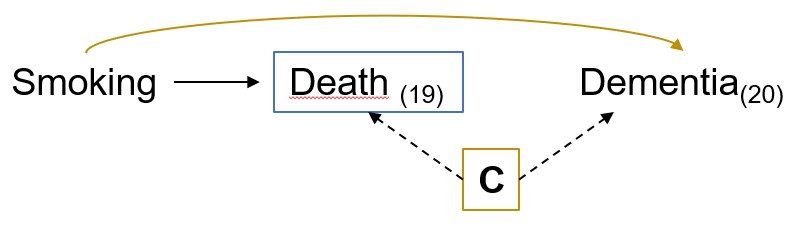
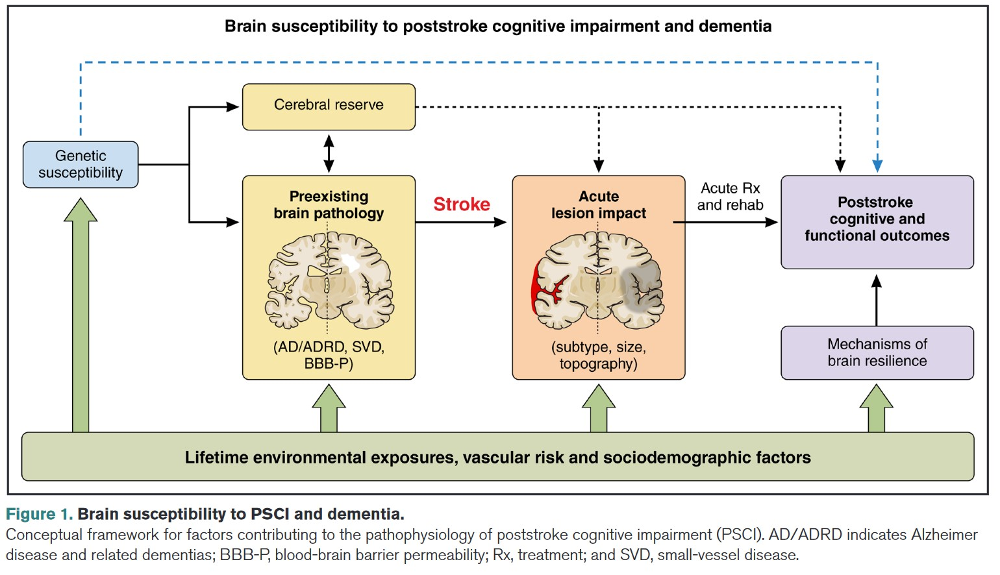

```{r setup, include=FALSE}
options(htmltools.dir.version = FALSE)
knitr::opts_chunk$set(
  fig.width=9, fig.height=3.5, fig.retina=3,
  out.width = "100%",
  cache = FALSE,
  echo = FALSE,
  message = FALSE, 
  warning = FALSE,
  hiline = TRUE
)
library(tidyverse)
library(gt)
library(knitr)
library(fontawesome)


```

```{r xaringan-themer, warning=FALSE, include=FALSE}
library(xaringanthemer)
style_mono_light(
  base_color = "#005587",
  black_color = "#002B43",
  table_row_even_background_color = "#FFFFFF",
  title_slide_text_color = "#FFFFFF",
  table_border_color = "#8bb8e8",
  text_bold_color = "#002B43",
  text_font_size = "24px",
  header_h1_font_size = "2.75rem",
  header_h2_font_size = "2.35rem",
  header_h3_font_size = "2rem",
  padding = "16px 64px 16px 32px",
  colors = c(
    yellow = "#ffb81c",
    purple = "#3e2f5b",
    green = "#136f63",
    white = "#FFFFFF"
  ))

```

class: title-slide, center, middle, inverse
background-image: url(./figs/logo.png)
background-position: 95% 95%
background-size: 28%, 25%

# Bridging .yellow[causal inference] methods and .yellow[social epidemiology] to promote .yellow[health equity] in .yellow[aging populations]


.center[

L. Paloma Rojas-Saunero MD, PhD
<br>
Postdoctoral scholar
<br>
Department of Epidemiology, UCLA

]

???

---
```{r, echo=FALSE}
xaringanExtra::use_progress_bar("#ffb81c", "top", "0.25em")
```

# Outline

- Background

- Research Agenda

- Research Themes: 

  + A. Causal framework to study time-varying exposures 

  + B. Advances on estimands for research questions with competing/truncating events 

  + C. Study of social and structural determinants of health

- Future directions

- Potential collaborations

---
# Background

.flexibleColumn[.smaller[
- **Bolivia**
  + Medicine, Universidad Mayor de San Andrés
  + Undergraduate Research Assistant, Research Institute in Health and Development
]]


.right[
.smaller[

_Healthcare Access and Quality Index, Lancet Global Health, 2022_
]]


???
I was born and raised in Bolivia, where I earned my medical degree. This map, from The Lancet Global Health, shows healthcare access and quality worlwide, andh illustrates that Bolivia is one of the most disadvantaged countries in South America in regards to heath acces. Experiencing these health inequities during my training fueled my passion for research, though educational opportunities were also scarce.

---
# Background

.flexibleColumn[.smaller[
- **Bolivia**
  + Medicine, Universidad Mayor de San Andrés
  + Undergraduate Research Assistant, Research Institute in Health and Development
- **Argentina**
  + Master in Clinical Research / Research Fellow, Internal Medicine Research Unit, Hospital Italiano de Buenos Aires
  + Statistics for Health Sciences, Instituto de Cálculo, Universidad de Buenos Aires
  + Research Associate, Liver Transplant Unit, Hospital El Cruce
- **Mexico**
  + Research Assistant, National Institute of Public Health
]]


.right[
.smaller[

_Healthcare Access and Quality Index, Lancet Global Health, 2022_
]]


???
I moved to Argentia, where I earned a Master’s in Clinical Research and completed a two-year graduate program in statistics for health sciences. I was a research fellow in the Internal Medicine Department, and transitioned to  research associate in a liver transplant unit, leading a project on longitudinal data collection for transplant candidates.
Working with EHR data exposed me to the challenges of leveraging such complex and powerful data to answer meaningful research questions. I was determined to learn causal inference methods as a next step. 

---
# Background

.flexibleColumn[.smaller[
- **Bolivia**
  + Medicine, Universidad Mayor de San Andrés
  + Undergraduate Research Assistant, Research Institute in Health and Development
- **Argentina**
  + Master in Clinical Research / Research Fellow, Internal Medicine Research Unit, Hospital Italiano de Buenos Aires
  + Statistics for Health Sciences, Instituto de Cálculo, Universidad de Buenos Aires
  + Research Associate, Liver Transplant Unit, Hospital El Cruce
- **Mexico**
  + Research Assistant, National Institute of Public Health
- **Netherlands**
  + PhD. in Epidemiology, Erasmus MC
- **United States**
  + Postdoctoral Scholar, FSPH, UCLA

]]


.right[
.smaller[

_Healthcare Access and Quality Index, Lancet Global Health, 2022_
]]

???
I completed a PhD in Epidemiology at Eramus MC in the Netherlands, shifting to dementia research. As you can see in this map, healthcare access is highly ranked in the region. So when I realized that I had gone too far on methods and clinical research when my passion began from living inequities in my country, I chose to find a postdoc that could help me bridge causal inference methods with social epidemiology. So I feel very lucky to be a postdoc at UCLA in this Department.

---
# Research Agenda

.pull-left[


]

.middle[
.pull-right[

I implement a **causal framework** to leverage **longitudinal observational data** and understand how **cardiometabolic risk factors** and **social and structural determinants** impact on **aging-related outcomes** in midlife and late life.
]
]

---
# Causal framework

.pull-left[
**Causal estimands:** Contrast of (counterfactual) outcome distributions in the **same individuals** but under **different levels of exposure**

The only explanation for a difference is the exposure, not comparing different individuals
]


.right[
]


---
# Observational Data

.flexibleColumn[
**Target population** <br>
**Eligibility criteria**<br>
**Intervention**<br>
Point <br> 
Static <br>
Dynamic <br>
Stochastic <br>
**Outcome of interest** <br>
Continuous <br>
Time-to-event <br>
**Intercurrent events**<br>
Competing events <br>
Lost to follow-up <br>
Adverse reactions <br>
**Summary Measure** <br>
]

.right[

 ]

---
class: center, middle, inverse

# A. Advances on estimands for research questions with competing/truncating events 


---
## The hazard of hazard ratios

.center[

]

.footnote[
.smaller[
<br>
Stensruds et al. Limitations of hazard ratios in clinical trials. Eur Heart J
. 2019 
]]

---
## Hazard ratios vs. risk differences at a specific time point

.pull-left[
.center[

]
]

.footnote[
_Work in progress. Gradwohl N et al._
]

???
For instance, several studies suggest that hypertension at older ages might reduce dementia risk, and refer to biological mechanisms to support this claim. In a recent project from my group, we showcase that indeed hazard ratios for this relationship shift toward the null at older ages.

--

.pull-right[
.center[

]
]
???
However, When we look at absolute risk differences, we observed a different story: individuals with hypertension have a higher cumulative incidence of dementia over time, with differences growing substantially at older ages.   

---

class: left, middle

## Considering Questions Before Methods in Dementia Research With Competing Events and Causal Goals 

.smaller[

  .left[**L. Paloma Rojas-Saunero**, Jessica G. Young, Vanessa Didelez, Arfan Ikram, Sonja A. Swanson]

  .left[_American Journal of Epidemiology_, 2023
  ]

]

---
### Causal estimands when competing events are present

.pull-left[

What is the risk* of dementia at 20 years of follow-up had all individuals stopped smoking, compared to had all individuals continued smoking?

$$Pr[Y_{20}^{a = 1} = 1] - Pr[Y_{20}^{a = 0} = 1]$$


<br>

*crude or cause-specific risk
]


--

.pull-right[

What is the risk** of dementia at 20 years of follow-up had all individuals stopped smoking _and not died_ during the study period, compared to had all individuals continued smoking _and not died_ ?


$$Pr[Y_{20}^{a = 1, d_{19} = 0} = 1] - Pr[Y_{20}^{a = 0, d_{19} = 0} = 1]$$


<br>
**net risk

]

---

### Causal estimands when competing events are present

.pull-left[

What is the risk* of dementia at 20 years of follow-up had all individuals stopped smoking, compared to had all individuals continued smoking?

$$Pr[Y_{20}^{a = 1} = 1] - Pr[Y_{20}^{a = 0} = 1]$$


<br>

*crude or cause-specific risk

]


.pull-right[

What is the risk** of dementia at 20 years of follow-up had all individuals stopped smoking _and not died_ during the study period, compared to had all individuals continued smoking _and not died_ ?


$$Pr[Y_{20}^{a = 1, d_{19} = 0} = 1] - Pr[Y_{20}^{a = 0, d_{19} = 0} = 1]$$


<br>
**net risk

]

<!-- --- -->
<!-- ### Identifiability assumptions for death -->

<!-- ```{r} -->
<!-- table <- tibble::tribble( -->
<!--   ~ "<b> Assumption </b>", -->
<!--   ~ "<b> Total Effect </b>", -->
<!--   ~ "<b> Controlled direct effect </b>", -->
<!--   "<b> Exchangeability </b>", -->
<!--   "Not needed", -->
<!--   "Death is independent of future outcomes had everyone followed A = a and death was eliminated, conditional on covariates", -->
<!--   "<b> Positivity </b>", -->
<!--   "Not needed", -->
<!--   "At every follow-up time, there are individuals with any possibly observed level A = a and covariate history who remain alive and free of dementia diagnosis", -->
<!--   "<b> Consistency </b>", -->
<!--   "Not needed", -->
<!--   "An intervention that “eliminates death” is well-defined" -->
<!-- ) -->

<!-- table %>% slice(1) %>% gt() %>%  -->
<!--   tab_options( -->
<!--     table.font.size = 26 -->
<!--   ) %>%  -->
<!--       cols_width( -->
<!--     "<b> Assumption </b>" ~ px(230), -->
<!--     "<b> Total Effect </b>" ~ px(200), -->
<!--     "<b> Controlled direct effect </b>" ~ px(550)) -->
<!-- ``` -->


<!-- --- -->
<!-- ### Identifiability assumptions for death -->

<!-- ```{r} -->
<!-- table %>% slice(1:2) %>% gt() %>%  -->
<!--   tab_options( -->
<!--     table.font.size = 26 -->
<!--   ) %>%  -->
<!--     cols_width( -->
<!--     "<b> Assumption </b>" ~ px(230), -->
<!--     "<b> Total Effect </b>" ~ px(200), -->
<!--     "<b> Controlled direct effect </b>" ~ px(550)) -->
<!-- ``` -->
<!-- ??? -->
<!-- Independent censoring assumption -->

<!-- --- -->
<!-- ### Identifiability assumptions for death -->

<!-- ```{r} -->
<!-- table %>% gt() %>%   tab_options( -->
<!--     table.font.size = 26 -->
<!--   ) %>%  -->
<!--       cols_width( -->
<!--     "<b> Assumption </b>" ~ px(230), -->
<!--     "<b> Total Effect </b>" ~ px(200), -->
<!--     "<b> Controlled direct effect </b>" ~ px(550)) -->
<!-- ``` -->

---
background-image: url(./figs/rs_logo.jpg)
background-position: 5% 95%
background-size: 15%

### Smoking cessation on dementia risk over 20 years

<br><br>
```{r}

res <- tibble::tribble(
  ~ "<b> Causal effect </b>",
  ~ "<b> Risk Difference (95%CI) </b>",
  ~ "<b> Risk Ratio (95%CI) </b>",
  "<b> Total effect on dementia </b>",
  "2.1 (-0.1, 4.2)",
  "1.21 (0.99, 1.50)",
  "<b> Controlled direct effect on dementia (with IPCW for death) </b>",
  "-2.6 (-6.1, 0.8)",
  "0.86 (0.72, 1.05)",
  "<b> Total effect on mortality </b>",
  "-17.4 (-20.5, -14.2)",
  "0.68, (0.63, 0.72)"
)

res %>% gt() %>% tab_options(
    table.font.size = 26
  ) %>% 
    cols_width(
    "<b> Causal effect </b>" ~ px(500),
    "<b> Risk Difference (95%CI) </b>" ~ px(250),
    "<b> Risk Ratio (95%CI) </b>" ~ px(200))
```

---
### Exchangeability assumption for death as censoring event


```{r}

res2 <- tibble::tribble(
  ~ "<b> Assumption </b>",
  ~ "<b> Risk Difference (95%CI) </b>", 
  ~ "<b> Risk Ratio (95%CI) </b>",
"<b> Unconditional exchangeability </b>",
"-0.7 (-3.3, 2.2)",
"0.96 (0.82, 1.16)",
"<b> Conditional exchangeability on baseline covariates </b>",
"-1.5 (-4.6, 1.8)",		
"0.92 (0.78, 1.12)",		
"<b> Conditional exchangeability on baseline and time-varying covariates</b>",
"-2.7 (-6.1, 0.8)",
"0.86 (0.7, 1.1)")

res2 %>% gt() %>% tab_options(
    table.font.size = 26
  ) %>% 
    cols_width(
    "<b> Assumption </b>" ~ px(500),
    "<b> Risk Difference (95%CI) </b>" ~ px(250),
    "<b> Risk Ratio (95%CI) </b>" ~ px(200))
```

???
we also show, depending on how we chose to evoke, and what we accomplished this, we would get different answers

---

## Related work

.center[

]

---
class: center, middle

## .left[Next steps]

.pull-left[

.bigger[
.center[Extending the estimands framework for repeated measures of a continuous outcome]


]
]


--

.pull-right[
.bigger[
.center[Quantify and prevent bias from survival into the study in cohorts of older adults using simulations and synthethic data]


<br>.smaller[_Stensruds et al. JASA. 2022_]
]
]


---
class: center, middle, inverse

# B. Causal framework to study time-varying exposures

---
class: left, middle

## Racial and Ethnic Differences in the Risk of Dementia Diagnosis Under Hypothetical Blood Pressure–Lowering Interventions: The Multi-Ethnic Study of Atherosclerosis

.small[

  .left[**L. Paloma Rojas-Saunero**, Timothy M. Hughes, <ins>Elizabeth Rose Mayeda</ins>, Marcia Pescador Jimenez]

  .left[_Alzheimers & Dementia_, 2024
  ]

]

---
class: center, middle


]


---
background-image: url(./figs/mesa_logo.png)
background-position: 5% 95%
background-size: 20%

### Study design

.pull-left[
- **Study population**: Black, Chinese, Latino and White middle and older aged adults

- **Data sources**: Multi-Ethnic Study of Atherosclerosis (MESA)
]

.pull-right[

- **Exposure**: Systolic blood pressure collected in five waves

- **Outcome**: Dementia diagnosis derived from EHR records

- **Intercurrent event**: Dementia-free deaths

- **Time zero/Baseline:** Interview date for wave 1

- **End of follow-up:** Time of dementia diagnosis, time of death prior to dementia diagnosis, loss to follow-up

]


---
### G-computation

.center[**_What would have happened had everyone was randomized and had adhered to each intervention (g)?_**]


.pull-left[
.center[

]
]

--

.pull-right[
.center[

]]

**Parametric G-formula**

.footnote[
.smaller[
<br><br>
**A** = SBP, **Y** = Dementia diagnosis, **L** = _Fixed covariates_: age, sex, education, income, health insurance, APOE E-4, history of diabetes, myocardial infartion, stroke, and coronary heart disease. _Time-varying covariates_: SBP, total cholesterol (continuous), LDL, BMI, current smoking, current alcohol use, myocardial infarction, stroke, and coronary heart disease diagnosis]]

---
### Controlled direct effect of hypothetical interventions

.center[.middle[

]]

---
### Risk Ratios for the effect of hypothethical blood pressure interventions compared to the natural course


.center[.middle[

]]


---
class: left, middle

## Effect of Incident Stroke on Dementia Risk Over 10 Years in a Cohort of Asian American and Non-Latino White Older Adults in California

.small[

  .left[ **L. Paloma Rojas-Saunero**, Yixuan Zhou, Eleanor Hayes-Larson, Yingyan Wu, Taylor Mobley, <ins>Roch Nianogo</ins>, Holly Elser, <ins>Gilbert C. Gee</ins>, <ins>Ron Brookmeyer</ins>, Rachel Whitmer, Paola Gilsanz, and <ins>Elizabeth Rose Mayeda</ins> ]

  .left[_Neurology_, In press]

]
???
Stroke can precipitate pathological changes in the neurovascular unitleading to loss of structural and functional connectivity that could increase dementia risk.
Previous work had major methodological limitations, including how to account for the fact that stroke increases mortality, which competes with dementia.
Studies on this topic have very selected samples with minimal (if any)representation of the Asian American population.

---
class: center, middle

.center[  ]

---
background-image: url(./figs/kaiser_logo.png)
background-position: 5% 95%
background-size: 20%

### Study design

.pull-left[
- **Study population**: Chinese, Japanese, Filipino, South Asian and non-Latix White older adults

- **Data sources**: Kaiser Permanente NC surveys + Electronic Health Records

]

.pull-right[

- **Exposure**: Incident stroke (ischemic + hemorrhagic) derived from ICD codes

- **Outcome**: Incident dementia derived from ICD codes

- **Intercurrent event**: Dementia-free deaths

- **Time zero/Baseline:** Time of survey

- **End of follow-up:** Time of dementia diagnosis, time of death prior to dementia diagnosis, turning 90 years old

]


---
### Cumulative incidence of stroke at 10 years of follow up

.left-column[

Aalen-Johansen estimator: when a participant dies, the risk of dementia is 0

]

.right-column[ ]


---
### Controlled direct effect of stroke on dementia risk

.left-column[

.left[
Weighted Kaplan-Meier estimator for time-varying exposures 

Inverse probability weights for stroke (IPTW) 

Inverse probability weights for death]

]

.right-column[ .right[]]

.footnote[
.smaller[
<br><br><br><br>
_Fixed covariates_: age, sex, education, self-rated health, smoking status. <br>
_Time-updated covariates_:SBP, BMI, total cholesterol, diabetes, hypertension, dyslipidemia, acute myocardial infarction, congestive heart failure, ischemic heart disease, peripheral vascular disease, cancer

]]

---
### Total effect of stroke on dementia risk

.left-column[
Aalen Johansen estimator including IPTW weights

Includes the indirect path between stroke and death
]

.right-column[ .right[]]

.footnote[
.smaller[
<br><br><br><br>
_Fixed covariates_: age, sex, education, self-rated health, smoking status. <br>
_Time-updated covariates_:SBP, BMI, total cholesterol, diabetes, hypertension, dyslipidemia, acute myocardial infarction, congestive heart failure, ischemic heart disease, peripheral vascular disease

]]

---
### Quantitative bias analysis for differential dementia diagnosis

.left-column[

We set the sensitivity of dementia diagnosis in the stroke arm to 0.99 and considered a range of sensitivity values in the no-stroke arm, from 0.50 (worst case scenario) to 0.90. 

]

.right-column[  ]


---
## Related work

.center[

]

---
class: center, middle, inverse

# C. Study of social and structural determinants of health in aging related outcomes

---
class: left, middle

## Racialized residential segregation in 1940 and later-life memory decline in Black and White US older adults

.small[

  .left[ **L. Paloma Rojas-Saunero**, Taylor Mobley, Yixuan Zhou, Jenni Shearston, <ins>Courtney S. Thomas Tobin</ins>, Kara Rudolph, Jennifer Manly, <ins>Gilbert C Gee</ins>, Rob Warren, Joan Casey,  and <ins>Elizabeth Rose Mayeda</ins>]

  .left[_In preparation_]

]

---
background-image: url(./figs/hrs_logo.png), url(./figs/ipums_logo.png)
background-position: 5% 95%, 95% 95%
background-size: 20%, 20%

##Study design

.center[
_What is the effect of racialized residential segregation in 1940 on late-life memory decline?_
]

Health and Retirement Study linkage with 1940 Census

.pull-left[

]

.pull-right[
]

---

class: left, middle

## Occupational Determinants of Cognitive and Brain Health Among Middle-Aged and Older Latino/a/e/x Adults in the U.S.

.small[

  .left[ **L. Paloma Rojas-Saunero**, Jacqueline Torres, <ins>Jian Li</ins>, Hector González, <ins>Hirám Beltrán Sanchez</ins>, Charles DeCarli, <ins>Elizabeth Rose Mayeda</ins>]

  .left[_In preparation for resubmission_]

]

---
## Motivation

.center[

]

---
## Motivation

.center[

]

---
## Motivation

.center[

]

---
# Future Directions

.pull-left[


]

--

.pull-right[

<br>]
.small[
- **K99/R00 Career Development Award (_Resubmission_)**
<br>
- **Alzheimer's Association Research Fellowship to Promote Diversity (_Pending_)**
<br>
- **Columbia Center for Interdisciplinary Research on Alzheimer's Disease Disparities (CIRAD) RCMAR (_Pending_)**
]
]

---
## Collaborations

- Elizabeth Rose Mayeda, UCLA
- Gilbert C. Gee, UCLA
- Ron Brookmeyer, UCLA
- Roch A. Nianogo
- Courtney S. Thomas Tobin, UCLA
- Jian Li, UCLA
- Hirám Beltrán Sánchez, UCLA
- Mirella Díaz-Santos, UCLA
- Rachel Whitmer, UC Davis
- Maria M. Glymour, Boston University
- Marcia Pescador Jimenez, Boston University
- Ruijia Chen, Boston University
- Paola Gilsanz, KPNC
- Joan Casey, UWashington
- Jessica G. Young, Harvard Chan SPH


**Research Groups**
- Mayeda Research Group
- Practical Causal Inference Lab
- FSPH Rooted Academy
- Equity for Latinx-Hispanic Healthy Aging (ELHA) Lab
- California Center for Population Research


---
class: left, middle, inverse

# .yellow[Thank You!]


.left[
lp.rojassaunero@ucla.edu

]
