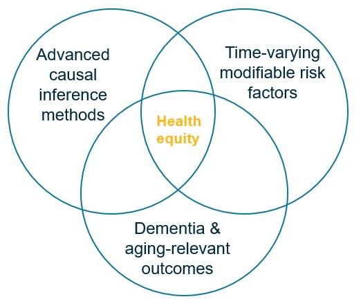

```{r setup, include=FALSE}
options(htmltools.dir.version = FALSE)
knitr::opts_chunk$set(
  fig.width=9, fig.height=3.5, fig.retina=3,
  out.width = "100%",
  cache = FALSE,
  echo = FALSE,
  message = FALSE, 
  warning = FALSE,
  hiline = TRUE
)
library(tidyverse)
library(gt)
library(knitr)
library(fontawesome)


```

```{r xaringan-themer, warning=FALSE, include=FALSE}
library(xaringanthemer)
style_mono_light(
  base_color = "#005587",
  black_color = "#002B43",
  table_row_even_background_color = "#FFFFFF",
  title_slide_text_color = "#FFFFFF",
  table_border_color = "#8bb8e8",
  text_bold_color = "#002B43",
  background_color = "#FFFFFF",
  text_font_size = "24px",
  header_h1_font_size = "2.75rem",
  header_h2_font_size = "2.35rem",
  header_h3_font_size = "2rem",
  padding = "16px 64px 16px 32px",
  colors = c(
    yellow = "#ffb81c",
    purple = "#3e2f5b",
    green = "#136f63",
    white = "#FFFFFF"
  ))

```

class: title-slide, center, middle, inverse
background-image: url(./figs/logo.png)
background-position: 95% 95%
background-size: 28%, 25%

# Advancing .yellow[Health Equity] in .yellow[Aging Research] through a .yellow[Causal Inference] Framework


.center[

L. Paloma Rojas-Saunero MD, PhD
<br>
Postdoctoral scholar
<br>
Department of Epidemiology, UCLA

]

???

---
```{r, echo=FALSE}
xaringanExtra::use_progress_bar("#ffb81c", "top", "0.25em")
```
# Background

.flexibleColumn[.smaller[
- **Bolivia**
  + Medicine
  + Undergraduate Research Assistant
]]


.right[
.smaller[

_Healthcare Access and Quality Index, Lancet Global Health, 2022_
]]


???
I was born and raised in Bolivia, here in the heart of south america, where I earned my medical degree. This map, from The Lancet Global Health, shows healthcare access and quality index worlwide, and as you can see Bolivia is one of the most disadvantaged countries in the region. Experiencing these health inequities during my training fueled my passion for public health.

---
# Background

.flexibleColumn[.smaller[
- **Bolivia**
  + Medicine
  + Undergraduate Research Assistant
- **Argentina**
  + Master in Clinical Research/Statistics for Health Sciences
  + Researcher in Clinical epidemiology
  ]]


.right[
.smaller[

_Healthcare Access and Quality Index, Lancet Global Health, 2022_
]]


???
I moved to Argentia, where I earned a Master’s in Clinical Research and completed a two-year graduate program in statistics for health sciences. During that time I worked predominantly in clinical research in Internal Medicine, Critical Care and Liver Transplant outcomes. 
I taught biostatistics in a master program, and founded R-Ladies Buenos Aires, a chapter to teach programing to women and gender minorities. After working with electronic health records and clinical registries, I knew I needed to train in causal inference methods to translata data into meaningful research.


---
# Background

.flexibleColumn[.smaller[
- **Bolivia**
  + Medicine
  + Undergraduate Research Assistant
- **Argentina**
  + Master in Clinical Research/Statistics for Health Sciences
  + Researcher in Clinical epidemiology
- **Mexico**
  + Research Assistant Environmental Epi
]]


.right[
.smaller[

_Healthcare Access and Quality Index, Lancet Global Health, 2022_
]]

???
While living in Argentina, I also worked as research assistant for the National Institute of Public Health, Cuernavaca Mexico, in a remote position for the Environmental Epi department.
My mentors encouraged me to pursuit a PhD in Epidemiology

---
# Background

.flexibleColumn[.smaller[
- **Bolivia**
  + Medicine
  + Undergraduate Research Assistant
- **Argentina**
  + Master in Clinical Research/Statistics for Health Sciences
  + Researcher in Clinical epidemiology
- **Mexico**
  +  Research Assistant Environmental Epi
- **Netherlands**
  + PhD. in Epidemiology, Erasmus MC
- **United States**
  + Visiting Scholar CAUSALab
- **Germany**
  + Visiting Scholar, Leibniz Inst


]]


.right[
.smaller[

_Healthcare Access and Quality Index, Lancet Global Health, 2022_
]]

???
I received my PhD in Epidemiology at Erasmus MC in Rotterdam Netherlands, my work was to extend causal inference methods in dementia research. During my PhD, I visited the CAUSALab at Harvard, TA’d an online course on Confounding by Dr. Miguel Hernán. I also spent at the Leibniz Institute in Germany. While I built strong collaborations with causal inference experts and launched a career in methods, I realized that I had drifted from my passion to understand health inequities, and I seeked a postdoc to learn about the field of social epi. 

---
# Background

.flexibleColumn[.smaller[
- **Bolivia**
  + Medicine
  + Undergraduate Research Assistant
- **Argentina**
  + Master in Clinical Research/Statistics for Health Sciences
  + Researcher in Clinical epidemiology
- **Mexico**
  +  Research Assistant Environmental Epi
- **Netherlands**
  + PhD. in Epidemiology, Erasmus MC
- **United States**
  + Visiting Scholar CAUSALab
- **Germany**
  + Visiting Scholar, Leibniz Inst
- **United States**
  + Postdoctoral Scholar, FSPH, UCLA

]]


.right[
.smaller[

_Healthcare Access and Quality Index, Lancet Global Health, 2022_
]]

???
Luckely, I found the ideal postdoc at UCLA, that could help me bridge causal inference methods with social epidemiology to study aging-related outcomes.

---
# Research Agenda

.pull-left[
.center[


]
]

--

.pull-right[
**Contributions to the field**

- Advances on estimands for research questions with competing events 

- Implementing a causal framework to study time-varying modifiable risk factors of dementia
  + Cardiovascular risk factors
  + Social and structural determinants of health

]

---
background-image: url(./figs/press1.PNG)
background-size: 60%

???
More generally, researchers have often found unexpected inverse associations between common risk factors—such as smoking, hypertension, and obesity—and dementia. An even more striking example is the well-documented inverse association between cancer and dementia.

Your epidemiologic instincts might be thinking of all the potential sources of bias that could explain these associations, while researchers are thinking of all the potential biological mechanisms that could explain these... 

---
background-image: url(./figs/chain.jpg)
background-size: 50%

???
I see this as a result of communication between and a lack of teaching resources on this area.
My ultimate goal is to bridge the gap between methods development and real world appliations, as you will see in the following work. 

---

class: center, middle, inverse

# Advances on estimands for research questions with competing events 

---
class: left, middle

## Considering Questions Before Methods in Dementia Research With Competing Events and Causal Goals 

.smaller[

  .left[**L. Paloma Rojas-Saunero**, Jessica G. Young, Vanessa Didelez, Arfan Ikram, Sonja A. Swanson]

  .left[_American Journal of Epidemiology_, 2023
  ]]

---
## Smoking cessation and 20-year dementia risk  

<br><br><br>

.center[


]

.footnote[**C**: Shared risk factors]

---

## Questions before methods

.pull-left[
**Total effect**

What is the risk of dementia at 20 years of follow-up had all individuals stopped smoking, compared to had all individuals continued smoking?


]

--

.pull-right[
**Controlled direct effect**

What is the risk of dementia at 20 years of follow-up had all individuals stopped smoking **and not died** during the study period, compared to had all individuals continued smoking **and not died** ?


]

.footnote[**C**: Shared risk factors]

---
## Questions before methods

.pull-left[
**Total Effect**

What is the risk of dementia at 20 years of follow-up had all individuals stopped smoking, compared to had all individuals continued smoking?

]


.pull-right[
**Controlled direct effect**

What is the risk of dementia at 20 years of follow-up had all individuals stopped smoking **and not died** during the study period, compared to had all individuals continued smoking **and not died** ?


]

.footnote[**C**: Shared risk factors]

---
background-image: url(./figs/rs_logo.jpg)
background-position: 95% 95%
background-size: 15%

## Smoking cessation on dementia risk

.center[
]

???
What we see is that had we asked a question about the CDE and use appropiate methods, we would see that smoking cessation prevents dementia risk.
Had we asked a question about the total effect, smoking cessation increases your risk of dementia, but again this is not bias, but rather the unbiased result for a question that does not satisfy our interest.

---

## Competing events in health equity aging research


.pull-left[.center[.bigger[Descriptive, predictive or causal contrasts comparing dementia risk between two groups (_disparity estimand_) will be impacted by differential mortality
]]]

.pull-right[
<br><br>

]

.footnote[**Rojas-Saunero LP**, Glymour MM, Mayeda ER. Selection Bias in Health Research: Quantifying, Eliminating, or Exacerbating Health Disparities?. _Current Epidemiology Reports._ 2024]

---
## Extensions of this work

.center[

]

???
Introducing different estimands for competing events has helped me demonstrate that when we prioritize the research question and let it guide the methods, the inverse association between cancer and dementia disappears. 
Recent work by Dr. Gina Nam, outstanding PhD candidates from the epi department, replicated this analysis on a much larger and diverse sample using code that I had written, showing similar results, further breaking this pattern in the literature.

---
## Impact

.center[

]

---
## Teaching materials

.center[

]

---
## Related work

.small[
- **Rojas-Saunero LP**, van der Willik KD, Schagen SB, Ikram MA, Swanson SA. Towards a clearer causal question underlying the association between cancer and dementia. _Epidemiology._ 2024.

- **Rojas-Saunero, L.P.**, Glymour, M.M. & Mayeda, E.R. Selection Bias in Health Research: Quantifying, Eliminating, or Exacerbating Health Disparities?. _Current Epidemiology Reports._ 2024.

- **Rojas-Saunero LP**, Patino CM, Ferreira JC. Intercurrent events in clinical research: the norm, not the exception. _Jornal Brasileiro de Pneumologia._ 2022.

- **Rojas-Saunero LP**, Ikesu R, Hayes-Larson E, Fong J, Chen R, Posis AIB, Whitmer RA, Gilsanz P, Glymour MM, Mayeda ER. Social isolation and functional limitation over 6 years of follow-up in a diverse cohort in Northern California: Kaiser Healthy Aging and Diverse Life Experiences (KHANDLE) Study. _In preparation._

- **Rojas-Saunero LP**, Wu Y, Gee GC, Brookmeyer R, Posis AIB, Whitmer RA, Gilsanz P, Mayeda ER. Sex/gender differences in the risk of dementia for Asian American ethnic subgroups and non-Latino White older adults in California. _In preparation._

]

---
class: center, middle, inverse

# Implementing a causal framework to study time-varying modifiable risk factors of dementia
---

class: left, middle

## Effect of Incident Stroke on Dementia Risk Over 10 Years in a Cohort of Asian American and Non-Latino White Older Adults in California

.small[

  .left[ **L. Paloma Rojas-Saunero**, Yixuan Zhou, Eleanor Hayes-Larson, Yingyan Wu, Taylor Mobley, Roch Nianogo, Holly Elser, Gilbert C. Gee, Ron Brookmeyer, Rachel Whitmer, Paola Gilsanz, and Elizabeth Rose Mayeda ]

  .left[_Neurology_, In press]

]
???
Stroke can precipitate pathological changes in the neurovascular unitleading to loss of structural and functional connectivity that could increase dementia risk.
Previous work had major methodological limitations, including how to account for the fact that stroke increases mortality, which competes with dementia.
Studies on this topic have very selected samples with minimal (if any)representation of the Asian American population.

---

## Motivation

- Stroke can trigger pathological changes in the neurovascular unit, disrupting structural and functional connectivity and increasing dementia risk.

--

- Existing studies have highly selected samples with little to no representation of Asian Americans.

--

- Prior research has major methodological limitations.

---
## Research question

- .bigger[What is the direct effect of incident stroke in the 10-year-risk of dementia across different Asian American ethnicities and White populations, had we eliminated death?]

--

- .bigger[What is the total effect of incident stroke in the 10-year-risk of dementia  across different Asian American ethnicities and White populations?]

---
background-image: url(./figs/kaiser_logo.png)
background-position: 95% 95%
background-size: 20%

## Study population & Design

- Asian American and White members of Kaiser Permanente Northern California from CMHS or RPGEH surveys.

  + With no history of stroke
  + With no history of dementia
  + From 60 to 89 years old

--

- Study Design

  + Exposure: Incident stroke in EHR (ischemic stroke, hemorrhagic stroke)
  + Outcome: Incident dementia diagnosis in EHR
  + Time zero/Baseline: Time of survey
  + End of follow-up: Dementia diagnosis, death, or age 90

---
## Covariates

.pull-left[
**Time-fixed covariates**
- Baseline age
- Sex/gender
- Nativity status
- Educational attainment
- Health status
- Smoking status
]

.pull-right[

**Time-varying covariates**
- Systolic blood pressure (median value/year)
- BMI (median value/year)
- Cholesterol (median value/year)
- Incident comorbidities
  + diabetes
  + hypertension
  + myocardial infarction
  + congestive heart failure
  + cancer]

--

**Time-updated inverse probability weights for stroke (IPTW):** so that those who have a stroke and those who don't are comparable at every time-point before stroke.


---
### Controlled direct effect of stroke on dementia

- **Had we had eliminated death** 

--

- Assumptions:
  + No unmeasured confounding
  + Loss to follow up is not informative
  + Dementia and death are statistically independent conditional on covariates
  + No measurement error

--

- **Inverse probability weights for death over follow-up (IPCW):** to make participants who remain alive after stroke comparable to the no-stroke group over follow-up.

--

- Estimate cumulative incidence of dementia using weighted Kaplan-Meier estimator (IPTW*IPCW)

--

- Calculate risk differences relating incident stroke and dementia at 10 years

---
### Controlled direct effect of stroke on dementia risk

.center[]

---
### Total effect of stroke on dementia risk

- **Allowing for the impact of stroke on mortality**

--

- Assumptions:
  + No unmeasured confounding
  + Loss to follow up is not informative
  + No measurement error

--

- Estimate cumulative incidence of dementia using weighted Aalen-Johansen estimator (IPTW)

--

- Calculate risk differences relating incident stroke and dementia at 10 years

---
### Total effect of stroke on dementia risk

.center[]

???
However, if we would have targeted a total effect, including the indirect path that stroke increases mortality, all effects shift towards or below the null. This reiterates how different ways to account for death as a competing event can lead to very different results. 

Now on all analysis, we are assuming that there is no measurement error, but we can expect that those who have had a stroke had a strick screening of cognitive impairment. And  among those who don't have stroke, their is potential underdiagnosis of dementia. To understand how this bias could impact our results we did a QBA.

---
### Weighted cumulative incidence curves for Filipino participants

.center[]

---
### Quantitative bias analysis for differential dementia diagnosis

.left-column[

We set the sensitivity of dementia diagnosis in the stroke arm to 0.99 and considered a range of sensitivity values in the no-stroke arm, from 0.50 (worst case scenario) to 0.90. 

]

.right-column[  ]

---
## Related work

.smaller[
**Target trial emulation for time-varying interventions on dementia & stroke risk**
- **Rojas-Saunero LP**, Hughes TM, Mayeda ER, Pescador Jimenez M. Racial and ethnic differences in the risk of dementia diagnosis under hypothetical blood‐pressure‐lowering interventions: The Multi-Ethnic Study of Atherosclerosis. _Alzheimer's & Dementia Journal._ 2024.
- **Rojas-Saunero LP**, Hilal S, Murray EJ, Logan RW, Ikram MA, Swanson SA. Hypothetical blood-pressure-lowering interventions and risk of stroke and dementia. _European Journal of Epidemiology._ 2021.
- Caniglia EC, **Rojas-Saunero LP**, Hilal S, Licher S, Logan R, Stricker B, Ikram MA, Swanson SA. Emulating a target trial of statin use and risk of dementia using cohort data. _Neurology._ 2020. ]

--

.smaller[
**Target trial emulation for social determinants of health**
- **Rojas-Saunero LP**, Labrecque JA, Swanson SA. Invited Commentary: Conducting and Emulating Trials to Study Effects of Social Interventions. _American Journal of Epidemiology._ 2022.
- **Rojas-Saunero LP**, Mobley T, Zhou J, Shearston J, Rudolph K, Manly J, Gee GC, Robin-Thomas C, Casey J, Mayeda EL. Racialized residential segregation in 1940 and later-life memory decline in a nationally representative cohort of Black and White US older adults. In preparation.
]

--

.smaller[
**Target trial emulation in critical care**
- Urner M, Jüni P, **Rojas-Saunero LP**, Hansen B, Brochard LJ, Ferguson ND, Fan E. Limiting Dynamic Driving Pressure in Patients Requiring Mechanical Ventilation. _Critical Care Medicine._ 2023.
]

---

class: left, middle, inverse

## Future Directions

---
## Occupational determinants of brain & cognitive health

--

.pull-left[

]

---
## Occupational determinants of brain & cognitive health

.pull-left[

]

--

.pull-right[

- These mechanisms are a downstream of working discriminatory practices and regulations

- We need to study how these impact understudied populations such the Latino/a/e/x community 

- To disentangle these mechanisms we need causal inference methods!]


---
## Occupational determinants of brain & cognitive health

.pull-left[
.center[


]

]

--

.pull-right[
.center[<br><br>

<br>
]
]

---
## .left[Future directions: Methodological Innovations]

.pull-left[

Extending the estimands framework for repeated measures of a continuous outcome


<br>.smaller[_In preparation_]
]


--

.pull-right[
Quantify and prevent bias from survival into the study in cohorts of older adults using simulations and synthetic data

]


---
## .left[Future directions: Methodological Innovations]

.pull-left[

.bigger[
Use simulations to understand the sources that drive effect heterogeneity
]
]
--

.pull-left[

.center[

]]

---
## Mentors, students and collaborators

.container[
.left-column2[
.smaller[
- Elizabeth Rose Mayeda, UCLA (_Postdoc Mentor_)  
- Sonja A. Swanson, Pitt (_PhD Mentor_)  
- Alexander Ivan Posis, UC Davis  
- Charles DeCarli, UC Davis  
- Courtney S. Thomas Tobin, UCLA  
- Dan Mungas, UC Davis  
- Eleanor Hayes-Larson, USC  
- Eleanor Murray, BU  
- Ellen Caniglia, Penn  
- Gilbert C. Gee, UCLA  
- Hector Gonzalez, UCSD  
- Hirám Beltrán Sánchez, UCLA  
- Jian Li, UCLA  
- Jessica G. Young, HSPH  
- Joan Casey, UWashington  
- Joey Fong, UCLA  
- Lan Wen, U. Waterloo  
- Laura Acion, Metadocencia  
]]

.middle-column2[
.smaller[
- M. Martha Tellez Rojo, INSP  
- Marcia Pescador Jimenez, BU  
- Maria M. Glymour, BU  
- Mirella Díaz-Santos, UCLA  
- Paola Gilsanz, KPNC  
- Rachel Whitmer, UC Davis  
- Roch A. Nianogo, UCLA  
- Ron Brookmeyer, UCLA  
- Ruijia Chen, BU  
- Vanessa Didelez, Leibniz Inst.  

**Students**
- Jose Luis Villca, UMSS,
- Cecilia Curvale, Hosp. El Cruce
- Gina Nam, UCLA
- Kelly Guo, EMC
- Ryo Ikesu, UCLA  
- Taylor Mobley, UCLA  
- Yixuan Zhou, UCLA  
- Yingyan Wu, UCLA  
]]

.right-column2[
.smaller[
**Research Groups**
- Mayeda Research Group
- Practical Causal Inference Lab
- FSPH Rooted Academy
- MELODEM
- Equity for Latinx-Hispanic Healthy Aging (ELHA) Lab
- California Center for Population Research

**Grant Support**
- USC/UCLA Center on Biodemography and Population Health (PI)
- NIA R01AG074359 (Mayeda)
- NIA R01AG0603969 (Mayeda)
- NIA R01AG052132 (Mayeda)


]]]


---
class: left, middle, inverse

# .yellow[Thank You, Gracias!]


.left[
lp.rojassaunero@ucla.edu

]


