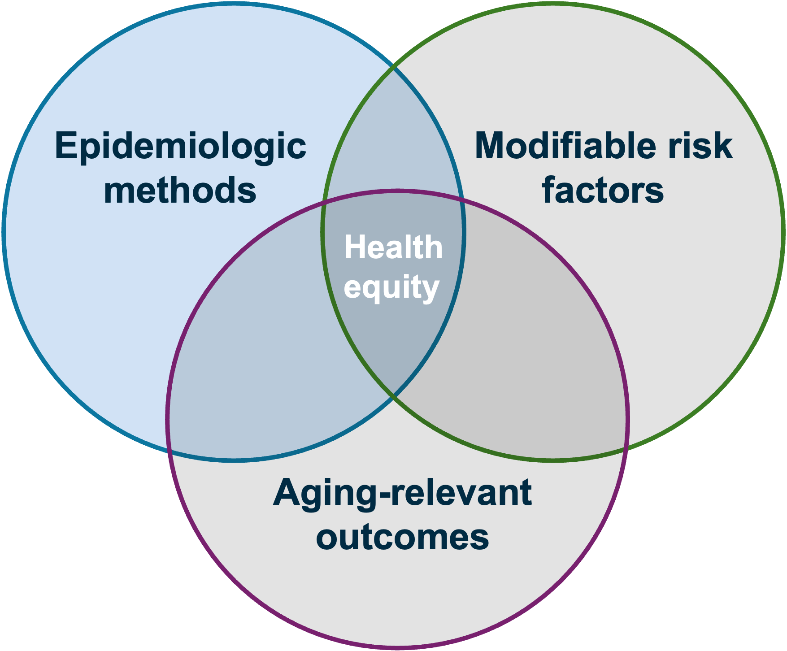
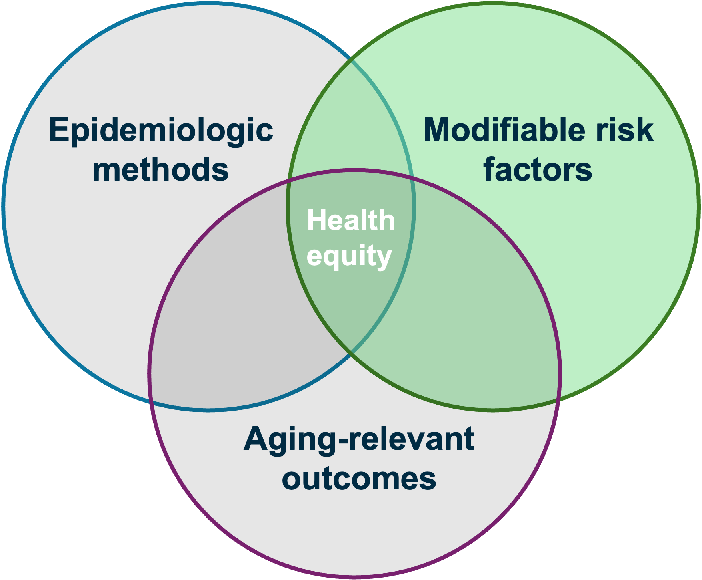
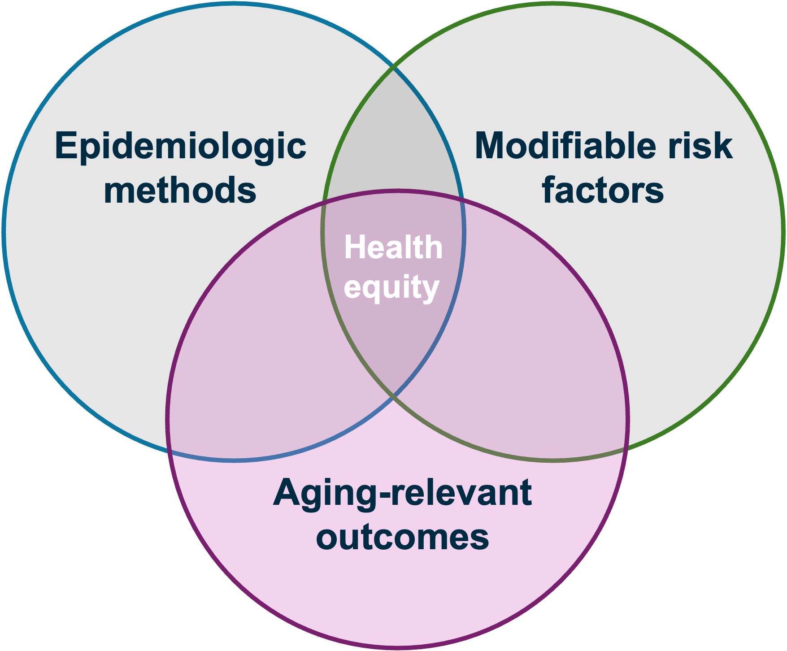

```{r setup, include=FALSE}
options(htmltools.dir.version = FALSE)
knitr::opts_chunk$set(
  fig.width=9, fig.height=3.5, fig.retina=3,
  out.width = "100%",
  cache = FALSE,
  echo = FALSE,
  message = FALSE, 
  warning = FALSE,
  hiline = TRUE
)
library(tidyverse)
library(gt)
library(knitr)
library(fontawesome)
library(xaringanExtra)


```

```{r xaringan-themer, warning=FALSE, include=FALSE}
library(xaringanthemer)
style_mono_accent(
  base_color = "#005587",
  black_color = "#002B43",
  table_row_even_background_color = "#FFFFFF",
  title_slide_text_color = "#FFFFFF",
  table_border_color = "#8bb8e8",
  text_bold_color = "#002B43",
  background_color = "#FFFFFF",
  text_font_size = "32px",
  header_h1_font_size = "2.5rem",
  header_h2_font_size = "2.3rem",
  header_h3_font_size = "1.5rem",
  padding = "16px 64px 16px 32px",
  colors = c(
    yellow = "#ffb81c",
    purple = "#3e2f5b",
    green = "#136f63",
    white = "#FFFFFF"
  ))

```

```{r xaringan-tile-view, echo=FALSE}
xaringanExtra::use_tile_view()
```

class: title-slide, center, middle, inverse
background-image: url(./figs/logo.png)
background-position: 95% 95%
background-size: 28%, 25%

# Advancing .yellow[Health Equity] in .yellow[Aging Research] through a .yellow[Causal Inference] Framework


.center[

L. Paloma Rojas-Saunero MD, PhD
<br>
Postdoctoral scholar
<br>
Department of Epidemiology, UCLA

]

???

---
```{r, echo=FALSE}
xaringanExtra::use_progress_bar("#ffb81c", "top", "0.25em")
```
# Background

.twoCols[
.col[
.smaller[
- **Bolivia**
  + Medicine
]]


.col[
.smaller[

_Healthcare Access and Quality Index, Lancet Global Health, 2022_
]]
]

???
I was born and raised in Bolivia, where I earned my medical degree. 
This map from The Lancet Global Health shows healthcare access and quality worlwide. Bolivia is one of the most disadvantaged countries in the region. 
Growing up and training in this context is what sparked my interest in health inequities and in using clinical research to understand, and reduce those gaps.

---
# Background

.twoCols[
.col[
.smaller[
- **Bolivia**
  + Medicine
- **Argentina**
  + MS in Clinical Research/Statistics for Health Sciences
  + Researcher in Internal Medicine, Critical Care, Liver Transplant
  ]]


.col[
.smaller[

_Healthcare Access and Quality Index, Lancet Global Health, 2022_
]]
]

???
I then moved to Argentina, where I completed a Master’s in Clinical Research and formal training in statistics for health sciences.

During this time, I worked as a clinical researcher in internal medicine, critical care, and liver transplant research—primarily using electronic health records and clinical registries.

Working with complex, messy clinical data pushed me toward epidemiologic methods and causal inference as tools to translate data into meaningful clinical evidence


---
# Background

.twoCols[
.col[
.smaller[
- **Bolivia**
  + Medicine
- **Argentina**
  + MS in Clinical Research/Statistics for Health Sciences
  + Researcher in Internal Medicine, Critical Care, Liver Transplant
- **Mexico**
  + Research Assistant Environmental Epi
]]


.col[
.smaller[

_Healthcare Access and Quality Index, Lancet Global Health, 2022_
]]
]

???

While in Argentina, I also worked remotely as a research assistant with the National Institute of Public Health in Mexico in environmental epidemiology.

That experience broadened my perspective beyond clinical settings and encouraged me to pursue doctoral training in epidemiology

---
# Background

.twoCols[
.col[
.smaller[
- **Bolivia**
  + Medicine
- **Argentina**
  + MS in Clinical Research/Statistics for Health Sciences
  + Researcher in Internal Medicine, Critical Care, Liver Transplant
- **Mexico**
  +  Research Assistant Environmental Epi
- **Netherlands**
  + PhD in Epidemiology, Erasmus MC
- **United States**
  + Visiting Scholar CAUSALab, HSPH
- **Germany**
  + Visiting Scholar, Leibniz Inst


]]


.col[
.smaller[

_Healthcare Access and Quality Index, Lancet Global Health, 2022_
]]]

???

I completed my PhD in Epidemiology at Erasmus Medical Center in the Netherlands. My dissertation focused on extending causal inference methods to dementia research.

During my PhD, I visited the CAUSALab at Harvard and the Leibniz Institute in Germany, where I built long-term collaborations with experts in causal inference, which shaped my career as a methods-oriented epidemiologist. 

---
# Background

.twoCols[
.col[
.smaller[
- **Bolivia**
  + Medicine
- **Argentina**
  + MS in Clinical Research/Statistics for Health Sciences
  + Researcher in Internal Medicine, Critical Care, Liver Transplant
- **Mexico**
  +  Research Assistant Environmental Epi
- **Netherlands**
  + PhD in Epidemiology, Erasmus MC
- **United States**
  + Visiting Scholar CAUSALab, HSPH
- **Germany**
  + Visiting Scholar, Leibniz Inst
- **United States**
  + Postdoctoral Scholar, FSPH, UCLA

]]


.col[
.smaller[

_Healthcare Access and Quality Index, Lancet Global Health, 2022_
]]
]

???
I then moved to UCLA for my postdoctoral training with Dr. Elizabeth Rose Mayeda, where I’ve focused on applying and extending causal inference methods to study social determinants and health disparities in dementia research

---
# Research Focus

.pull-left[

 
]

--

.pull-right[
**Causal inference:**
  + To account for death as competing/truncation event
  + To study time-varying exposures

**Intersectionality:**
  + Effect heterogeneity
  + MAIHDA framework

]

???
Methodologically, my work centers on causal inference—particularly methods to account for death as a competing or truncation event and to study time-varying exposures.

More recently, I’ve expanded this work to study effect heterogeneity by race/ethnicity and sex/gender, including applications of the MAIHDA framework to understand intersecting disparities.

Transition:
With these tools, I study risk factors that operate at multiple levels

---
# Research Focus

.pull-left[

 ]

.pull-right[
- **Clinical:** statins, blood pressure interventions, cancer risk

- **Social**: social isolation, education, SES, food insecurity, household crowding

- **Structural:** residential segregation, rural-urban disparities

]

???
What ties these factors together is that they are potentially intervenable across the life course.

---
# Research Focus

.pull-left[


]

.pull-right[
- **Clinical**: dementia, stroke, death

- **Cognition**: memory decline

- **Functional**: (instrumental) activities of daily living
]

---
# Research Focus

.center[


]

???
So across methods, risk factors, and outcomes, my research aims to identify actionable targets to reduce the burden of aging related outcomes, and related disparties - and to develope and teach methods that improve the quality of dementia and aging research.

---
# Research Outline

**Death as competing/truncation event in aging research** 

  + Stroke and dementia risk
  + Social isolation and functional impairment trajectories

--

**Time-varying risk factors of dementia**

  + Systolic blood pressure and dementia risk across race/ethnic subgroups

--

**Future work**

  + Occupational risk factors of cognitive and brain health among Latinxs
  
???
“I organize my research into three main areas.

First, I study how to define and estimate clinically meaningful effects in the presence of death as a competing or truncation event. I’ll focus on two applied examples—stroke and dementia, and social isolation and functional impairment.

Second, I use target trial emulation to study modifiable risk factors over time, using blood pressure control and dementia risk as an example.

Finally, I’ll briefly discuss future work extending these methods to occupational determinants of cognitive and brain health in Latinx populations.

---
class: left, middle, inverse

# Death as competing/truncation event in aging research

???
I’ll start with death as a competing or truncation event, because this is an unovaidable challenge in aging research and if we don’t define it clearly  we can end up with results that are potentially missinterpreted

---

background-image: url(./figs/inverse_risk_factors.jpg)
background-size: 100%

???
Several studies have reported protective or inverse associations between well-known risk factors and dementia. 

WHile many invoke biological pathways, the  common thread is that all of these exposures strongly affect mortality. 

But before flagging bias we have to ask, what is the question these estimates are answering?

---
background-image: url(./figs/kaiser_logo.png)
background-position: 93% 93%
background-size: 20%
class: left, middle

# Effect of Incident Stroke on Dementia Risk Over 10 Years in a Cohort of Asian American and Non-Latino White Older Adults in California

.small[

  .left[ **Rojas-Saunero L.P.**, Zhou Y., Hayes-Larson E., Wu Y., Mobley T., Nianogo R., Elser H., Gee G.C., Brookmeyer R., Whitmer R., Gilsanz P., Mayeda E.R.]

  .left[ _Neurology_, 2025]

]

???
I’ll use stroke and dementia as a concrete applied example, where we faced exactly this challenge.

---
## Motivation

.pull-left[
- Existing studies have highly selected samples with minimal representation of Asian American ethnic groups

- Methodological challenges:
 + Define stroke ever vs. never
 + Death is a competing event for dementia
]

.pull-right[


]

???
Stroke is a strong risk factor for both dementia and death, making it a natural example of a competing event.

At the same time, Asian American populations are underrepresented in prior work.

---
background-image: url(./figs/kaiser_logo.png)
background-position: 93% 93%
background-size: 20%

## Study design

- **Participants**: Chinese, Japanese, Filipino, South Asian and non-Latinx White older adults from KPNC free of stroke and dementia at baseline

- **Incident stroke**: ischemic + hemorrhagic, derived from ICD codes

- **Dementia diagnosis**: derived from ICD codes

- **Dementia-free deaths**: from EHR, and linked registries

- **Follow-up:** From survey to time to dementia diagnosis, death, loss to follow-up or turning 90 years old

---
## How do we handle death?

<br><br><br>

.center[


]

.footnote[**C**: Shared risk factors]

???
This directed acyclic graph illustrates the core challenge. Stroke affects dementia directly, but it also affects death. Once death occurs, the risk of dementia is zero.

---
## Effect of incident stroke on dementia risk (_total effect_)

.center[
$Pr[Y_{t+1}^{a=1}=1] - Pr[Y_{t+1}^{a=0}=1]$
]

.pull-left[
- Captures both:
  - Direct effect
  - Effect mediated by death
  
- Death as competing event
]

.pull-right[
<br>


]

- Estimator: Aalen-Johansen, Fine-Gray, Cox-PH model

???
This estimand captures both the direct effect of stroke on dementia and the indirect effect through death.

---
## Effect of incident stroke on dementia risk had we prevented death (_controlled direct effect_)

.center[
$Pr[Y^{a=1, d=0}=1] - Pr[Y^{a=0, d=0}=1]$
]

.pull-left[

- Death as censoring event

- Relies on the independent censoring assumption
]

.pull-right[

]

- Estimator: Kaplan Meier, Cox-PH model

???
Alternatively, we can ask a hypothetical question: What would dementia risk look like if everyone survived?

This defines a controlled direct effect.
---
## Effect of incident stroke on dementia risk had we prevented death (_controlled direct effect_)

.center[
$Pr[Y^{a=1, d=0}=1] - Pr[Y^{a=0, d=0}=1]$
]

.pull-left[

- Death as censoring event

- Relies on the independent censoring assumption
]

.pull-right[

]

- Estimator: Kaplan Meier, Cox-PH model

???
The trade-off is that this estimand relies on strong assumptions—particularly independent censoring by death.

Different estimands answer different questions.

---
## Results


???
As you can see, the answers differ substantially depending on the estimand.
The controlled direct effect is much larger, because it describes a world in which stroke survivors remain at risk for dementia.”

---
background-image: url(./figs/khandle_star_logo.png)
background-position: 90% 95%
background-size: 40%
class: left, middle

# Social isolation and functional impairment trajectories in a diverse cohort of middle-aged and older adults in Northern California

.small[

  .left[**Rojas-Saunero LP**, Ikesu R, Zhou Y, Hayes-Larson E, Fong JO, Chen R, Posis A.I.B, Whitmer RA, Gilsanz P, Torres J, Kutwal A, Glymour MM, Mayeda ER]
  
  .left[ _The Journals of Gerontology, Series A: Biological Sciences and Medical Sciences._ 2026.]
  
  .left[Supported by USC/UCLA Biodemography Center Pilot Project Award (P30AG017265)]
]

???
So far, I’ve focused on time-to-event outcomes.
The same issue arises when the outcome is measured repeatedly over time, not just as a single event.

Next, I’ll show how the same principles apply when outcomes are measured repeatedly—using social isolation and functional impairment trajectories as an example.

---
## Motivation

.pull-left[


]

.pull-right[

- Evidence is mixed, but most studies define disability as an absorbing state and restrict analysis to those who remain in the study 

- Dropout and death are as truncation events; once they happen, outcome at future time points are undefined

]

???
Social isolation is rising risk factor for poor outcomes among older adults, but surprisingly the evidence on the association with functional impairment is mixed. 

Functional impairment is often treated as an absorbing state, and analyses typically condition on remaining alive and observed


---
background-image: url(./figs/khandle_star_logo.png)
background-position: 90% 95%
background-size: 40%

## Study design

**Social Isolation**: Binarized 5-item Social Isolation Index

**Functional Impairment**: Functional impairment (ADLs + IADLs + mobility, 0–36) at 4 waves over 5 years

**Descriptive estimands**:

+ **As observed:** among participants still alive and observed

+ **Under elimination of dropout/death:** predicts trajectories for all participants at all waves

---
## Results


.center[] 

???
When we condition on survival, trajectories appear to improve over time—because the sample becomes increasingly selected.

When we eliminate dropout and death, trajectories worsen, revealing the underlying functional decline

---

## Competing/truncation events in health equity research


.pull-left[
- Differential mortality can bias descriptive, predictive, and causal comparisons across groups

- Accounting for death is critical when studying disparities in aging outcomes
]

.pull-right[
<br><br>

]

.footnote[**Rojas-Saunero LP**, Glymour MM, Mayeda ER. _Current Epidemiology Reports._ 2024]

---
## Disentangling inverse associations in aging research

.center[

]

???
Introducing different estimands for competing events has helped me demonstrate that when we prioritize the research question and let it guide the methods, the inverse association between cancer and dementia disappears. 

---
## From estimands to story-led causal inference

.center[

]

???
This work has motivated broader discussions in the field of causal inference. A commentary on my paper informed broader thinking about story-led causal inference—where the scientific question, not the method, comes first.Even before looking at the data. 

---
## Teaching materials

.center[
]

???
Because these issues come up repeatedly in applied aging research, I’ve invested in developing teaching materials that make competing and truncation events accessible to clinicians and applied researchers.

This includes an educational paper in the American Journal of Epidemiology, workshops at SER, and work on intercurrent events that connects causal inference concepts to clinical questions.

My goal is not to turn clinicians into methodologists, but to give them the tools to ask better questions and to collaborate effectively with statisticians

---
class: left, middle, inverse

# Target trial emulation to study modifiable risk factors of dementia

???
Now I’ll shift to a related but distinct challenge: how to define interventions over time using observational data.

If competing events force us to be precise about outcomes, time-varying risk factors force us to be precise about interventions

---
## Motivation

.pull-left[

- Dementia prevention research is inherently causal

- Evidence largely comes from observational studies

- Most studies rely on single time-point exposure assessment
]

.pull-right[
 ]

---
background-image: url(./figs/mesa_logo.png)
background-position: 90% 95%
background-size: 20%
class: left, middle

# Racial and ethnic differences in the risk of dementia diagnosis under hypothetical blood pressure–lowering interventions: The Multi-Ethnic Study of Atherosclerosis
.small[

  .left[**Rojas-Saunero LP**, Hughes TM, Mayeda ER, Jimenez MP]
  
  .left[ _Alzheimer's & Dementia._ 2024.]
]

???

---
## Motivation

- **SPRINT-MIND trial**
  
  + Intensive (<120 mmHg) vs. standard (<140 mmHg) SBP control

--

- Highly selected population → limited generalizability

--

- Hypertension burden is higher in Black and Latinx adults

--

- Need evidence on whether intensive blood pressure control could reduce disparities in population-based settings

???
“Blood pressure control is a perfect example of this mismatch — and it’s where target trial emulation becomes particularly useful.”

---
## Target Trial Emulation

.center[] 

---
background-image: url(./figs/mesa_logo.png)
background-position: 90% 95%
background-size: 20%

## Study design

- **Eligibility: **Chinese, Black, Latinx, White adults < 85 years old, free of cardiovascular disease and dementia

--
- **Treatment strategies:**

  + Sustain SBP <120 mmHg over follow-up
  + Sustain SBP <140 mmHg over follow-up
  + Natural course/observed distribution (comparison arm)

--

- **Outcome:** Dementia diagnosis over 19 years of follow-up, with death as a censoring event

---
## Parametric G-formula

.center[

]

???

“In reality, SBP is related to behaviors and health conditions that also change over time — smoking, BMI, lipids, cardiovascular disease.”

“These factors affect dementia risk and influence future SBP levels and treatment decisions.”

“If we ignore them, we risk confounding.
If we adjust for them naively, we may block part of the effect.”

---
## Results

.pull-left[

]

--

.pull-right[
% Participants that would required to be intervened at some point over follow-up to adhere to <=120 mmHg strategy

  + Black: 93%
  + Latinx: 86%
  + Chinese: 80%
  + White: 82%
  + Total: 86%]
  
---
# Discussion

- Sustained intensive SBP control may reduce dementia risk, with heterogeneity across groups

--

- Findings suggest that Black and Latinx adults may require greater support to sustain intensive control

--

- The target trial framework helps us refine research questions to estimate the impact of potentially implementable and equitable interventions

---
## Target trial emulation framework in clinical research

.smaller[

**Dementia research:**

- **Rojas-Saunero LP**, Hilal S, Murray EJ, Logan RW, Ikram MA, Swanson SA. Hypothetical blood-pressure-lowering interventions and risk of stroke and dementia. _European Journal of Epidemiology._ 2021.

- Caniglia EC, **Rojas-Saunero LP**, Hilal S, Licher S, Logan R, Stricker B, Ikram MA, Swanson SA. Emulating a target trial of statin use and risk of dementia using cohort data. _Neurology._ 2020.

- _Triangulation of Innovative Methods to End Alzheimer’s Disease (TIME-AD)_ grant, P01AG082653-01A1: Collaborator, currently writing guidelines on target trial emulation

**Critical care research:**
- Urner M, Jüni P, **Rojas-Saunero LP**, Hansen B, Brochard LJ, Ferguson ND, Fan E. Limiting Dynamic Driving Pressure in Patients Requiring Mechanical Ventilation. _Critical Care Medicine._ 2023.

- Co-Investigator, grant “Implementing Novel Causal Evaluations in the PRACTICAL Trial and through an International Observational Data Network (INCEPTION) Project”, Canadian Institutes of Health Research (CIHR)
]

---
## Target trial emulation for social determinants of health

.smaller[
- **Rojas-Saunero LP**, Labrecque JA, Swanson SA. Invited Commentary: Conducting and Emulating Trials to Study Effects of Social Interventions. _American Journal of Epidemiology._ 2022.

- Ikesu R, Wu Y, **Rojas-Saunero LP**, Nianogo R, Torres J, Kotwal A, Yusuke T, Ramirez C, Mayeda ER. Estimating the effects of hypothetical loneliness interventions on memory function among middle-aged and older adults in the United States. _Under review_ 2025

- Wu Y, Zhou Y, **Rojas-Saunero LP**, Chen R, Gross AL, Nianogo R, Ritz BR, Mayeda ER. Effect of hypothetical education interventions on late-life memory function and decline among middle-aged and older adults in China. _Work in progress._

- Wu Y, Ikesu R, **Rojas-Saunero LP**, Nianogo R, Gross AL, Ritz BR, Seamans MJ, Elser H, Mayeda ER. Emulating a target trial of sustained influenza vaccination and memory function and decline among middle-aged and older adults in the United States. _Work in progress._
]

---
class: left, middle, inverse

# Future Directions

---
class: middle


.center[


.smaller[[Rodriguez CE et al. Front. Public Health. 2023](https://www.frontiersin.org/journals/public-health/articles/10.3389/fpubh.2023.1258280/full)] 
]

---
background-image: url(./figs/chamacos_sol_logo.png)
background-position: 93% 93%
background-size: 20%

## Occupational determinants of cognitive and brain health among middle-aged and older Latinxs

**Early to Mid- life:** Do physical & mental job stressors shape cognitive function in Latina women from agricultural areas? (CHAMACOS)

--

**Mid- and Late Life:** How do job stressors & occupational complexity relate to neuroimaging biomarkers? (SOL-INCA)

--

**Hypothetical stochastic interventions:** What much would cognitive decline change had we reduced job stressors and/or increased occupational complexity? Who benefits most? (SOL-INCA)

.footnote[NIH|NIA K99/R00, Impact score: 16, _pending_]

---
## Future work and opportunities at UCLA

.pull-left[

]


.pull-right[
.small[
- **Research Collaborations:**
  + Department of Medicine and clinical divisions
  + Cross-campus collaborations in aging, health equity, and methods
  + VA and RAND partnerships for population-based and policy-relevant research

- **Teaching & mentorship:**
  + MS in Clinical Research
  + Mentorship of trainees interested in clinical epidemiology and causal inference
]
]

---
## Mentors, students and collaborators

.container[
.left-column2[
.even_smaller[
- Elizabeth Rose Mayeda, UCLA (_Postdoc Mentor_)  
- Sonja A. Swanson, Pitt (_PhD Mentor_)  
- Alexander Ivan Posis, UC Davis  
- Courtney S. Thomas Tobin, UCLA  
- Dan Mungas, UC Davis  
- Eleanor Hayes-Larson, USC  
- Eleanor Murray, BU  
- Ellen Caniglia, Penn  
- Gilbert C. Gee, UCLA  
- Hector Gonzalez, UCSD  
- Hirám Beltrán Sánchez, UCLA  
- Jian Li, UCLA  
- Jessica G. Young, HSPH  
- Joan Casey, UWashington  
- Joey Fong, UCLA  
- Lan Wen, U. Waterloo  
- Laura Acion, Metadocencia
- M. Martha Tellez Rojo, INSP  
]]

.middle-column2[
.even_smaller[
- Marcia Pescador Jimenez, BU  
- Maria M. Glymour, BU  
- Mirella Díaz-Santos, UCLA
- Onyiebuchi A. Arah, UCLA
- Paola Gilsanz, KPNC  
- Rachel Whitmer, UC Davis  
- Roch A. Nianogo, UCLA  
- Ron Brookmeyer, UCLA  
- Ruijia Chen, BU  
- Vanessa Didelez, Leibniz Inst.  

**Students**
- Cecilia Curvale, Hosp. El Cruce
- Gina Nam, UCLA
- Kelly Guo, EMC
- Ryo Ikesu, UCLA  
- Taylor Mobley, UCLA  
- Yixuan Zhou, UCLA  
- Yingyan Wu, UCLA  
]]

.right-column2[
.even_smaller[
**Academic communities**
- Mayeda Research Group
- Practical Causal Inference Lab
- FSPH Rooted Academy
- MELODEM
- Equity for Latinx-Hispanic Healthy Aging (ELHA) Lab
- California Center for Population Research

**Grant Support**
- USC/UCLA Center on Biodemography and Population Health (PI)
- NIA R01AG074359 (Mayeda)
- NIA R01AG0603969 (Mayeda)
- NIA R01AG052132 (Mayeda)


]]]


---
class: left, middle, inverse

# .yellow[Thank You, Gracias!]


.left[
lp.rojassaunero@ucla.edu

]

---
class:center, middle

##Extra slides

---
## Identifiability assumptions for death

```{r}
table <- tibble::tribble(
  ~ "<b> Assumption </b>",
  ~ "<b> Total Effect </b>",
  ~ "<b> Controlled direct effect </b>",
  "<b> Exchangeability </b>",
  "Not needed",
  "Death is independent of future outcomes had everyone followed A = a and death was eliminated, conditional on covariates",
  "<b> Positivity </b>",
  "Not needed",
  "At every follow-up time, there are individuals with any possibly observed level A = a and covariate history who remain alive and free of dementia diagnosis.",
  "<b> Consistency </b>",
  "Not needed",
  "An intervention that “eliminates death” is well-defined."
)

table %>% gt() %>% 
  tab_options(
    table.font.size = 22
  ) %>% 
      cols_width(
    "<b> Assumption </b>" ~ px(200),
    "<b> Total Effect </b>" ~ px(150),
    "<b> Controlled direct effect </b>" ~ px(350))
```

.footnote[Rojas-Saunero et al. _American Journal of Epidemiology_. 2023]

---
## Estimators


```{r}
estimands <- tibble::tribble(
  ~Feature,        ~`Total Effect`,                                                                                  ~`Controlled Direct Effect`,
  "Estimator",     "Aalen–Johansen",                                                                                 "Kaplan–Meier",
  "Death handling","Competing event",                                                                                "Censoring event",
  "Hazards needed","Dementia + death",                                                                               "Dementia only",
  "Risks",         "Risk of dementia = conditional risk of dementia in year t × cumulative probability of surviving dementia-free and death-free up to t−1", 
                   "Risk of dementia = conditional risk of dementia in year t × cumulative probability of surviving dementia-free up to t−1"
)

estimands %>% 
  gt() %>% tab_options(
    table.font.size = 22
  ) %>% 
    cols_width(
   1 ~ px(300),
    2 ~ px(300),
   3 ~ px(300)
    ) %>% 
   tab_style(
    style = cell_text(align = "center", weight = "bold"),
    locations = cells_column_labels(everything()))

```

.footnote[Rojas-Saunero et al. _American Journal of Epidemiology_. 2023]

---
## Covariates

.pull-left[
.small[

**Time-fixed covariates**
- Baseline age
- Sex/gender
- Nativity status
- Educational attainment
- Health status
- Smoking status
]]

.pull-right[
.small[
**Time-varying covariates**
- Systolic blood pressure (median value/year)
- BMI (median value/year)
- Cholesterol (median value/year)
- Incident comorbidities
  + Diabetes
  + Hypertension
  + Myocardial infarction
  + Congestive heart failure
  + Cancer]
]

<br><br>

.small[**Time-updated inverse probability weights for stroke (IPTW):** so that those who have a stroke and those who don't are comparable at every time-point before stroke.
]

---
## Controlled direct effect of stroke on dementia

.small[
- Assumptions:
  + No unmeasured confounding
  + Loss to follow up is not informative
  + Dementia and death are statistically independent conditional on covariates
  + No measurement error

- **Inverse probability weights for death over follow-up (IPCW):** to make participants who remain alive after stroke comparable to the no-stroke group over follow-up.

- Estimate cumulative incidence of dementia using weighted Kaplan-Meier estimator (IPTW*IPCW)

- Calculate risk differences relating incident stroke and dementia at 10 years
]

---
## Total effect of stroke on dementia risk

.small[

- Assumptions:
  + No unmeasured confounding
  + Loss to follow up is not informative
  + No measurement error

- Estimate cumulative incidence of dementia using weighted Aalen-Johansen estimator (IPTW)

- Calculate risk differences relating incident stroke and dementia at 10 years
]

---
## Weighted cumulative incidence curves for Filipino participants

.center[]

---
## Quantitative bias analysis for differential dementia diagnosis

.left-column[

We set the sensitivity of dementia diagnosis in the stroke group to 0.99 and considered a range (0.5 - 0.9) of sensitivity values in the no-stroke group 

]

.right-column[  ]

---

## G-formula

.small[
1. Model all variables using the covariate history

2. Use coefficients to simulate longitudinal data on covariates and exposure, based on a random sample of baseline data

3. Replace exposure values based on the hypothetical intervention at every time-point

4. Estimate the predicted probability of the outcome based on the updated intervention

5. Calculate the average of the subject-specific risks and bootstrap CI

6. Repeat steps 2-6 for each hypothetical intervention

]