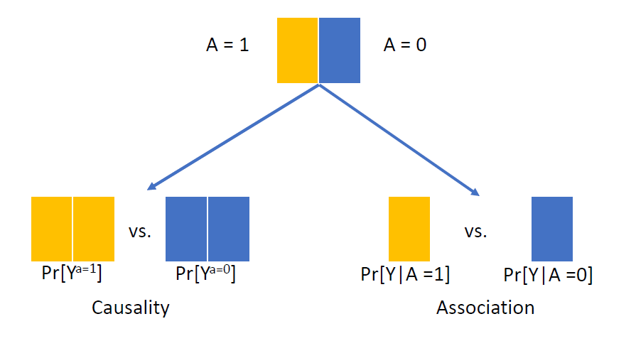

```{r setup, include=FALSE}
options(htmltools.dir.version = FALSE)
knitr::opts_chunk$set(
  fig.width=9, fig.height=3.5, fig.retina=3,
  out.width = "100%",
  cache = FALSE,
  echo = FALSE,
  message = FALSE, 
  warning = FALSE,
  hiline = TRUE
)
library(tidyverse)
library(gt)
library(knitr)
library(fontawesome)
library(xaringanExtra)


```

```{r xaringan-themer, warning=FALSE, include=FALSE}
library(xaringanthemer)
style_mono_accent(
  base_color = "#005587",
  black_color = "#002B43",
  table_row_even_background_color = "#FFFFFF",
  title_slide_text_color = "#FFFFFF",
  table_border_color = "#8bb8e8",
  text_bold_color = "#002B43",
  background_color = "#FFFFFF",
  text_font_size = "32px",
  header_h1_font_size = "2.5rem",
  header_h2_font_size = "2.3rem",
  header_h3_font_size = "1.5rem",
  padding = "16px 64px 16px 32px",
  colors = c(
    yellow = "#ffb81c",
    purple = "#3e2f5b",
    green = "#136f63",
    white = "#FFFFFF"
  ))

theme_set(
  theme_xaringan() +
    theme(
      plot.title = element_text(color = "#002B43", face = "bold"),
      axis.title = element_text(color = "#002B43"),
      axis.text = element_text(color = "#002B43")
    )
)

```

```{r xaringan-tile-view, echo=FALSE}
xaringanExtra::use_tile_view()
```

class: title-slide, center, middle, inverse
background-image: url(./figs/logo.png)
background-position: 95% 95%
background-size: 28%, 25%

# Introduction to .yellow[Target Trial Emulation] Framework


.center[

L. Paloma Rojas-Saunero MD, PhD
<br>
Postdoctoral scholar
<br>
Department of Epidemiology, UCLA

]

???

---
```{r, echo=FALSE}
xaringanExtra::use_progress_bar("#ffb81c", "top", "0.25em")
```

# Causal Estimand

<br>

.center[] 

---
# Estimands have 5 elements

**1. Target population** 

--

**2. Treatment strategies**

--

**3. Outcome (endpoint)**

--

**4. Population-level summary measure**

--

**5. Intercurrent events**

.footnote[.small[ICH E9 harmonised guideline on statistical principles for clinical trials (i.e., ICH E9(R1) addendum)]]

---

# Statins and Dementia Risk

<br>

.center[
$Pr[Y^{a=1}_{t} = 1] - Pr[Y^{a=0}_{t} = 1]$
]

---
# Randomized Controlled Trials (RCTs)

Experiment in which participants are randomly assigned to follow specified treatment strategies.

--

**Ideal randomized trial**:

   + No loss to follow-up

   + Full adherence through out the study duration

   + Double blind assignment
   
--

**By design: consistency, exchangeability, positivity** 

---
# RCTs

Usually they following time points are aligned by design:

- Eligibility criteria

- Treatment assignment (randomization)

- Follow-up starts

--
<br>

**By design: prevents immortal time bias**

---
.center[

**Association is causation!**



]

.footnote[.smaller[Hernán MA, Robins JM (2025). Causal Inference: What If]]

???
Under this design, comparing the observed average outcomes under each treatment arm is the same as comparing what would have happened had everybody been in one treatment arm versus the other

---
# Limitations of RCTs

.pull-left[
**Common flaws**

- Imperfect adherence
- Differential attrition
- Limited generalizability
]

--

.pull-right[

**Feasibility**

- Costs
- Time constrains
- Ethics
]

---
# Target Trial Emulation Framework


- Describe the protocol elements of the **_ideal_** target trial that connects to your estimand

  + Eligibility criteria
  + Treatment Strategies
  + Assignment procedures
  + Follow-up
  + Outcomes (and intercurrent events)
  + Causal contrasts
  + Identifying assumptions
  + Data analysis plan

---

.center[] 

.footnote[.smaller[Fu E. JASN. 2023]]

---
# Intention-to-Treat-Effects (ITT)

- The effect of treatment **assignment**

- In RCTs of treatment vs. placebo, double blinded, if treatment has null effect, then the ITT would be null

- If treatment has an effect but not everyone adheres, then it is a conservative estimate (bias towards the null)

- These believes are not held in **pragmatic** or **head-to-head** trials 

---
# Per-Protocol Effects

- What is the effect of **adhering** to the treatment strategy that people where assigned to

- It incorporates intercurrent events more transparently (e.g. adhere unless adverse reaction happens).

- Harder to answer, due to time-varying confounding feedback, not as popular as ITT.

---
class: left, middle

# Emulating a target trial of statin use and risk of dementia using cohort data

.small[

  .left[
Caniglia EC, Rojas-Saunero LP, Hilal S, Licher S, Logan R, Stricker B, Ikram MA, Swanson SA.]

 .left[_Neurology._ 2020]
 
 ]

---
class: center, middle


.left[

.footnote[.smaller[Fu E.L. et al. Clinical Kidney Journal. 2020]]
]

???

Frequently, observational studies that don't conceptualize the target trial self inflict with bias due to time-zero missalignment, or other sources of bias

---
class: even_smaller

```{r}
target_statins <-
  tibble::tribble(
    ~ "<b> Section </b>",
    ~ "<b> Target trial protocol </b>",
    ~ "<b> Emulation using observational data </b>",
    "<b> Eligibility criteria </b>",
    "Age 55 - 80 years, no statin prescription in the previous 2 years, known to be dementia free, MMSE >=26",
    "Same, except MMSE which is measured within the previous 3 years, with cholesterol, BMI and SBP measurement",
    "<b> Treatment strategies  </b>",
    "1. Initiate statin therapy at baseline and remain on it during the follow-up unless serious illnes occurs <br>
     2. Refrain from taking statin therapy during the follow-up unless serious illness occurs",
    "Same",
    "<b> Randomized assignment </b>",
    "Random assignment to either strategy at baseline",
    "Random assignment at baseline within levels of sex, educational attainment, age, calendar year, smoking status, MMSE, BMI, APOE4 status, cardiovascular covariates",
    "<b> Start/End of follow-up </b>",
    "From baseline until dementia dx, death, or loss to follow-up (10 years without an MMSE measurement), or January 1st, 2015, which ever happened first",
    "Same",
    "<b> Outcome  </b>",
    "Dementia (Death as a censoring event) <b>",
    "Same",
    "<b> Causal contrast  </b>",
    "Intention-to-treat <br>
    Per-protocol effect",
    "Same") %>% mutate(n = row_number())


target_statins %>% filter(n %in% c(1)) %>% select(-n) %>% gt() %>% 
   cols_width(
    "<b> Section </b>" ~ px(120),
    "<b> Target trial protocol </b>" ~ px(320),
    "<b> Emulation using observational data </b>" ~ px(320))
     
```

---
class: even_smaller

```{r}
target_statins %>% filter(n %in% c(1:2)) %>% select(-n) %>% gt()  %>% 
   cols_width(
    "<b> Section </b>" ~ px(120),
    "<b> Target trial protocol </b>" ~ px(320),
    "<b> Emulation using observational data </b>" ~ px(320))
```

---
class: even_smaller

```{r}
target_statins %>% filter(n %in% c(1:3)) %>% select(-n) %>% gt()  %>% 
   cols_width(
    "<b> Section </b>" ~ px(120),
    "<b> Target trial protocol </b>" ~ px(320),
    "<b> Emulation using observational data </b>" ~ px(320)) 
```

---
class: even_smaller

```{r}
target_statins %>% filter(n %in% c(1:4)) %>% select(-n) %>% gt()  %>% 
   cols_width(
    "<b> Section </b>" ~ px(120),
    "<b> Target trial protocol </b>" ~ px(320),
    "<b> Emulation using observational data </b>" ~ px(320))
```

---
class: even_smaller

```{r}
target_statins %>% filter(n %in% c(1:5)) %>% select(-n) %>% gt()  %>% 
   cols_width(
    "<b> Section </b>" ~ px(120),
    "<b> Target trial protocol </b>" ~ px(320),
    "<b> Emulation using observational data </b>" ~ px(320))
```

---
class: even_smaller

```{r}
target_statins %>% filter(n %in% c(1:6)) %>% select(-n) %>% gt()  %>% 
   cols_width(
    "<b> Section </b>" ~ px(120),
    "<b> Target trial protocol </b>" ~ px(320),
    "<b> Emulation using observational data </b>" ~ px(320))
```

---
# Rotterdam Study

.center[]


---
# Study Design

.center[]

.footnote[.smaller[https://ehud.co/blog/2023/03-sequential_trial_design/#a-single-sequential-trial]]

---
# ITT (Q1) vs. PP Effects (Q2)

.center[]

---
# Discussion

- Our findings suggest a potential decreased risk of dementia after sustained statin use compared with no statin use (PP).

--

- A per-protocol effect with more clinically-relevant discontinuation rules would be more insightful.

--

- There is still potential confounding by indication (at baseline and time-varying) and differential measurement error in dementia diagnosis.

---
background-image: url(./figs/mesa_logo.png)
background-position: 90% 95%
background-size: 20%
class: left, middle

# Racial and ethnic differences in the risk of dementia diagnosis under hypothetical blood pressure–lowering interventions: The Multi-Ethnic Study of Atherosclerosis
.small[

  .left[**Rojas-Saunero LP**, Hughes TM, Mayeda ER, Jimenez MP]
  
  .left[ _Alzheimer's & Dementia._ 2024.]
]

???

---
# Motivation

- **SPRINT-MIND trial**
  
  + Intensive (<120 mmHg) vs. standard (<140 mmHg) SBP control

--

- Highly selected population → limited generalizability

--

- Hypertension burden is higher in Black and Latinx adults

--

- Need evidence on whether intensive blood pressure control could reduce disparities in population-based settings

---
background-image: url(./figs/mesa_logo.png)
background-position: 90% 95%
background-size: 20%

# Study Design

- **Eligibility: **Chinese, Black, Latinx, White adults < 85 years old, free of cardiovascular disease and dementia

--
- **Treatment strategies:**

  + Sustain SBP <120 mmHg over follow-up
  + Sustain SBP <140 mmHg over follow-up
  + Natural course/observed distribution (comparison arm)

--

- **Outcome:** Dementia diagnosis over 19 years of follow-up, with death as a censoring event

---
# Parametric G-formula

.center[

]

???

“In reality, SBP is related to behaviors and health conditions that also change over time — smoking, BMI, lipids, cardiovascular disease.”

“These factors affect dementia risk and influence future SBP levels and treatment decisions.”

“If we ignore them, we risk confounding.
If we adjust for them naively, we may block part of the effect.”

---
# Results

.pull-left[

]

--

.pull-right[
% Participants that would required to be intervened at some point over follow-up to adhere to <=120 mmHg strategy

  + Black: 93%
  + Latinx: 86%
  + Chinese: 80%
  + White: 82%
  + Total: 86%]
  
---
# Discussion

- Sustained intensive SBP control may reduce dementia risk, with heterogeneity across groups, but we first need to understand safety

--

- We didn't say how we would intervene on SBP, stronger assumptions for **consistency**

--

- Findings suggest that Black and Latinx adults may require greater support to sustain intensive control


---
class: middle, center

# Not a clinical epidemiologist?


---
# Complex Exposures


.pull-left[
] 
--

.pull-right[We often measure characteristics of individuals, places, or environments that may not reflect the intervention itself.
]

---
# Compound exposures

- Compound exposures are made up of components that together form a whole.

--

- Example: Socioeconomic status is derived from income, education, and occupational status.

--

- To satisfy the consistency assumption, any change in a component of SES should result in the same effect.

---
# Compound exposures

- **Consistency** (Cole and Fragakis) 

  + $Y_{i(a,k)}$: Individual $i$ receives exposure $A = a$ via intervention $k$.
  
  + Consistency holds when $Y_{i(a)} = Y_{i(a,k)}$
  
  + The range of possible $k$ (the means by which exposure occurs) varies depending on the specific $a$ (exposure tested)

---
# Physical activity and cognitive function

- Let's say we are interested in the effect **physical activity** $A$ on **cognitive function** $Y$

--

- Consistency implies that if a person does **30 minutes of moderate physical activity** $A = a$ on their own

--

- Their outcome $Y_{i(a)}$ should be the same as if the same level of activity were assigned through intervention $k$, such as **running, swimming, cleaning**

---
class: middle

For compound exposures (e.g. social, environmental, biomarkers), we must consider the **range of possible interventions** $k$ that could lead to the same **exposure level** $a$  


---
# Weighted average compositional effect

- Reflects a **weighted average** of all changes in components of a composite variable in a study, with weights based on their frequency

--

- **Key challenge**: Without knowing the distribution of these changes, it's hard to assess intervention implications.  

--

- Understanding how components change helps define **confounders and effect modifiers**

---
# In Practice

- Having a clear question (or estimand) is crucial, and so is thinking about the **ideal** study

--

- The TTE helps prevent biases, and makes explicit the assumptions needed to identify causal effects from observational data

--

- It is a dynamic process, since it requires a deep understanding of the data sources and a constant check that the causal contrasts and subsequent results are informative. 

--

- Hot take: You can use TTE even if a study doesn't have the intervention measured (or it doesn't even exist yet) under stronger assumptions

---
# Publications on 'Target Trial Emulation' by Year"
```{r}
# Load libraries
library(tibble)
library(ggplot2)

df <- tibble(
  Year = c(2026, 2025, 2024, 2023, 2022, 2021, 2020, 2019, 2017),
  Count = c(226, 494, 207, 86, 45, 29, 4, 1, 1)
)

ggplot(df, aes(x = factor(Year), y = Count)) +
  geom_col() +
  labs(
    title = "",
    x = "Year",
    y = "Count"
  ) +
  theme_minimal(base_size = 18) +
  theme(
    # Axis titles
    axis.title = element_text(
      color = "#002B43",
      size = 18
    ),
    
    # Axis text
    axis.text = element_text(
      color = "#002B43",
      size = 14
    ),
    
    # Grid tweaks
    panel.grid.major.x = element_blank(),
    panel.grid.minor = element_blank(),
    panel.grid.major.y = element_line(color = "#D9E6F2"),
    
    # Background
    plot.background = element_rect(fill = "white", color = NA),
    panel.background = element_rect(fill = "white", color = NA),
    
    # Spacing
    plot.margin = margin(20, 30, 20, 10)
  )

```

.footnote[PubMed search on: `r Sys.Date()`]

---
# Quality of publications using TTE

.center[] 

.footnote[.small[Simon-Tillaux et al. BMJ Open.2024]]

---

.center[] 


---
class: center, middle
# Thank you! Gracias!

<br> <br>


`r fa("paper-plane")`</i>&nbsp;lp.rojassaunero@ucla.edu</a><br>

`r fa("github")` <a href="https://github.com/palolili23"> </i>&nbsp; @palolili23</a><br>

@palolili23.bsky.social
